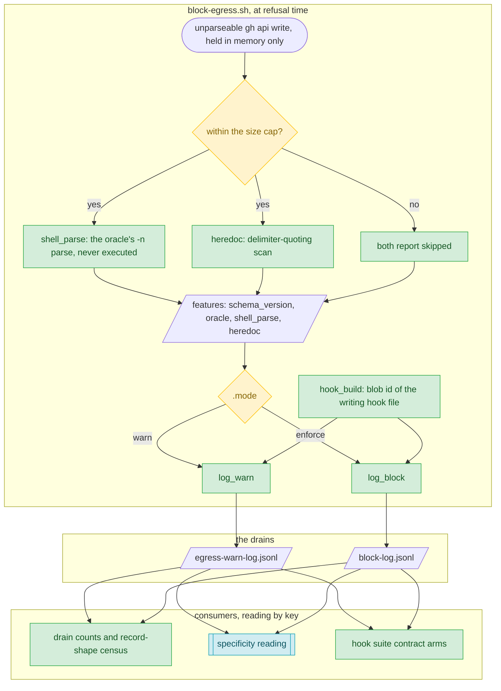

# ADR-205 — A refusal record carries the command's structure, never the command

## Status

**Proposed.** The design was locked by the operator at the egress-hook-batch Stage-5 Collective Review scope-lock, together with the independent adversarial review's refinements; this record was authored at Stage 6 Engineering after that lock. The `Proposed → Accepted` transition is the Stage 13 Close ratification beat's to perform.

**Numbering provenance.** Claimed as **205** against an anchor of **203** on `origin/main`, read from the repository's own ADR-numbering detector. The release branch already carries this release's other record at 204, so this one takes the next number and the sequence stays gap-free. The number binds at the Stage-12 claim; should the mainline claim it first, the renumbering tool moves this record at merge time and appends one provenance note here per hop. In-release prose cites this record by its slug token, which carries no number shape and resolves at the claim.

**Authoring provenance.** The Stage-5 design named this record; the File Change Matrix ratified at the Stage-4 gate carried no path for it, so the release plan's Deviation Log records the added row with its authority.

## Context

A refusal record exists so a control can be audited for its own false-positive rate. BLOCK-EGRESS-007 refuses a `gh api` write it cannot tokenize, with the cause `unparseable`. That cause has no path, so its evidence was a constant, and two such records differed only in timestamp, input digest and working directory. The rule's safety argument for the cause — a command that cannot be parsed cannot execute either — holds for a malformed command and fails for a well-formed one the scanner mis-models, which is exactly the distinction an auditor has to draw.

Recording more about a refused command trades directly against the privacy floor for hook records: the block log keeps a one-way digest of the tool input, never its text, and the warn log keeps no digest at all. A command can carry a credential or other sensitive data, and records are durable once written and are routinely excerpted into public issues.

Two further constraints shaped the design. The record is written on the way to a deny, and under `set -e` a failing command inside a hook function ends the hook with a status the PreToolUse contract treats as non-blocking, so anything added to that path must be unable to cost the deny. And the records come from two writers — the warn log's, at `.mode=warn`, and the block log's, at `.mode=enforce` — so a field set carried by only one of them would leave the other's records as unclassifiable as before.

## Decision

The platform adopts, for BLOCK-EGRESS-007 `unparseable` refusal records written by `core/hooks/block-egress.sh`:

1. **A versioned `features` object, identical in both writers, holding enumerated structure only.** `schema_version` is the integer 1. `oracle` names the parser that judged the syntax: `bash-<major>.<minor>` of the running shell, which is the oracle, or `unknown`. `shell_parse` is that parser's verdict on the command's syntax, read and never executed: `ok` (accepted), `error` (rejected), `skipped` (above the size cap, not checked) or `unavailable` (the parser is missing, or its run produced no verdict). `heredoc` is the heredoc delimiter quoting: `none`, `quoted`, `unquoted`, `both`, or `skipped` above the cap. No member carries command text, an offset, a length or a path fragment. `evidence` stays byte-identical, and no `phase` key and no top-level `cause` key is added.
2. **A top-level `hook_build`:** the first 16 hex of the git blob id of the hook file that wrote the record, or `unknown`.
3. **Neither can change a verdict, and nothing added can cost one.** The features are computed before the verdict function runs, and its exit depends on the mode alone. Only the parser's own verdict statuses map to verdict values: exit 0 is `ok`, exit 2 — bash's syntax-error status — is `error`, and any other outcome is `unavailable`, so a failed run never reads as proof the refusal was right. One size cap bounds both computations. A record whose features cannot be written is written with `hook_build` alone, and a record that cannot carry either is written in the plain form. The block log's digest step is guarded the same way.

### Data flow — the refusal-record contract
<!-- design-artifact: flow-class=data-flow; name=refusal-record; depicts=core/hooks/block-egress.sh -->

| Producer | Mode | Writes to | Keys on an `unparseable` record |
|---|---|---|---|
| `log_warn` | `.mode=warn` — the refusal is allowed and recorded | `egress-warn-log.jsonl` | `ts` · `hook` · `rule` · `tool` · `reason` · `evidence` · `hook_build` · `features` |
| `log_block` | `.mode=enforce` — the refusal is denied and recorded | `block-log.jsonl` | `ts` · `hook` · `rule` · `tool` · `input_digest` · `cwd` · `evidence` · `hook_build` · `features` |

| Consumer | Reads | How |
|---|---|---|
| Drain counts and record-shape census | both logs | by key; this class is one more record variant, and shadow records are still selected by their `phase` key |
| Specificity reading | `features.shell_parse`, scoped by `features.oracle` | `error` → true-positive · `ok` → benign-shape · `skipped` or `unavailable` → unclassified |
| Hook suite contract arms | sandbox copies of both logs | as a JSON value stream, never by line count, so any serialization reads alike |

## Alternatives Considered

**Encoding — where the features live.**
- *Tokens appended to `evidence`.* Rejected: recoverable only by splitting a prose field whose grammar differs per rule, while consumers select records by key.
- *Flat top-level keys.* Rejected: no namespace in a sink every hook writes to.
- *A container named after the rule.* The strongest encoding alternative, rejected: it states the rule twice, in two places that can disagree, and forces every future writer to take a dynamic key.
- *A sidecar log.* Rejected: a third writer and a second fact-bearing surface, joined to the first only by a second-resolution timestamp that concurrent sessions make ambiguous.
- *A shared library writer now.* Rejected: outside this release's scope, and a new hook-library member cascades through three rosters.

**Vocabulary — what to record.**
- *Descriptive metrics* — quote kind, offsets, lengths, token counts. Rejected: identical for a false and a true refusal in four of the five measured mechanisms, and quasi-identifying beside a timestamp.
- *A write-time mechanism label* — the scanner's own diagnosis. Rejected: it encodes today's theory of false refusals and misfiles any mechanism nobody has catalogued yet.
- *A keyed digest of the command.* Rejected: classification would still need the command.
- *The oracle alone.* A strong alternative, rejected: it loses the heredoc delimiter split that a heredoc remedy needs.
- *An oracle verdict that does not name its oracle.* Rejected at the adversarial review: verdicts from different parser grammars — one host's bash and another's — would pool under one schema version with nothing to scope them.
- *Reading any failed oracle run as a syntax error.* Rejected at the adversarial review: an instrument failure would read as proof the refusal was right.

**Producer identity.**
- *None*, recovering the build from the deployed file's timestamp. Rejected: each redeploy erases it.
- *A deploy-stamped constant.* Rejected: the publisher is outside this release's scope.
- *A hand-maintained constant.* Rejected: a missed bump mislabels records silently.

**Bounds and failure.**
- *Capping the oracle alone.* Rejected at the adversarial review: the heredoc scan reads the same caller-sized input on the same deny path.
- *Writing the plain record whenever the features cannot be written.* Rejected at the adversarial review: a current-build record would then be indistinguishable by key from one written before this decision; the fallback keeps `hook_build`.

## Consequences

**Positive.** Every such refusal is classifiable without its command. The false-refusal share, and the heredoc share within it, is measurable from the records alone, and because each record names its producer, the share can be compared across builds.

**Negative.** Drain consumers must recognise one more record variant. The oracle is bash while the shell that runs a command may differ, which is why the record names its oracle and every verdict is read as scoped to it. Two subprocess-backed values sit on the refusal path — the refusal path only, under one size cap. And the approximation remains: the scanner still refuses what it mis-models. This record makes the approximation measurable; it does not repair it.

**Neutral.** No other record changes shape, `evidence` is byte-identical, and serialization is unchanged. Records written before this decision carry neither key and cannot be classified after the fact; the release that introduced it disposed of them as unrecoverable, bound to deploy time rather than to the absence of a key, so a current-build record that lost its features is never counted among them.

**Forward compatibility.** The shape is designed so that a shared writer across hooks could adopt it without relocating anything: rule-specific structure inside `features`, interpreted by `rule` and versioned by `schema_version`, and provenance at the top level. This record decides the `unparseable` record alone; whether and how other hooks adopt the shape is that writer's own decision to make.

## Reversibility

CHEAP to revert the code: records already written keep their keys, and new ones simply stop carrying them. MODERATE as a contract once other writers and consumers build on the shape.

## Related ADRs

- ADR-030 — the hook-registry fragment that documents this rule regenerates the registry index.
- ADR-078 — the security hooks' fail-closed posture, which the failure-proof record path protects: a feature defect must never turn a deny into a non-blocking exit.
- ADR-150 — a hook drain gained a partition field so two populations could be told apart; the precedent for a record that describes its own class.
- ADR-167 — drains are git-ignored and invisible to CI, so a record has to describe itself.
- ADR-187 — command position is canonicalized, not parsed: the approximation this record makes auditable.
- {{ADR:egress-allowlist-rows-declare-their-match-domain}} — the same release's allowlist row-scope decision, which leaves this rule's writers untouched.

## References

- #6201 — the unparseable refusal records this decision makes classifiable, with its five acceptance criteria.
- #6194 — the co-discharge partner that serializes this field set one record per line.
- #7544 — the proposed shared refusal-record writer across hooks, for which this shape is designed to be adoptable.
- #7548 — the observation card for the scanner's false-refusal mechanisms, whose remedy these records size.
