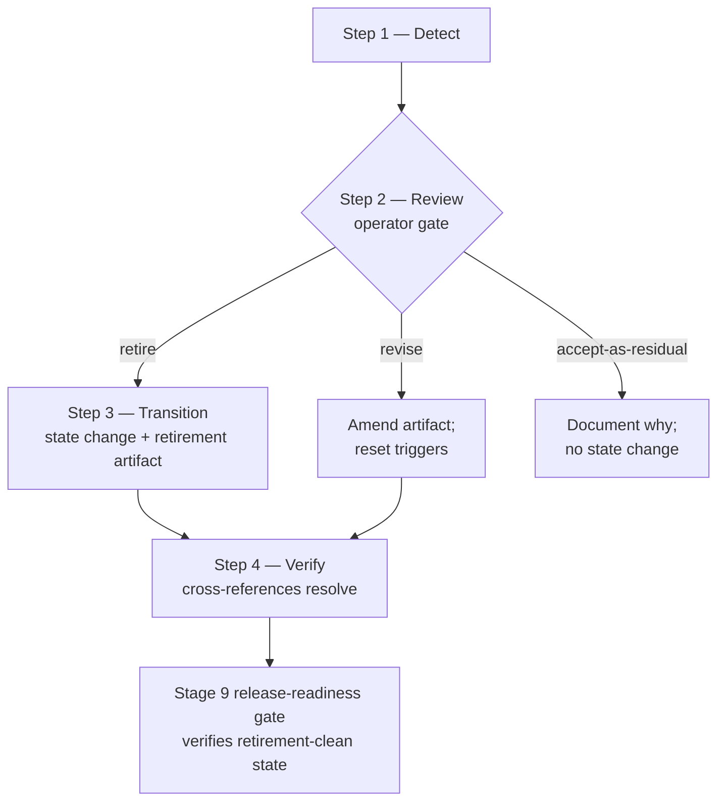

<!-- reference-durability: allow-version-ref -->
<!-- reference-durability: allow-link -->

# KM Corpus Governance Framework

**Origin:** KM corpus governance framework (first spec of its wave).
**Tier:** K1 codified-knowledge corpus per [`knowledge-architecture.md`](../disciplines/knowledge-architecture.md).
**Class:** prescriptive standards — mandate language predominates ("every K1 artifact MUST have an owner; new corpus additions MUST pass approval per evidence tier; retirement MUST proceed through state transitions, never deletion").
**Primary consumers:** Workspace owner authoring or amending K1 reference docs / frameworks / SKILL.md instances; Stage 13 Close spoke surfacing cadence-due or trigger-fired retirement candidates; Stage 5 Solutioning spokes consulting ownership / authority / composition boundary rules.
**Secondary consumers:** future downstream releases — records-management, DRAFT→APPROVED workflow, `pmo-qa-auditor` KM scanning, future ownership-map peer spec — all forward-compat per §9 schema-stability commitment.
**Hard upstream consumption:** practice-efficacy-framework — 6-signal catalog + 10-col ledger row schema + `retirement_trigger_eligible: yes` flag on 4 lagging signals + 3 trigger semantics (T-OP / T-RW / T-CI) consumed VERBATIM per that framework's schema-stability commitment §10. See §4.1 (efficacy trigger source row).
**Status:** Canonical.
**Introduced:** km-governance-and-efficacy.
**Cutover:** Downstream consumer integrations apply from the release following this framework's introduction; the release introducing this framework is exempt from its own forcing function (reflexive-pipeline-loop discipline; pattern matches sibling cutover precedents per [`release-process.md`](../../release/governance/release-process.md)).

---

## §1 Purpose and Scope

The KM corpus governance framework codifies WHO owns each K1 artifact, WHAT authority approves new K1 entries by evidence tier, WHAT triggers and workflow govern KM-artifact retirement, WHO governs this framework itself (meta-governance), and HOW this framework composes with adjacent governance surfaces (records-management, AI-artifact workflow, operating-model, Anthropic-base-vs-build registry). It is the layer-above governance for the K1 corpus that previous releases left to convention.

The framework does NOT govern WHICH practices to admit OR retire — that decision class belongs to the operator at the gates the framework defines, consuming signals from the relevant peer specs. The framework provides:

1. A **4-value owner-class enum** + 2-tier storage model (registry-authoritative + frontmatter-cache) (§2).
2. An **approval protocol** composing with [`corpus-curation.md`](../disciplines/corpus-curation.md) ET1–ET5 evidence-tier vocabulary, adding authority-scope distinction (new-artifact vs amendment) (§3).
3. A **retirement protocol** composing 4 trigger sources — efficacy (from [`practice-efficacy-framework.md`](practice-efficacy-framework.md)) + curation (RT-a..RT-d from [`corpus-curation.md`](../disciplines/corpus-curation.md)) + staleness (from [`km-protocols.md §2`](../disciplines/km-protocols.md)) + contraindication-prevalence (DEFERRED to the applicability-framework ledger when populated) — with a 4-step workflow and retirement-artifact format aligned with [`km-protocols.md §1`](../disciplines/km-protocols.md) KM- state vocabulary (§4).
4. A **meta-governance section** binding the framework to itself reflexively: workspace owner accountable + tier-bound cadence + No-Ungoverned-Changes amendment protocol + Tier 2 [SCOPE CHANGE] escalation + reflexive cutover discipline (§5).
5. **Composition boundaries** versus  (records-management) /  (Artifact-state machine) /  (operating-model) /  (Anthropic-base-vs-build) (§6).
6. **Framework-catalog integration discipline** — how ownership-class semantics propagate into the existing 11-col owner column (§7).
7. A **cutover statement** declaring this framework exempt from its own enforcement at introduction (§8).
8. A **10-point schema-stability commitment** (§9 — 4 conventions inherited from  + 6 forward by this framework) that locks downstream consumer integrations.
9. A **pilot-verification section** describing ship state, deferred items, and Stage 13 release-readiness obligations (§10).
10. **Related references** + **provenance** (§11, §12).

**Out of scope (explicit):**

- Closure / merge / relabel / de-milestone of records-management (OPEN), Artifact-state machine (OPEN), operating-model (CLOSED), anthropic-base-vs-build registry (CLOSED). Per the least-destructive-disposition discipline — composition documentation in §6 ONLY; no reciprocal edits.
- Backfill of frontmatter `owner:` field across all K1 reference docs. The framework establishes the convention; 4 docs are already populated; the 4 new frameworks (this one + practice-efficacy + review-composition + initiative-roadmap) demonstrate the discipline. Backfill of the remaining ~20 K1 reference docs is a forward release.
- Skill SKILL.md modifications. No skill behavior changes at ship; `owner:` frontmatter on SKILL.md is a forward-compat convention documented in §2.4 only.
- Automated `check-km-owner.sh` tooling. The framework specifies the discipline; tool implementation is a future release.
- Contraindication-prevalence trigger threshold codification. Reserved slot in §4.1 (4th source); threshold codification deferred to the applicability-framework when its contraindication ledger ships.
- Layer 2 (`projects/`) files. The framework governs Layer 1 only.

**Reading order.** A consumer applying the framework reads §2 (ownership model) → §3 (approval protocol) → §4 (retirement protocol) → §5 (meta-governance) → §6 (composition boundaries). Sections §1, §7, §8, §9, §10, §11, §12 are reference / discipline / cutover / forward-contract content read once at integration time.

---

## §2 Ownership Model (Tier-A activated concept-model)

Every K1 artifact in the platform corpus has an owner. The ownership model is the framework's central concept-model artifact (per [`design-artifact-standard.md § 6`](design-artifact-standard.md) concept-model standard — Tier-A activated artifact #1 per release plan §7).

### §2.1 Ownership graph

The model organizes ownership along a **single accountability root** (Workspace Owner) with **4 delegate classes** stored in a **2-tier storage model** (registry-authoritative + frontmatter-cache). The concept renders as:

```
                ┌──────────────────────────────────────────────┐
                │  Accountability root (single, in current     │
                │  single-operator PMO state):                 │
                │                                              │
                │      operator-class:                         │
                │      Workspace owner ([OPERATOR_NAME])           │
                └──────────────────────────────────────────────┘
                            │
                            │ delegates to ↓ via 4 owner-classes
                            │
   ┌────────────────────────┼────────────────────────────────┐
   │                        │                                │
   ▼                        ▼                                ▼
┌─────────────────┐  ┌───────────────────┐   ┌────────────────────────┐
│ operator-class  │  │ role-class        │   │ artifact-class         │
│ (DEFAULT)       │  │ (logical persona) │   │ (skill, agent,         │
│                 │  │                   │   │  framework, process)   │
│ e.g.            │  │ e.g.              │   │ e.g.                   │
│ "Workspace      │  │ "PMO Architect",  │   │ "pmo-qa-auditor",      │
│  owner          │  │ "Principal        │   │ "release-planner",     │
│  ([OPERATOR_NAME]          │  │  Engineer"        │   │ "13-stage pipeline"    │
│  [OPERATOR_NAME])"       │  │                   │   │                        │
└─────────────────┘  └───────────────────┘   └────────────────────────┘
                                                         │
                                                         │
                                                         ▼
                                       ┌────────────────────────────────┐
                                       │ future-collective-class        │
                                       │ (RESERVED — not active in      │
                                       │  single-operator state;        │
                                       │  future-state)                 │
                                       │                                │
                                       │ e.g.                           │
                                       │ "Architecture Council",        │
                                       │ "PMO Governance Board"         │
                                       └────────────────────────────────┘
                            │
                            │ stored in ↓ 2 tiers
                            │
                ┌───────────┴───────────────────────────┐
                │                                       │
                ▼                                       ▼
┌────────────────────────────────┐    ┌────────────────────────────────┐
│  Tier 1 — Registry             │    │  Tier 2 — Frontmatter cache    │
│  (authoritative)               │    │  (demonstration / discovery)   │
│                                │    │                                │
│  framework-catalog.md          │    │  K1 reference doc              │
│  `owner` col (col 11 of        │    │  `owner:` frontmatter field    │
│  11-col schema)                │    │                                │
│                                │    │  Currently 4 docs populated;   │
│  Every catalogued row carries  │    │  ~20 backfill deferred         │
│  an `owner` value (catalog =   │    │                                │
│  source of truth)              │    │                                │
└────────────────────────────────┘    └────────────────────────────────┘
       │                                       │
       │  Conflict resolution: registry WINS   │
       └───────────────────────────────────────┘
```

The two-tier storage model deliberately mirrors the **`version_anchor` precedent** at [`framework-corpus-discipline.md § 5`](framework-corpus-discipline.md): the framework-catalog `version_anchor` column is the authority; per-doc `framework_version_anchor:` frontmatter (where present) is *derived demonstration*, not source. `deploy.sh` Check 18b enforces consistency. The same authoritative-vs-demonstration discipline is what the ownership model adopts here — and what survives the duplicate-source-discipline.md register-or-remove M2 challenge in the originating Stage 5 spec.

### §2.2 4-value owner-class enum

The enum is FORWARD-STABLE per §9 schema-stability commitment. New owner-classes MAY be added later; existing class labels NEVER reassigned, NEVER renamed, NEVER removed.

| Owner-class | Format | Authority semantics | Granularity |
|---|---|---|---|
| `operator-class` | `operator-class:Workspace owner (...)` or bare `Workspace owner (...)` | Single accountable human; final authority in single-operator PMO state | Root accountable owner — DEFAULT for single-operator PMO |
| `role-class` | `role-class:<logical-persona-name>` (e.g., `role-class:PMO Architect`) | Logical role/persona; in single-operator state, maps to operator-class with role-hat-active | Logical role; resolves to operator-class when role-hat is the operator's |
| `artifact-class` | `artifact-class:<skill-or-process-name>` (e.g., `artifact-class:pmo-qa-auditor`, `artifact-class:13-stage pipeline`) | Skill or process is the accountable surface; operator approves changes via skill governance per [`canonical-skill-structure.md`](canonical-skill-structure.md) | Skill / agent / framework / process; the artifact IS the authority |
| `future-collective-class` | `future-collective-class:<collective-name>` (e.g., `future-collective-class:Architecture Council`) | Reserved for multi-operator future-state per forward-state scenarios; NOT active in single-operator state at ship | Reserved — slot exists for forward-compat without requiring multi-operator infrastructure |

### §2.3 Owner-format convention

An `owner` field value uses the format: `<owner-class>:<owner-identifier>`. For brevity in framework-catalog rows and frontmatter (where context is already declared), the bare `<owner-identifier>` form is acceptable — the existing framework-catalog seed rows use the bare form (`Workspace owner ([OPERATOR_NAME])`), and the implicit class is `operator-class`. Cross-doc references in prose use the explicit `<owner-class>:` prefix per the [`lifecycle-states-canonical.md §2`](lifecycle-states-canonical.md) object-prefix convention pattern (e.g., `KM-Active`, `Domain-A-superseded`).

### §2.4 2-tier storage model

| Tier | Storage location | Authoritative? | Scope at ship |
|---|---|---|---|
| **Tier 1 — Registry** | [`framework-catalog.md`](../specs/framework-catalog.md) `owner` column (col 11 of 11-col schema) | **YES** (wins on conflict) | Every catalogued framework row carries an `owner` value — the [`framework-catalog.md`](../specs/framework-catalog.md) catalog is the live source of truth for which frameworks exist and their owners (no row count is restated here; it drifts as frameworks are added) |
| **Tier 2 — Frontmatter cache** | K1 reference doc YAML frontmatter `owner:` field | NO (mirrors registry; for in-context discoverability) | 4 K1 reference docs currently carry `owner:` frontmatter (framework-catalog.md, PMO_Platform_Template.md, framework-corpus-discipline.md, template-protocol.md); ~20 others deferred — backfill out of scope for this release (separate Issue + plan for a future release) |

**Conflict resolution.** If the framework-catalog `owner` column and a per-doc frontmatter `owner:` field disagree, the framework-catalog row WINS. Frontmatter cache MUST be amended to match. Drift detection for this consistency check is a future enhancement (parallel to existing `deploy.sh` Check 18b for `framework_version_anchor:`); not shipped.

**Forward-only adoption.** New K1 reference docs MUST carry the `owner:` frontmatter field. Existing K1 reference docs without `owner:` are not blocked from amendment; backfill is a separate forward release. The 4 new frameworks demonstrate the discipline at ship.

### §2.5 SKILL.md owner convention (forward-compat)

For pmo-platform SKILL.md files, the `owner:` frontmatter field is a forward-compat convention not enforced currently. When adopted (forward release), the value follows the same format as K1 reference docs. The Anthropic upstream `anthropic-skills:skill-creator` does NOT include `owner:` in its frontmatter schema by default; adding `owner:` to PMO SKILL.md files is additive (forward-compat) and does not break the upstream convention.

---

## §3 Approval Protocol

The approval protocol governs admission of new K1 corpus entries. It COMPOSES with [`corpus-curation.md`](../disciplines/corpus-curation.md), which owns the **evidence-tier vocabulary** (ET1–ET5). This framework does NOT redefine the vocabulary; it adds the **authority-scope distinction** (new-artifact authority vs amendment authority) that closes the AC-2 mapping.

### §3.1 Evidence-tier → approval-authority mapping

The mapping cites [`corpus-curation.md §1`](../disciplines/corpus-curation.md#evidence-tier-vocabulary) verbatim and adds the new-artifact-vs-amendment authority distinction.

| Evidence tier (per [`corpus-curation.md §1`](../disciplines/corpus-curation.md#evidence-tier-vocabulary)) | Acceptance gate | New-artifact approval authority | Amendment authority (change to existing K1 artifact) |
|---|---|---|---|
| **ET1** Systematic review / meta-analysis | ≥2 independent studies; review name + year cited | `operator-class` (auto-admit; lowest scrutiny) | `operator-class` (No-Ungoverned-Changes protocol applies) |
| **ET2** Peer-reviewed canonical framework | Framework + edition/year; named author/body | `operator-class` (standard scrutiny) | `operator-class` (No-Ungoverned-Changes) |
| **ET3** Practitioner consensus / industry standard | Standard + edition; paired applicability note per the corpus-curation discipline | `operator-class` (standard scrutiny + applicability-note discipline) | `operator-class` (No-Ungoverned-Changes) |
| **ET4** Emergent / internal pattern | Originating release/issue + ≥2 internal applications; emergence-rule N=2 satisfied per [`decision-discipline.md § 4.2`](../disciplines/decision-discipline.md) | `operator-class` + emergence-rule satisfied | `operator-class` (No-Ungoverned-Changes) |
| **ET5** Expert opinion / single-source | `[EXPERT-OPINION:]` label + mandatory paired contraindication + scheduled re-review | `operator-class` explicit per-instance | `operator-class` (No-Ungoverned-Changes) |

### §3.2 Authority-scope rule

> **New-artifact authority** governs admission of a new K1 entry to the corpus (creating a new reference doc, framework, or named practice). The authority maps via the §3.1 evidence-tier table.
>
> **Amendment authority** governs modifications to existing K1 artifacts. Same authority maps (operator-class for all tiers in the current single-operator PMO state). Amendments MUST follow the No-Ungoverned-Changes protocol per [`CLAUDE.md § Universal Preferences`](<OPERATOR_INSTANCE_CLAUDE_MD>): GitHub Issue + implementation plan + PR approval.
>
> **Escalation path when operator-class is the authority and the operator is unavailable:** N/A in the current single-operator state — the operator IS the authority. Forward-compat: when `future-collective-class` becomes active (per the multi-operator future-state), escalation maps to the collective. The collective's specific protocol is downstream work; this framework reserves the slot.

### §3.3 Composition discipline (single-home)

The vocabulary belongs to [`corpus-curation.md`](../disciplines/corpus-curation.md). This framework cites; never duplicates. If [`corpus-curation.md`](../disciplines/corpus-curation.md) ET-tier semantics change, this framework's §3.1 table updates by reference (cross-doc citation refresh), not by parallel mutation. The pattern is a deliberate application of [`duplicate-source-discipline.md`](duplicate-source-discipline.md) register-or-remove.

---

## §4 Retirement Protocol (Tier-A activated process-flow)

The retirement protocol governs the lifecycle of K1 artifacts beyond active corpus membership. It COMPOSES 4 trigger sources from peer specs (no parallel triggers invented), defines a 4-step workflow with an operator gate, and specifies the retirement-artifact format that aligns with [`km-protocols.md §1`](../disciplines/km-protocols.md) KM- state machine. Retirement is NEVER deletion (per the least-destructive-disposition discipline) — retired artifacts persist for traceability, historical context, and inbound-reference resolution.

This is the framework's Tier-A activated process-flow artifact (per [`design-artifact-standard.md § 6`](design-artifact-standard.md) process-flow standard — Tier-A activated artifact #2 per release plan §7).

### §4.1 4-source trigger composition

Retirement triggers are sourced from 4 peer specs. No parallel triggers are invented here — each source row CITES the owning spec and consumes its semantics verbatim. The 4-source enum is FORWARD-STABLE per §9 schema-stability commitment (additive only; new sources MAY be added — e.g., `regulatory-mandate` for compliance-driven retirement — but existing source IDs NEVER renamed or removed).

| Source | Trigger reference | Mechanism | Threshold | Composition note |
|---|---|---|---|---|
| **`efficacy`** (per practice-efficacy-framework schema-stability contract — consumed VERBATIM) | T-OP / T-RW / T-CI (only when `retirement_trigger_eligible: yes` — the 4 lagging signals SIG-G1 / SIG-G2 / SIG-G3 / SIG-G4 per [`practice-efficacy-framework.md § 3`](practice-efficacy-framework.md)) | Read [`practice-efficacy-ledger.md`](<OPERATOR_INSTANCE_EVALS_RESULTS_PATH>/practice-efficacy-ledger.md) rows with `trigger_fired: yes` | Per practice-efficacy-framework thresholds (T-OP: ≥3 in 90d; T-RW: ≥2 in 5-release window; T-CI: ≥1 since last review) | [`practice-efficacy-framework.md`](practice-efficacy-framework.md) owns trigger; this framework consumes for retirement candidacy |
| **`curation`** (per [`corpus-curation.md § 2`](../disciplines/corpus-curation.md) step 6 — consumed VERBATIM) | RT-a (evidence overturned) / RT-b (framework deprecated by its body) / RT-c (superseded by higher-ET) / RT-d (ET5 re-review lapsed) | Read [`corpus-curation.md`](../disciplines/corpus-curation.md) retirement-trigger table; cite the RT-N row | Per [`corpus-curation.md`](../disciplines/corpus-curation.md) RT-a..RT-d definitions | [`corpus-curation.md`](../disciplines/corpus-curation.md) owns curation triggers; this framework consumes for retirement candidacy |
| **`staleness`** (per [`km-protocols.md § 2`](../disciplines/km-protocols.md) — consumed VERBATIM) | `today > staleness_due(a)` where `staleness_due` is computed from frontmatter `published_date` + K-tier + ET-tier | Read frontmatter; compute `staleness_due` per [`km-protocols.md § 2`](../disciplines/km-protocols.md) formula | Per [`km-protocols.md § 2`](../disciplines/km-protocols.md) thresholds (varies by K-tier × ET-tier — 36mo / 12mo / 6mo / 3mo by criticality) | [`km-protocols.md`](../disciplines/km-protocols.md) owns staleness; this framework consumes for retirement candidacy |
| **`contraindication-prevalence`** (per the applicability-framework — DEFERRED) | Number of contraindication entries against the practice exceeds a threshold | DEFERRED until [`applicability-framework.md`](../disciplines/applicability-framework.md) ships full contraindication ledger | DEFERRED (threshold codification awaits the ledger; reserved slot only per the intake-vs-solutioning WHAT-not-HOW discipline) | The applicability-framework owns contraindications when shipped; this framework reserves the trigger source slot for forward-compat |

### §4.2 4-step retirement workflow (process-flow)

The workflow has 4 steps with an explicit operator gate at step 2. The flow renders as:



Step-by-step detail:

| Step | Action | Owner | Output |
|---|---|---|---|
| **1 — Detect** | Trigger fires from any of the 4 sources in §4.1; retirement-candidate record assembled with: artifact path + trigger source + evidence pointer + cross-reference to triggering ledger row / RT-N row / staleness_due computation / contraindication record | Automated (efficacy ledger row / curation step 6 detection / staleness scan / contraindication query) OR operator-initiated | Retirement-candidate record (in release-readiness checklist OR ad-hoc operator session) |
| **2 — Review** (operator gate) | Operator examines candidate; surveys impact via grep for inbound cross-references and dependency-graph fan-out (same method [`blast-radius.sh`](../../release/tools/blast-radius.sh) uses); identifies successor candidates if any; renders disposition | `operator-class` | One of three dispositions: (a) retire (state transition per step 3), (b) revise (amend artifact; reset triggers), (c) accept-as-residual (no action; document why in artifact frontmatter or release plan deviation log) |
| **3 — Transition** (only when step 2 = retire) | Apply [`km-protocols.md § 1`](../disciplines/km-protocols.md) state transition: `KM-Active → KM-Deprecated` (no successor) OR `KM-Active → KM-Superseded` (`superseded_by:` pointer set) OR `KM-Active → KM-Rejected` (proposed but operator-declined — rare for in-corpus artifacts; typically applies pre-admission) | `operator-class` | Frontmatter retirement fields populated; retirement-artifact body section authored per §4.3; cross-references updated to point to successor (when KM-Superseded) |
| **4 — Verify** | Verify all inbound cross-references to the retired artifact still resolve (no 404s); verify dependents have updated to point to successor (KM-Superseded) OR have removed the dependency (KM-Deprecated); `deploy.sh` Check 14 (doc-link maintenance) runs at deploy time and catches any remaining drift | `operator-class` (with `deploy.sh` Check 14 mechanical verification) | Stage 9 release-readiness gate verifies retirement-clean state; release plan verification evidence records the check result |

### §4.3 Retirement artifact format

The retired artifact is NOT deleted. It receives 2 additive markers:

**(1) Frontmatter additions** (additive to existing frontmatter; do NOT replace):

```yaml
lifecycle_state: KM-Deprecated   # or KM-Superseded or KM-Rejected
retired_at: 2026-MM-DD            # ISO date of state transition
retirement_rationale: <one-line — cite trigger source + brief why>
retirement_trigger_source: efficacy | curation | staleness | contraindication-prevalence | operator-initiated
superseded_by: <pointer to successor artifact>   # KM-Superseded ONLY; empty for KM-Deprecated and KM-Rejected
```

**(2) Body addition** (append at end of artifact body, before any existing `---` footer divider):

```markdown
---
## Retirement Notice {#retirement-notice}

**State:** KM-Deprecated (or KM-Superseded or KM-Rejected)
**Retired:** YYYY-MM-DD
**Trigger source:** <one of: efficacy / curation / staleness / contraindication-prevalence / operator-initiated>
**Evidence pointer:** <path/to/triggering-record or RT-N or staleness_due computation>
**Rationale:** <one-paragraph operator-rendered why>
**Successor:** <link or "No successor — KM-Deprecated"> (for KM-Superseded)
```

The retired artifact retains its original content. Per the least-destructive-disposition discipline — retirement is NOT deletion. The artifact persists for traceability + historical context + inbound-reference resolution. Removal of the artifact file is an independent decision-class (file-deletion, not retirement) that requires explicit operator authorization outside this framework's scope.

### §4.4 Reactivation protocol

A `KM-Deprecated` artifact MAY be reactivated to `KM-Active` if the original retirement trigger no longer applies AND no superseding artifact exists. Reactivation requires:

1. Operator decision (per §3.2 amendment authority).
2. Frontmatter update: `lifecycle_state: KM-Active`; retirement fields removed (`retired_at`, `retirement_rationale`, `retirement_trigger_source`).
3. Body Retirement Notice updated to `## Reactivation Notice` with date + rationale.

A `KM-Superseded` artifact CANNOT be reactivated without first `KM-Deprecating` the superseding artifact (operator-explicit action — two-step ceremony). A `KM-Rejected` artifact CANNOT be reactivated; re-propose as a new artifact instead (terminal state per [`km-protocols.md § 1`](../disciplines/km-protocols.md)).

---

## §5 Meta-Governance (KM-of-KM)

The framework is itself a K1 artifact subject to KM governance. This section binds the framework to itself reflexively without governance-theater (the artifact IS the binding; cadence + amendment protocol + escalation are real obligations, not labels).

### §5.1 Framework owner

Owner: `operator-class:Workspace owner ([OPERATOR_NAME])`. The framework appears as a row in [`framework-catalog.md`](../specs/framework-catalog.md) with the same `owner` value at the registry-of-record tier per §2.4.

### §5.2 Review cadence

Tier-bound per [`framework-catalog.md`](../specs/framework-catalog.md) schema. At ship, this framework registers with `tier: emerging` per the [`framework-corpus-discipline.md`](framework-corpus-discipline.md) tier-assignment rule (NEW INTERNAL framework — first 2 minor releases of life). The `emerging` tier derives `review_cadence: continuous` per the framework-catalog row 29 derivation (`emerging→continuous`).

The framework graduates to `tier: evolving` (`review_cadence: 12mo`) after ≥2 minor releases of stable life, and to `tier: stable` (`review_cadence: 36mo`) after additional stability evidence per the same tier-assignment rule. Graduation is operator-rendered at each triggered review.

### §5.3 Amendment protocol

Standard No-Ungoverned-Changes per [`CLAUDE.md § Universal Preferences`](<OPERATOR_INSTANCE_CLAUDE_MD>): GitHub Issue + implementation plan + PR approval. The framework MUST NOT be amended via in-place edits to its own file without the Issue + plan + PR chain (anti-self-modification discipline; the framework cannot bootstrap its own bypass).

Amendments to this framework's §9 schema-stability commitment (the 10 STABLE items) carry the additional schema-evolution discipline per §9.2:

- New owner-classes / trigger sources / authority values MAY be added (additive evolution).
- Existing labels NEVER reassigned, NEVER renamed, NEVER removed.
- Threshold-value tunings (e.g., changing T-OP from ≥3 to ≥5) require operator approval but trigger SEMANTICS remain stable (consumers can rely on trigger names).
- Breaking changes (a rename, removal, or semantic-shift of an existing STABLE item) require Tier 2 [SCOPE CHANGE] escalation per §5.4.

### §5.4 Escalation for meta-disputes

A practice may conflict with the framework itself — e.g., a Stage 5 spoke discovers an ownership-class scenario the 4-value enum cannot express, or a retirement trigger source the 4-source composition doesn't cover. The escalation path:

1. **Surface the conflict** to the operator via Tier 2 [SCOPE CHANGE] per [`release-process.md § Inter-Stage Feedback Protocol`](../../release/governance/release-process.md). Conflict surfaces in the originating spoke's output (release plan deviation log + escalation comment on the parent issue).
2. **Operator renders decision**, one of:
   - **(a) Amend the framework** to accommodate the practice (e.g., add a new owner-class to §2.2 enum; add a new trigger source to §4.1). Schema-stability commitment §9 honored (additive only); amendment runs through the standard No-Ungoverned-Changes protocol per §5.3.
   - **(b) Reject the practice** as inconsistent with the framework (the practice cannot enter the corpus; the originating spoke routes back upstream to revise the practice's definition).
   - **(c) Document the practice as an accepted exception** with rationale per the least-destructive-disposition discipline — the practice is admitted with an exception annotation, and the framework's §10 Pilot Verification section logs the exception for future enum-evolution consideration.
3. **Resolution is recorded** in the framework Amendment History (§12 Provenance section) AND the affected practice's frontmatter / release plan deviation log.

### §5.5 Reflexive cutover discipline

Per cross-D consistency with sibling cutovers: the framework's enforcement applies to releases entering relevant stages strictly AFTER this framework's introduction. **The release introducing this framework is exempt** — the framework cannot fire on its own introducing release's Stage 13 close without creating a reflexive-pipeline-loop. All releases that entered Stage 13 before this framework's introduction are also exempt. Pattern matches sister cutover precedents per [`release-process.md`](../../release/governance/release-process.md).

See §8 Cutover for the full cutover statement.

---

## §6 Composition Boundaries

This framework is **distinct from** four adjacent governance surfaces: records-management, AI-generated-artifact workflow, pipeline-execution operating-model (CLOSED), and Anthropic-base-vs-custom classification (CLOSED). The five concerns operate at different layers of the same artifact lifecycle; consolidation would conflate orthogonal questions.

### §6.1 Composition statement

> **Scope boundary.** KM corpus governance (this framework — ownership / approval / retirement) is distinct from records-management retention/disposition, from AI-generated-artifact workflow, from pipeline-execution skill ownership, and from authorship-axis base-vs-custom classification. All five concerns operate at different layers of the same artifact lifecycle: a KM artifact may be ACTIVE under this framework AND under records retention AND PROMOTED AND owned by a skill AND classified as custom — five orthogonal attributes of the same artifact. Each concern requires its own machinery; consolidation would conflate orthogonal questions. The five frameworks compose by reference, not by absorption.

### §6.2 Composition table

| Concern | Question answered | Owning artifact / issue | This framework's relationship |
|---|---|---|---|
| **Records-management** (retention / classification / disposition / audit-trail) | "How long do KM artifacts persist; how are they disposed; what audit-trail records the disposition?" | records-management spec (OPEN; records-management policy when shipped) | **COMPOSE.** KM-Deprecated / KM-Superseded artifacts are RETAINED per records-management policy when shipped. This framework's retirement state machine (KM-Active → KM-Deprecated / KM-Superseded transitions per §4) is DISJOINT from the records-management retention-period rules. When records-management ships, it MAY consume this framework's KM- state transitions as one input to disposition-decision (e.g., KM-Deprecated artifacts may have shorter retention than KM-Active). No reciprocal edits to records-management; integration is forward-state work. |
| **DRAFT → REVIEWED → APPROVED → PROMOTED → ARCHIVED workflow for AI-generated artifacts** | "How do generated artifacts move from `08-Generated/` staging to production folders?" | Artifact-state machine spec (OPEN; Artifact-state machine for AI-generated artifacts) | **DISJOINT STATE MACHINES.** Per [`lifecycle-states-canonical.md § 5`](lifecycle-states-canonical.md) collision map: `Artifact-DRAFT / REVIEWED / APPROVED / PROMOTED / ARCHIVED` (object prefix `Artifact-`) is different from `KM-Proposed / Active / Deprecated / Superseded / Rejected` (object prefix `KM-`) — different actors (AI generator / operator review / KM corpus authority), different objects (generated artifact in `08-Generated/` / managed-knowledge artifact in K1 corpus), different transition semantics. The two machines do NOT compose runtime-wise: a KM artifact doesn't transition through Artifact-DRAFT; an AI-generated artifact in `08-Generated/` isn't a KM-Active artifact until PROMOTED. When the Artifact-state machine ships, this framework's §4 retirement protocol applies only to PROMOTED→KM-Active artifacts that have entered the K1 corpus. |
| **Skill / governance ownership for pipeline execution** | "Who owns skill/governance for pipeline execution mechanics?" | [`operating-model.md`](../disciplines/operating-model.md) (CLOSED) | **COMPOSE — boundary statement.** This framework's `role-class` owners (e.g., "PMO Architect", "Principal Engineer") REFERENCE the [`operating-model.md`](../disciplines/operating-model.md) role taxonomy where applicable. Pipeline-execution-skill ownership (which skill owns which pipeline stage) is owned by `operating-model.md`; KM-corpus governance (this framework) is the ABOVE-pipeline-execution layer. No reciprocal edits to `operating-model.md`; the role-class enum cites `operating-model.md` as its lookup table when role-class identifiers are used. |
| **Platform health audit / Anthropic-overlap registry** | "What custom skills overlap with Anthropic-shipped equivalents; what is base-vs-custom classification?" | [`anthropic-base-vs-build-registry.md`](../specs/anthropic-base-vs-build-registry.md) (CLOSED) | **COMPOSE — orthogonal axis.** Per [`knowledge-architecture.md § 2`](../disciplines/knowledge-architecture.md) 2×2 matrix: authorship axis (base ↔ custom, owned by the registry) is ORTHOGONAL to universality axis (universal ↔ contextual, owned by knowledge-architecture). Ownership (this framework) is a THIRD dimension distinct from both — every K1 artifact has an owner regardless of authorship + universality. No reciprocal edits to the registry; cross-reference for authorship-axis lookup only. |

### §6.3 Out-of-scope (per the least-destructive-disposition discipline)

- **records-management spec (OPEN)** — NO closure, NO merge, NO relabel, NO de-milestone, NO reciprocal body edits. Boundary documentation lives in this §6 table ONLY.
- **Artifact-state machine spec (OPEN)** — NO closure, NO modification.
- **operating-model spec (CLOSED)** — NO modification. Closed-issue reference is informational; closed-issue body remains untouched.
- **anthropic-base-vs-build registry (CLOSED)** — NO modification. Closed-issue reference is informational.

---

## §7 Framework-Catalog Integration

The ownership-class semantics defined in §2 propagate into [`framework-catalog.md`](../specs/framework-catalog.md) via the existing `owner` column (col 11 of 11-col schema). No schema modification is required.

### §7.1 Existing state at ship

[`framework-catalog.md`](../specs/framework-catalog.md) col 11 (`owner`) IS the authoritative ownership registry for catalogued frameworks per §2.4 Tier 1 — that catalog is the live source of truth for which frameworks exist and their owners (this framework does not restate the row count, which drifts as frameworks are added). Every catalogued row is populated with an owner value; operator-owned rows use `Workspace owner ([OPERATOR_NAME])` (operator-class bare form), and new framework rows are added by their respective release commits in the same bare form. This framework does NOT modify the schema; it DOCUMENTS the owner-column semantics + the owner-class enum that future rows MUST conform to (governance-discipline language).

### §7.2 Adding new framework rows

Per [`framework-corpus-discipline.md § 2`](framework-corpus-discipline.md): a new framework enters the corpus VIA the catalog by convention (the catalog-completeness surface is the governed mechanism per the catalog-completeness ADR). When adding a row, the `owner` value MUST be an owner-class identifier per §2.2 of this framework. The bare `<owner-identifier>` form is acceptable in the catalog (the existing seed rows demonstrate this); the implicit class is `operator-class` for `Workspace owner (...)`-format values.

### §7.3 Out-of-catalog K1 reference docs

K1 reference docs NOT registered in [`framework-catalog.md`](../specs/framework-catalog.md) (e.g., [`decision-discipline.md`](../disciplines/decision-discipline.md) IS in the catalog but [`release-process.md`](../../release/governance/release-process.md) is not — the latter is a `.claude/rules/` file, not a framework) carry ownership via the frontmatter `owner:` field per §2.4 of this framework. Backfill of all K1 reference docs with frontmatter ownership is DEFERRED to a future release with separate Issue + plan; this release establishes the convention and registers the 4 new framework docs (this one + practice-efficacy + review-composition + initiative-roadmap) with `owner:` frontmatter.

### §7.4 Governance-discipline language going forward

When a new framework enters the catalog going forward:

1. The `owner` column value MUST conform to §2.2 owner-class enum (bare or prefixed form).
2. The framework's canonical doc (when present) SHOULD carry the `owner:` frontmatter field matching the catalog row (Tier 2 cache per §2.4).
3. If catalog `owner` and frontmatter `owner:` disagree, the catalog WINS per §2.4 conflict-resolution rule.
4. Drift between Tier 1 and Tier 2 storage is operator-mediated discovery; automated drift detection (parallel to `deploy.sh` Check 18b for `framework_version_anchor:`) is a future enhancement.

---

## §8 Cutover

This framework applies to K1 corpus governance from **the release following its introduction onward**. **The release introducing this framework is exempt** from its own enforcement (reflexive-pipeline-loop discipline — matches sister cutover precedents per [`release-process.md`](../../release/governance/release-process.md)).

At ship, the framework is published; downstream consumers (Stage 13 release-readiness checklist line + future integrations) apply the framework once introduced.

The framework's [`framework-catalog.md`](../specs/framework-catalog.md) entry self-registers with `tier: emerging` per §5.2 (new INTERNAL framework, first 2 minor releases of life per [`framework-corpus-discipline.md`](framework-corpus-discipline.md) tier-assignment rule), with `review_cadence: continuous` per the catalog's `emerging`-tier derivation. The catalog row is the registration of record.

---

## §9 Schema-Stability Commitments

Downstream consumers — records-management, the DRAFT→APPROVED workflow, `pmo-qa-auditor` KM scanning, the future ownership-map peer spec, periodic `<OPERATOR_INSTANCE_ANALYSIS_PATH>/` KM-corpus health reports (future) — hard-depend on this framework's schema. The following commitments are **STABLE** from ship onward; consumers may rely on them across releases.

The schema-stability commitment is **10 points** total: 4 inherited from the practice-efficacy-framework (consumed VERBATIM at §4.1 efficacy trigger source) + 6 forward by this framework. The 10 STABLE markers below are the forward contract.

### §9.1 Inherited from  (consumed VERBATIM)

1. **6 signal IDs are STABLE** — `SIG-L1` (Adoption frequency), `SIG-L2` (Deviation rate from recommended approach), `SIG-G1` (Outcome quality), `SIG-G2` (Rework rate), `SIG-G3` (Operator-correction frequency), `SIG-G4` (Release failure rate attributable to practice). IDs will NOT be reassigned, renamed, or removed. This framework's §4.1 efficacy row consumes these IDs by reference. STABLE.

2. **`retirement_trigger_eligible: yes` flag on the 4 lagging signals is STABLE** — values are `yes` for SIG-G1 / SIG-G2 / SIG-G3 / SIG-G4 and `no` for SIG-L1 / SIG-L2. This is THIS framework's contract — the 4 retirement-eligible signals are the surface the §4.1 efficacy trigger source consumes. STABLE.

3. **3 trigger semantics are STABLE** — T-OP (operator-correction-count) / T-RW (rework-count) / T-CI (critical-incident-count) trigger definitions, measurement-window semantics, severity classifications will NOT change. Threshold values are TUNABLE under standard governance protocol with operator approval per the `[CALIBRATE-AFTER-3]` discipline; trigger SEMANTICS are stable. STABLE.

4. **10-col ledger row schema is STABLE** — column names, types, populate-when semantics will NOT change. Additive evolution (new columns trailing the 10) is permitted; existing columns are immutable. The §4.1 efficacy trigger row reads ledger rows with `trigger_fired: yes`; consumers can rely on the 10 columns being there. STABLE.

### §9.2 Forward by this framework

5. **4-value owner-class enum is STABLE** — `operator-class`, `role-class`, `artifact-class`, `future-collective-class`. The 4 labels will NOT be reassigned, renamed, or removed. New owner-classes MAY be added (additive evolution). STABLE.

6. **2-tier storage model is STABLE** — Tier 1 (framework-catalog `owner` column, authoritative) + Tier 2 (frontmatter `owner:` field, cache). Conflict-resolution rule: registry WINS. The two-tier topology + conflict-resolution rule will NOT change. STABLE.

7. **4-source retirement-trigger composition is STABLE** — source IDs `efficacy`, `curation`, `staleness`, `contraindication-prevalence`. New sources MAY be added (e.g., `regulatory-mandate` for compliance-driven retirement) — additive evolution. Existing source IDs NEVER renamed or removed. STABLE.

8. **Retirement state vocabulary is STABLE via peer-spec citation** — `KM-Deprecated` / `KM-Superseded` / `KM-Rejected` are CITED from [`km-protocols.md § 1`](../disciplines/km-protocols.md) (`km-protocols.md` owns the state vocabulary; this framework consumes; never redefines). [`km-protocols.md`](../disciplines/km-protocols.md) owns its own schema-stability for the KM- state vocabulary. STABLE via peer-spec.

9. **Authority-scope distinction is STABLE** — new-artifact authority vs amendment authority (§3.2). The mapping (both → `operator-class` in single-operator state) is stable; `future-collective-class` slot is reserved per §2.2. STABLE.

10. **Reflexive cutover discipline is STABLE per cross-D sister precedent** — the framework's enforcement applies after its introduction; the introducing release itself is exempt (§5.5 + §8). Matches sister cutover precedents per [`release-process.md`](../../release/governance/release-process.md). STABLE.

### §9.3 Schema-evolution policy — additive only

- New owner-classes MAY be added to the §2.2 enum. Existing labels NEVER reassigned, NEVER renamed, NEVER removed.
- New retirement-trigger sources MAY be added to the §4.1 enum (e.g., `regulatory-mandate`). Additive.
- New authority values MAY be added to §3.2 (e.g., when `future-collective-class` becomes active per the multi-operator future-state). Additive.
- New KM- states MAY be added to the §4.3 retirement-artifact format via [`km-protocols.md § 1`](../disciplines/km-protocols.md) extension (peer-spec governance). This framework consumes whatever states `km-protocols.md` defines.
- Threshold values (e.g., T-OP ≥3 in 90d) are TUNABLE under standard governance protocol with operator approval; trigger SEMANTICS are stable.
- New columns MAY be added trailing the existing 10-col ledger row schema (additive).

### §9.4 Breaking-change coordination

If a downstream consumer's Stage 5 surfaces a schema gap (e.g., records-management needs an additional owner-class for legal-records; OR an efficacy-related spec needs a new retirement-trigger source; OR ownership-map needs class semantics this framework doesn't define), the consumer escalates **Tier 2 [SCOPE CHANGE]** per [`release-process.md § Inter-Stage Feedback Protocol`](../../release/governance/release-process.md) back to this framework's owner.

Resolution paths:

1. **Operator approves** new owner-class / trigger source / authority value addition; framework is amended in the consumer's release branch; schema-stability commitment honored (additive only); No-Ungoverned-Changes protocol per §5.3 applies.
2. **Operator declines** and consumer's Stage 5 finds alternative path (revise the practice to fit existing enum; defer integration to a future release; document as accepted exception per §5.4 (c)).
3. **Operator escalates to Tier 3 [PLAN REJECTION]** if the consumer cannot proceed without a breaking change. Resolution requires governed amendment of this framework's schema-stability commitment + downstream consumer re-planning.

Schema-stability constraint OVERRIDES downstream-consumer design convenience — if a breaking change is required, it is operator-authorized governance, not silent mutation.

---

## §10 Pilot Verification

### §10.1 Ship state

At ship, the framework is published as this file at [`core/standards/km-governance-framework.md`](km-governance-framework.md). The companion ownership-registry entries are:

- **[`framework-catalog.md`](../specs/framework-catalog.md) row** — `km-governance-framework | INTERNAL | core/standards/km-governance-framework.md | 2026-05-23 | KM corpus governance for adopted platform knowledge artifacts | emerging | continuous | 2026-05-23 | continuous | Workspace owner ([OPERATOR_NAME])`.
- **[`architecture-overview.md § Peer-Spec Concept Ownership`](../disciplines/architecture-overview.md) row** — KM Governance Framework + 4-class ownership enum + 4-source retirement protocol (becomes row 32 after the sibling specs added rows 29 / 30 / 31).
- **[`OPERATIONS.md § KM Governance Ownership`](../governance/OPERATIONS.md)** — new H2 section (thin 2-paragraph pointer to this framework + reference to framework-catalog as registry; no duplication of framework content).
- **[`km-protocols.md`](../disciplines/km-protocols.md) frontmatter `consumers:` line update** — acknowledges this framework as now-shipped (F5a light frontmatter update).
- **[`corpus-curation.md § 2`](../disciplines/corpus-curation.md) step 3 cross-reference update** — replaces "future:  governance gate" with the now-resolved pointer to `km-governance-framework.md § 3` (F5b light cross-reference update).

### §10.2 Deferred items at ship

| # | Item | Disposition | Trigger to act |
|---|---|---|---|
| F1 | Frontmatter `owner:` backfill for ~20 K1 reference docs (the 4 already-populated docs cover only a small slice; the 4 new frameworks demonstrate the discipline; remaining backfill is mechanical) | DEFER to a future release | Operator decides backfill release timing (separate Issue + plan); framework §2.4 establishes the convention |
| F2 | SKILL.md `owner:` frontmatter convention adoption across all skills | DEFER to a future release | Operator decides skill-frontmatter cutover; framework §2.5 documents the forward-compat convention |
| F3 | Automated `check-km-owner.sh` tool (drift detection between Tier 1 and Tier 2 storage; parallel to `deploy.sh` Check 18b for `framework_version_anchor:`) | DEFER (no scheduled release) | Operator decides automated drift detection warrants tool implementation |
| F4 | `contraindication-prevalence` retirement trigger threshold codification | DEFER until the applicability-framework ships full contraindication ledger | Applicability-framework Stage 5 spoke decides threshold codification when its contraindication ledger lands |
| F5 | Reciprocal SKILL.md integration of KM scanning ([`pmo-qa-auditor`](../skills/pmo-qa-auditor/SKILL.md) consumes §4 retirement-state semantics + §2 ownership-graph as complementary signals) | DEFER to a future release | Stage 5 decides integration scope |
| F6 | Records-management integration (consumes §4 retirement-state semantics for disposition decisions) | DEFER to a future release | Stage 5 decides integration scope |
| F7 | Calibration GitHub Issue auto-spawn (operator-class enum coverage + 4-source trigger composition adequacy) | TRIGGER at 3rd post-cutover release applying framework | Stage 13 Close auto-spawns per `[CALIBRATE-AFTER-3]` discipline (matches [`release-process.md § Stage 3 Bundle A7`](../../release/governance/release-process.md) precedent for bundle-refresh calibration) |

### §10.3 Stage 13 release-readiness checklist obligation

From the release after this framework's introduction onward, Stage 13 Close spoke surfaces (per the obligation declared in §5.5 + §8 cutover):

- **K1 artifacts with cadence-due review** — per framework-catalog `tier` derivation (§5.2 + the [`framework-catalog.md`](../specs/framework-catalog.md) cadence rules); surfaces practices whose `next_review_due` ≤ release-window date.
- **K1 artifacts with fired retirement triggers** — per §4.1 4-source composition; surfaces practices whose retirement candidacy fired since the last release.
- **New K1 artifacts admitted in the release** — per §3 approval-protocol audit; surfaces new framework-catalog rows OR new K1 reference docs added in the release for compliance-with-discipline verification.

The operator renders disposition per surfaced practice — revise / refine / retire / accept-as-residual. Disposition is recorded in the release plan's verification-evidence section per standard Stage 13 discipline.

### §10.4 Audit-trail integrity

The framework's audit-trail surfaces are:

1. **[`framework-catalog.md`](../specs/framework-catalog.md) `owner` column** — append-only registry; each row's `owner` value is the registry-of-record per §2.4.
2. **K1 reference doc frontmatter `owner:`** — demonstration cache; consistency with registry verified at Stage 13 (manual; future automated drift detection per F3).
3. **Retirement artifact format (§4.3)** — frontmatter retirement fields + body Retirement Notice are durable on-artifact records; readers can reconstruct WHY an artifact was retired by reading the `retirement_rationale` + `retirement_trigger_source` + body evidence pointer.
4. **Stage 13 release-readiness checklist** — release-level surfacing of cadence-due / trigger-fired / new-admission events.

These four surfaces compose to produce a re-verifiable audit trail: any reader (operator, downstream consumer, future analysis report) can reconstruct WHO owns what AND WHY any retirement transition fired by reading the `owner:` field + retirement-artifact metadata back to originating evidence.

---

## §11 Related References

- [`framework-catalog.md`](../specs/framework-catalog.md) — the ownership registry of record per §2.4 Tier 1; this framework registers itself as a row at ship.
- [`architecture-overview.md § Peer-Spec Concept Ownership`](../disciplines/architecture-overview.md) — concept-index pointer to this framework (row 32).
- [`OPERATIONS.md § KM Governance Ownership`](../governance/OPERATIONS.md) — thin 2-paragraph pointer added by this release; delegates content to this framework.
- [`corpus-curation.md`](../disciplines/corpus-curation.md) — owns the ET1–ET5 evidence-tier vocabulary cited by §3.1; owns the RT-a..RT-d curation-trigger table cited by §4.1.
- [`km-protocols.md`](../disciplines/km-protocols.md) — owns the KM- state machine (§1) cited by §4.3; owns the staleness model (§2) cited by §4.1.
- [`lifecycle-states-canonical.md § 4.4`](lifecycle-states-canonical.md) — KM- vocabulary registration shipped by sibling lifecycle-states-canonical work this release; cross-machine collision map at §5.
- [`practice-efficacy-framework.md`](practice-efficacy-framework.md) — efficacy trigger source for §4.1; 6-signal catalog + 10-col ledger schema + 3-trigger semantics + `retirement_trigger_eligible` flag consumed verbatim per §9.1 (4 of 10 STABLE items).
- [`design-artifact-standard.md § 7`](design-artifact-standard.md) — Tier-A activation criteria for the 2 embedded design artifacts (§2 concept-model + §4 process-flow).
- [`evidence-grounding-standard.md`](evidence-grounding-standard.md) — R1 / R3 composition for Stage 5 cross-D consistency.
- [`framework-corpus-discipline.md`](framework-corpus-discipline.md) — tier-assignment rule + `version_anchor` 2-tier precedent that ownership 2-tier storage model mirrors per §2.4.
- [`duplicate-source-discipline.md`](duplicate-source-discipline.md) — register-or-remove rule applied throughout (single-home discipline for evidence-tier vocabulary, KM- state vocabulary, framework-catalog owner column).
- The least-destructive-disposition discipline — dominant pattern for §4 retirement protocol (retirement is NOT deletion; affected retirement-trigger work items NOT closed).
- The governance-theater discipline — applies to §5 meta-governance (cadence + amendment + escalation are real obligations, not labels).
- [`CLAUDE.md § Universal Preferences`](<OPERATOR_INSTANCE_CLAUDE_MD>) — No-Ungoverned-Changes amendment protocol invoked in §5.3; reversibility-tier discipline applied to framework amendments.
- records-management spec (OPEN; composition row in §6.2).
- Artifact-state machine for AI-generated artifacts (OPEN; composition row in §6.2).
- operating-model (CLOSED; composition row in §6.2).
- Anthropic-base-vs-build registry (CLOSED; composition row in §6.2).
- Future ownership-map peer spec (downstream consumer of §2 4-class enum + 2-tier storage).
- `pmo-qa-auditor` KM scanning (downstream consumer of §2 ownership-graph + §4 retirement-state semantics).
- Applicability-framework (contraindication-prevalence trigger source DEFERRED per §4.1 + §10.2 F4).
- Practice-efficacy-framework (efficacy trigger source per §4.1; 4 inherited STABLE commitments per §9.1).

---

## §12 Provenance

**Authoring lineage:**

| Stage | Sub-task / artifact | Date | Operator decision |
|---|---|---|---|
| Stage 1 Intake | Parent issue created | (pre-release) | Operator approved at triage |
| Stage 3 Bundle | Placed in the release plan | 2026-05-22 | Operator-APPROVED scope-lock |
| Stage 5 Solutioning | Solutioning spoke | 2026-05-23 | Operator APPROVED 7 D-decisions (D-LOC = A standards/; D-OWNERSHIP-MODEL = C HYBRID; D-APPROVAL-PROTOCOL = cite + authority-scope; D-RETIREMENT-PROTOCOL = 4-source composition; D-META-GOVERNANCE = workspace-owner + tier-bound + reflexive; D-COMPOSITION-RULES = 4-row table + ONE-WAY pointers; D-FRAMEWORK-CATALOG-INTEGRATION = verify + add) + 10-point schema-stability commitment forward |
| Stage 6 Engineering | Engineering spoke | 2026-05-23 | Spoke authored this framework + 5 file modifications per Stage 5 spec; closed parent sub-task on completion |
| Stage 9 Plan Review | (pending release PR) | TBD | Operator GO/NO-GO on release PR |
| Stage 12 Execute | (pending release deploy) | TBD | Operator merges release PR; this framework lands on `main` |
| Stage 13 Close | (pending release-notes + INDEX + DIGEST update) | TBD | Stage 13 chore-PR per [`release-process.md`](../../release/governance/release-process.md) Stage 13 chore-PR convention |

**Amendment history:** None at ship. Future amendments per §5.3 amendment protocol recorded here, one row per amendment, with: amendment ID, date, summary, operator-decision evidence (Issue + PR + Stage 9 GO).

**Cross-D consistency record (cumulative across the 10 prior-wave specs + this wave's first spec):** 10/10 conventions CONSISTENT per Stage 5 Collective Review; this framework consumes the prior-wave conventions verbatim and sets this wave's baseline.
