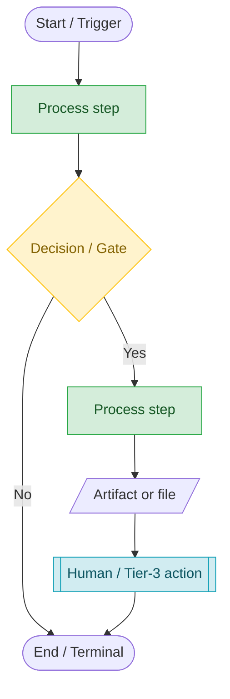
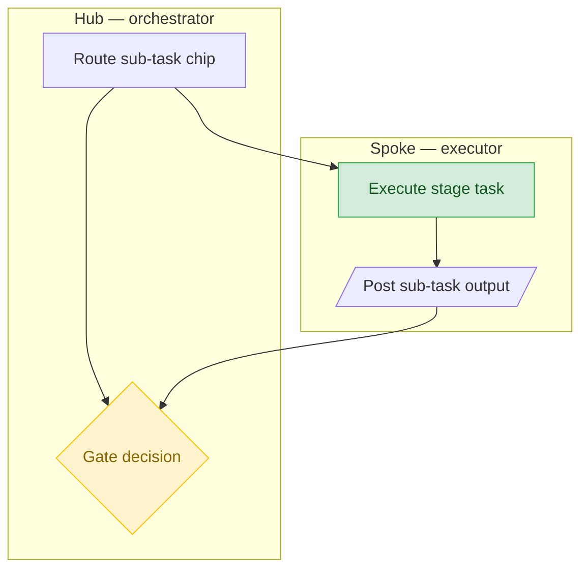

<!-- reference-durability: allow-link -->
# Process-Flow Diagram Standards

**Status:** Canonical
**Owner:** `core/standards/process-flow-diagram-standards.md`
**Introduced:** 2026-05-15
**Consumers:** Every skill or reference doc that authors/modifies a process-flow diagram. The retrofit track consumes the Adoption § Exemptions Registry anchor.
**Cross-references:** see § Related References at the foot of this file.

## Purpose

This document is the canonical authority for process-flow diagrams authored or materially modified going forward. It codifies the Mermaid syntax template, swimlane notation idiom, and color/shape grammar that every skill and reference doc consumes when depicting a workflow, and codifies the existing plain-fence ASCII flow-block as an accepted lightweight alternative governed by the binary decision rule below. Process-flow diagram style was inconsistent across skills previously; this standard makes the conventions explicit and consistent going forward.

## Scope & Diagram-Form Decision Rule

- Use **Mermaid** when the flow has ≥1 decision/gate node **OR** ≥2 actors (swimlanes) **OR** is cited as canonical by a skill/reference doc.
- Use the **ASCII flow-block** (plain ` ``` ` fence) when the flow is a linear stage/step sequence with no branching and ≤1 actor (e.g., the pipeline implementation-sequence block). ASCII blocks are **accepted, not deprecated** — the right tool for linear sequences.

## Mermaid Syntax Template



## Swimlane Notation Example



> Mermaid has no native swimlane primitive in `flowchart`; **`subgraph NAME[Label] … end` per actor is the standard lane idiom**. Rejected alternative `sequenceDiagram` participants — platform flows are activity flows, not message sequences (rationale recorded in § Design Rationale).

## Color / Shape Grammar

| Element | Mermaid syntax | Semantic | classDef | Fill / Stroke |
|---|---|---|---|---|
| Terminal | `([text])` stadium | Start / trigger / end | — (shape only) | default |
| Process step | `[text]` rect | Automated / agent action | `automated` | `#D4EDDA` / `#28A745` |
| Decision / Gate | `{text}` rhombus | Branch, stage-gate, QA checkpoint | `gate` | `#FFF3CD` / `#FFC107` |
| Artifact / file | `[/text/]` parallelogram | File / comment / document produced or consumed | — (shape only) | default |
| Human / Tier-3 | `[[text]]` subroutine | Operator / irreducible-human action | `human` | `#D1ECF1` / `#17A2B8` |
| External system | `[(text)]` cylinder | GitHub / Cowork / external dependency | `external` | `#E2E3E5` / `#6C757D` |
| Risk / blocked | any shape `:::risk` | Blocked path, risk surface, rollback edge | `risk` | `#F8D7DA` / `#DC3545` |
| Swimlane | `subgraph NAME[Label] … end` | Actor / role lane | — | default |

(Palette is Mermaid-`classDef`-expressible, WCAG-AA text contrast, 5 classes — deliberately minimal so authors can reproduce without a design system.)

## ASCII Flow-Block Convention

The plain-fence ASCII flow-block is the dominant existing form platform-wide — currently exactly one Mermaid diagram exists; every other flow is a plain-fence ASCII block. It is **accepted, not deprecated**: the right tool for a linear stage/step sequence with no branching and ≤1 actor, per the binary rule in § Scope & Diagram-Form Decision Rule. Authors use a plain triple-backtick fence with nodes connected by `→` or `-->` arrows in reading order. Canonical example — the pipeline implementation-sequence block:

```
Stage 5 Solutioning:   Spec-A ∥ Spec-B    (parallel)
   → Collective Review  (release gate — scope-lock)
Stage 6 Engineering:   Spec-A → Spec-B    (serialized)
   → Stage 7 Dev Testing → Stage 8 QA → Stage 9 Plan Review → Stage 12 Execute → Stage 13 Close
```

Promote to Mermaid (per § Scope & Diagram-Form Decision Rule) the moment the flow gains a decision/gate node, a second actor, or a canonical citation.

## Adoption

**Scope: FORWARD-ONLY.** This standard governs every process-flow diagram **when authored or materially modified**. Diagrams that predate this standard's adoption are **grandfathered** — not retroactively non-conformant, requiring no change to remain valid.

**Retroactive retrofit is explicitly OUT OF SCOPE for this standard.** Migrating pre-existing skill/reference diagrams to this standard is tracked separately (HARD-depends on this standard). The retrofit track owns the roster audit, per-skill `pmo-skill-editor` routing, `.skill` rebuilds, and the going-forward conformance-check question.

**Conformance trigger:** a diagram becomes in-scope the first time its enclosing fenced block is added or edited. Editing surrounding prose without touching the diagram does **not** trigger conformance.

### Diagram Inventory & Exemptions Registry

The retrofit track's one-time corpus audit recorded the diagram inventory and per-diagram conformance classification below. The inventory is **re-derivable** from the survey commands stated in the header — it is a snapshot of the audit's result, not a hand-maintained list. Three classes apply: **conforming** (Mermaid per the grammar, or an ASCII linear flow-block grandfathered by the § Scope decision rule), **needs-retrofit** (an ASCII flow-block carrying a decision/gate node or ≥2 actors — the rule mandates Mermaid — or a Mermaid block violating the shape grammar), and **exempt-with-rationale** (meets a needs-retrofit trigger but is intentionally kept non-conforming for a stated reason). Only exempt rows populate the Exempt-since / Rationale columns; conforming rows leave them `—`.

**Inventory derived:** 2026-06-25 at commit `e87bb22` via the two-surface enumeration. Surface A (Mermaid, deterministic) counts fenced `mermaid` blocks (lines opening a triple-backtick `mermaid` fence) across `core`, `release`, and `operations`, recursively — token mentions with zero opening fence are discarded. Surface B (plain-fence ASCII flow-blocks, eyeball-bounded per the § Scope decision rule — a naive arrow grep returns ~496 prose-laden files and is not an inventory; the rule grandfathers linear blocks, so Surface B hunts only the exceptions that carry a decision node or ≥2 actors). **Count observed:** 5 Mermaid fenced blocks across 4 diagram-bearing files, plus 1 grandfathered ASCII linear block in this standard; one in-scope ASCII flow-block carrying gate nodes was found to need retrofit (Surface B). Two grep hits were excluded as token-only false positives with zero diagram fences (`planning-solutioning-handoff.md` — "flowchart" in prose; the v2.23 release plan — prose referencing this very audit).

| Diagram (file:anchor) | Form | Class | Exempt since | Rationale | Tracking |
|---|---|---|---|---|---|
| `core/standards/process-flow-diagram-standards.md` § Mermaid Syntax Template | Mermaid | conforming | — | — | — |
| `core/standards/process-flow-diagram-standards.md` § Swimlane Notation Example | Mermaid | conforming | — | — | — |
| `core/standards/process-flow-diagram-standards.md` § ASCII Flow-Block Convention (pipeline implementation-sequence block) | ASCII (linear) | conforming | — | — | — |
| `core/standards/km-governance-framework.md` § 4.2 (4-step retirement flow) | Mermaid | conforming | — | — | — |
| `core/standards/universal-vs-localized-context.md` § 10.2 (R1–R4 reference-form decision tree) | Mermaid | conforming | — | — | — |
| `release/skills/release-planner/references/release-plan-template.md` (bundle dependency `graph LR`) | Mermaid | conforming | — | — | — |
| `release/references/standards/design-exploration.md` § 7 (Tier-A process-flow artifact) | ASCII (2 gate nodes; cited-as-canonical) | needs-retrofit | — | — | reactive retrofit issue (route via `pmo-skill-editor` discipline) |

**Needs-retrofit note (1).** `design-exploration.md` § 7 is a self-declared Tier-A *process-flow* artifact carrying two `GATE` decision nodes and an explicit canonical citation, rendered as a plain-fence ASCII block. Per § Scope & Diagram-Form Decision Rule, a gated and/or cited-as-canonical flow MUST use Mermaid. The block's enclosing fence was authored after this standard's adoption and materially modified thereafter (the worked-example revision that reshaped the Step-1 box), so it is **in-scope (not grandfathered)**. The retrofit is reactive — a follow-up issue redraws this single block in Mermaid per the grammar; the file is a reference doc (not a packaged skill), so no `.skill` rebuild applies. No diagram was classified exempt-with-rationale (the registry's Exempt-since / Rationale columns stay empty above).

## Design Rationale

Inline options analysis (no separate ADR Issue — single reasonable approach per doc-standard; mirrors `five-function-spine-and-process-flows.md`'s ADR-pointer pattern, lighter).

**Why subgraph-as-lane.** Mermaid has no native swimlane primitive in `flowchart`; `subgraph NAME[Label] … end` per actor is the standard lane idiom. Rejected alternative `sequenceDiagram` participants — platform flows are activity flows, not message sequences.

**Why dual-form (Mermaid + ASCII).** Only one Mermaid diagram exists platform-wide; the dominant existing form is plain-fence ASCII. A Mermaid-only standard would be honored in the breach and would maximally inflate the retrofit surface. The standard therefore codifies both Mermaid (AC-required, preferred for branching/multi-actor) and the ASCII flow-block as an accepted lightweight alternative, governed by the binary decision rule.

**Why the `five-function-spine-and-process-flows.md` consumer.** AC2 requires the standard be cited as canonical authority with a resolving reference link; an orphan file nothing points to is not "cited." `five-function-spine-and-process-flows.md` is the platform's self-declared process-flow anchor, already owns a citation registry, is single-source (no mirror pair / no `deploy.sh --check` Check 9 interaction), and is not a high-traffic surface (inter-issue contention stays zero). Rejected `canonical-skill-structure.md` (dual-gate-enforced, high-traffic, expands blast radius into Checks 6–10; also too narrow — reference docs author diagrams too) and `architecture-overview.md` (structural map, does not enumerate reference docs by filename, out-of-pattern).

## Related References

- [`design-artifact-standard.md`](../standards/design-artifact-standard.md) — META / parent framework for all 7 design-artifact flow types; this standard governs the process-flow class specifically. Composed per `design-artifact-standard.md` § 6 Tool Selection.
- [`five-function-spine-and-process-flows.md`](../disciplines/five-function-spine-and-process-flows.md) — the platform's self-declared canonical anchor for cross-cutting process flows; reciprocates the inbound citation from its § Related References.
- [`terminology-glossary.md`](../specs/terminology-glossary.md) — canonical term definitions (Function, Process, Methodology, Framework).
- [`pipeline/README.md`](../../release/references/pipeline/README.md) — 13-stage pipeline reference directory.
