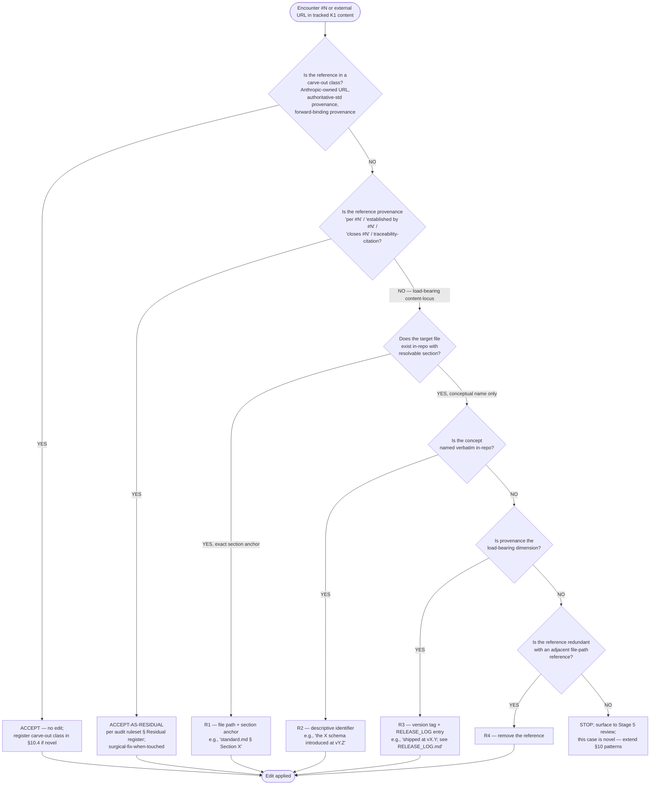

<!-- reference-durability: allow-link -->
<!-- reference-durability: allow-url -->

# Universal-Protocol vs. Localized-Context Standard

## Purpose

This standard is the **enforcement layer** on the universality axis. It does **not** define the axis, the tier classifier, or the leakage rubric — those are owned by [`knowledge-architecture.md`](../disciplines/knowledge-architecture.md), which [§5 Boundaries](../disciplines/knowledge-architecture.md#boundaries) of that document explicitly contracts: *knowledge-architecture owns the model; this standard owns the audit + enforcement layer on it.*

The division of ownership is fixed and non-negotiable (restating knowledge-architecture here would violate [`duplicate-source-discipline.md`](duplicate-source-discipline.md) — register-or-remove):

| Concern | Owner | This standard's relationship |
|---|---|---|
| The *principle* (universal ↔ contextual) | knowledge-architecture [§2 universality axis](../disciplines/knowledge-architecture.md#two-axes) | **Cite.** §1 states the authoring *consequence*; it does not redefine the axis. |
| The *classifier* (Q1 universality test, K1–K5) | knowledge-architecture [§1 tier-classifier](../disciplines/knowledge-architecture.md#tier-classifier) | **Cite.** §2's decision test is the authoring-facing localization of Q1, not a fork. |
| The *parameterization seam* (K1↔K2/K3) | knowledge-architecture [§3 seam](../disciplines/knowledge-architecture.md#parameterization-seam) | **Cite.** DC5 *tests* the seam; the positive exemplar is reused, not re-derived. |
| The *4-class rubric* (TRUE-LEAK / PARAMETERIZED-OK / ILLUSTRATIVE / GENERIC-ROLE) | knowledge-architecture [§4](../disciplines/knowledge-architecture.md#local-context-leakage-register) | **Reuse verbatim** as register disposition vocabulary. No parallel taxonomy. |
| The *operational decision test* | **this standard (§2)** | Owned — the gap knowledge-architecture left. |
| The *committed audit-dimension list* | **this standard (§3)** | Owned — knowledge-architecture §4 scan-signatures are "not exhaustive"; this commits the dimensions. |
| The *embedded-vs-teaching test* | **this standard (§5)** | Owned — knowledge-architecture applied ILLUSTRATIVE by judgment; this makes it decidable. |
| The *authoring guardrail* | **this standard (§7, spec only)** | Owned (spec). Implementation deferred to the `deploy.sh` Check-N follow-up (G-1). |

Intra-corpus links use **workspace-rooted absolute form** per the workspace-rooted-links ADR decision #3 — depth-invariant, resolved by `check-doc-links.py` workspace-root fallback and GitHub web rendering.

---

## §1 Principle — universal protocol vs. localized context

The platform corpus mixes two content types that look identical at the byte level but behave oppositely under portability: **universal protocol** (best-practice frameworks, stage gates, schemas, decision tests — true-and-useful verbatim for *any* PMO-platform deployment) and **localized context** (the org's name, owner identity, vendors, project keys, cadence norms — true only for *this* engagement). The structural model, the universality axis that separates them, and the proof that *custom ≠ contextual* are defined once in [`knowledge-architecture.md` §2](../disciplines/knowledge-architecture.md#two-axes) and the [parameterization seam in §3](../disciplines/knowledge-architecture.md#parameterization-seam). This standard does not redefine them.

The **authoring consequence** — the part this standard owns — is a single obligation: *a universal (K1) artifact MUST reference a localized parameter by pointer, never embed the localized value as a literal.* Universal protocol is read from canonical corpus paths (`core/`, `{core,operations,release}/skills/*/SKILL.md`, `core/rules/`); localized context is read from a declared, queryable source (`/CLAUDE.md` § Workspace Owner for K2/K3 values; `projects/[Project]/` for K4). A K1 file that hardcodes a K2–K5 literal has breached the seam and is, by definition, a **TRUE-LEAK** in the [knowledge-architecture §4 rubric](../disciplines/knowledge-architecture.md#local-context-leakage-register). Naming the principle creates the authoring obligation; §2 makes it checkable, §3 makes the audit systematic, §5 stops it from over-flagging teaching examples, and §7 specifies the guardrail that catches new leaks at the authoring path.

---

## §2 Decision test

Apply this checklist to any localized-looking literal encountered while authoring or auditing a Layer-1 (K1) file. It is the **authoring-facing localization of the [knowledge-architecture Q1 universality test](../disciplines/knowledge-architecture.md#tier-classifier)** (per [`decision-discipline.md`](../disciplines/decision-discipline.md) M1 Localization) — not a competing classifier. Q1 answers *"which tier?"*; this test answers *"is this a leak, and what do I do about it?"*

- **Q1 — Verbatim-portability.** Would this exact string be true-and-useful, unchanged, for a *different* org or project running the platform? **NO →** it is contextual (K2–K5); continue. **YES →** it is K1; stop, not a leak.
- **Q2 — Operative-coupling.** Does any platform control-flow, routing rule, or generated-output template *key on this specific literal* (behavior changes if the literal changes)? **YES →TRUE-LEAK** regardless of presentation — this is the portability blocker; go to §6 for disposition.
- **Q3 — Parameter-availability.** Does a declared parameter home exist for this value (`/CLAUDE.md` § Workspace Owner, `projects/[Project]/PROJECT.md`, an OOM parameter)? **YES →** the fix is *parameterize against that home* (the [`daily-status/SKILL.md:97`](../../operations/skills/daily-status/SKILL.md) pattern). **NO →** disposition is *extract* (create the parameter home first) or *accept-with-rationale*.
- **Q4 — Substitution-discoverability.** Reading *only this unit* (section / code block / table / ±3 lines), could a second portfolio identify the literal as theirs-to-replace without external knowledge? **YES →** if Q2 is also NO, it is a teaching example (§5) — register-but-defer. **NO →** it is embedded leakage even if not operative.

The test resolves to exactly one of the four [knowledge-architecture §4 classes](../disciplines/knowledge-architecture.md#local-context-leakage-register). §5 formalizes the Q2/Q4 interaction as a decidable truth table.

---

## §3 Audit dimension list

The audit examines five committed dimensions. The informational D1–D8 starter set from the original intake (2026-04-26) was cut **8 → 5**: a dimension earns its place only if it maps to a *distinct [knowledge-architecture K-tier](../disciplines/knowledge-architecture.md#five-tier-classification)* **and** a *distinct disposition* — otherwise it is a register column that does not change the action (governance debt per CLAUDE.md "prefer durable structures"). This is the durable home of the cut justification; no separate ADR exists (per §8 and [`duplicate-source-discipline.md`](duplicate-source-discipline.md) — a separate ADR restating this would itself be a duplicate source).

| Committed dimension | K-tier | Absorbs | Observable signature (the grep family) | Default class | Disposition |
|---|---|---|---|---|---|
| **DC1 — Organizational identity** | K3 + K2-identity | D1 | Owner/person names, person-tied role strings, org name (`[COMPANY_X]`), phone/email/PII patterns | **TRUE-LEAK** (highest severity) | extract → parameterize against `/CLAUDE.md` § Workspace Owner |
| **DC2 — Institutional systems & vendors** | K3 | D2 + D7 channel signature | Named tools/vendors/systems/channels (`Smartsheet`, `Jira`, `Confluence`, `Teams`, specific MCP-server names) at a point where a parameter should be read | TRUE-LEAK or ILLUSTRATIVE (per §5) | parameterize / declare config source |
| **DC3 — Project identifiers & instance paths** | K4 | D3 **+ D4** | Project keys (`[PROJECT_KEY]`), project folder names, hardcoded `projects/<Project>/…` paths, `<KEY>_*` filename prefixes | mostly ILLUSTRATIVE; TRUE-LEAK iff operative | accept-as-example / parameterize iff operative |
| **DC4 — Operating-model assumptions** | K2 OOM | D5 **+ D6 + D8** | Hardcoded delivery-approach / cadence (`daily status`, `Monday steerco`) / sign-off / compliance-framework literals where the OOM parameter should be read | TRUE-LEAK or ILLUSTRATIVE | parameterize against the OOM parameter; **applicability-framework boundary — see note** |
| **DC5 — Parameterization-seam integrity** *(net-new)* | structural / cross-cutting | — | A K1 artifact that *legitimately needs* a K2–K5 value: does it reference the parameter (the `daily-status:97` pointer pattern) or embed the literal? | adjudicates PARAMETERIZED-OK / GENERIC-ROLE vs. leak | n/a — it is the verdict dimension and the guardrail's hook |
| **DC6 — Reference-durability** *(net-new)* | structural / cross-cutting | — | A K1 artifact cites an external GitHub Issue / Milestone / PR (`#N` bare or full URL) as **load-bearing content-locus** — the cited target is named as the authoritative source for in-scope content; a consumer cannot resolve the reference without leaving the repository | adjudicates RESOLVES-IN-REPO vs. EXTERNAL-OFF-RAMP per §10 | parameterize against in-repo target (file path + section anchor) OR descriptive identifier OR version-tag + `RELEASE_LOG.md` entry OR remove-when-redundant per §10.3; carve-outs §10.4 |

**The 8 → 5 cut — justification (durable home; no separate ADR):**

- **D3 ⊕ D4 → DC3.** Same K4 leak (project-instance literal), two surface forms (bare key vs. path embedding the key). [knowledge-architecture §4](../disciplines/knowledge-architecture.md#local-context-leakage-register) treats them together. Separate dimensions would produce identical dispositions on correlated rows → a column with no action. **Merged.**
- **D5 ⊕ D6 ⊕ D8 → DC4.** Methodology, cadence, and governance/compliance norms are the same K2-OOM-value tier with the same disposition (parameterize against the OOM parameter) and the same applicability-framework boundary. D8 (compliance frameworks) additionally has near-zero observable signature today — no embedded SOX/HIPAA/GDPR literals exist — so a standalone D8 would yield zero findings and break the "≥1 finding per dimension" acceptance criterion. **Merged; compliance is a register-if-found sub-signature.**
- **D7 → folded into DC2 / dropped.** Channel literals (`Teams`, `Slack`) *are* DC2 vendor/system signatures. Format choice (Markdown / `.pptx` / `.docx`) is a **universal platform capability**, not localized context (same class as the universal 01–08 project scaffold). A "Markdown is assumed" finding is not a portability blocker. **Only the real leak (named channel) is absorbed into DC2.**
- **DC5 added (net-new) — the decisive call.** DC1–DC4 are *content detectors* (what leaked). The principle's actual subject is the *seam* ("reference the parameter, never the value"). The knowledge-architecture positive exemplar ([`daily-status/SKILL.md:97`](../../operations/skills/daily-status/SKILL.md)) and its PARAMETERIZED-OK / GENERIC-ROLE classes are *seam-honored states*, not content — they have no home in a pure content-family taxonomy. Without DC5 the audit catalogs symptoms and cannot express "this one is correct *because* it points at the parameter." DC5 is also exactly the surface the §7 authoring guardrail enforces; omitting it would leave the guardrail un-anchored.

**DC4 → applicability-framework boundary note.** DC4 detects an *OOM value leaking into a K1 container*. It does **not** assess whether the platform *model itself* (the 13-stage pipeline, the 01–08 scaffold) is portable across methodologies — that is [`applicability-framework.md`](../disciplines/applicability-framework.md) territory. Flagging the universal scaffold or pipeline as a "leak" is audit over-reach; DC4 bounds it out. This is the R3 scope-hold expressed at the dimension layer.

---

## §4 Worked example — each class referencing the other

The seam is honored when each class reads the other through a declared interface, never by embedding.

**(a) Universal protocol correctly *reading* localized context — the canonical positive exemplar.**
[`daily-status/SKILL.md:97`](../../operations/skills/daily-status/SKILL.md) — a K1 skill instruction:

> `- **Strikethrough owner's items:** Items assigned to the workspace owner (from CLAUDE.md)`

The universal protocol (strikethrough the owner's action items) needs a K3 value (*who is the owner?*). It references the parameter by pointer — `(from CLAUDE.md)` — and never names the person. A second portfolio changes `/CLAUDE.md` § Workspace Owner and the skill is correct unchanged. This is the [knowledge-architecture §3 positive exemplar](../disciplines/knowledge-architecture.md#parameterization-seam); every new or edited K1 artifact MUST follow it at the seam.

**(b) Localized context correctly *declared as a queryable source*.**
[`/CLAUDE.md`](<OPERATOR_INSTANCE_CLAUDE_MD>) § Workspace Owner is the declared K3 parameter home: *"[OPERATOR_NAME] — Senior Program Manager / Technical Program Manager at [COMPANY_X]."* The localized value lives in exactly one place, at a path every agent knows. The two classes reference each other through this single interface — universal protocol points *in* (`(from CLAUDE.md)`); localized context is published *out* (one § in one file). Neither embeds the other. Replacing the engagement is then a one-file edit, which is the entire portability claim the Product Vision asserts.

---

## §5 Embedded-vs-teaching-example test

A localized literal in a K1 file is often a **deliberate teaching example** that improves readability (e.g., `Example: ABC_FDD_Review_FDD002_2026-03-18.md`). The audit must not flag these, or it over-reaches and the guardrail becomes noise. This test makes the knowledge-architecture judgment-applied ILLUSTRATIVE class a **predicate**.

**The Parameterized-Form Co-location Test.** A localized literal is a TEACHING EXAMPLE (class ILLUSTRATIVE; register-but-defer; **no** issue-draft) **iff ALL THREE hold**:

- **C1 — Parameterized form co-located.** The universal/parameterized form it instantiates appears in the *same readable unit* (same section, code block, table, or ±3 lines). Canonical PASS: [`artifact-generator/SKILL.md:168-169`](../../operations/skills/artifact-generator/SKILL.md) — the parameterized convention `[ProjectAbbrev]_[ArtifactType]_[Identifier]_[Date].md` is stated immediately above the example `ABC_FDD_Review_FDD002_2026-03-18.md`.
- **C2 — Illustrative, not operative.** No platform control-flow, routing rule, or output template keys on the literal. Canonical FAIL: [`file-router/SKILL.md:54`](../../operations/skills/file-router/SKILL.md) — `- **Jira ticket references** matching project key patterns (e.g., ABC-### for [PROJECT_KEY])`: the routing logic *is* the example; there is no parameter surface; behavior keys on the literal.
- **C3 — Substitution-discoverable.** A second portfolio reading *only this unit* can identify the literal as theirs-to-replace without external knowledge (an `e.g.` / `Example:` / placeholder marker makes it self-evident).

**Truth table (operative-coupling is the single load-bearing discriminator):**

| Condition | Classification | Issue-draft? |
|---|---|---|
| C1 ∧ C2 ∧ C3 | **ILLUSTRATIVE — teaching example** | No (register-but-defer) |
| **¬C2** (operative — control flow keys on the literal) | **TRUE-LEAK** *(regardless of C1/C3 — the portability blocker)* | Yes if ≥ MEDIUM (§6) |
| C2 ∧ ¬(C1 ∧ C3) (inert sample data, no parameterized surface) | **ILLUSTRATIVE — LOW** | No (defer / accept-as-example) |
| References a parameter / generic role (`workspace owner (from CLAUDE.md)`) | **PARAMETERIZED-OK / GENERIC-ROLE** | No (not a leak — seam honored; DC5 PASS) |

Only **¬C2 (operative coupling)** forces TRUE-LEAK irrespective of presentation. That is the precise boundary between "blocks a second portfolio" and "helps a reader" — the side-by-side PASS ([`artifact-generator:168-169`](../../operations/skills/artifact-generator/SKILL.md)) vs. FAIL ([`file-router:54`](../../operations/skills/file-router/SKILL.md)) is the calibration pair.

---

## §6 Severity threshold & disposition vocabulary

**Disposition vocabulary** — the [knowledge-architecture §4 rubric](../disciplines/knowledge-architecture.md#local-context-leakage-register), reused verbatim (no parallel taxonomy): **TRUE-LEAK** · **PARAMETERIZED-OK** · **ILLUSTRATIVE** · **GENERIC-ROLE**. Disposition actions: **extract** (create parameter home, then point), **parameterize** (point at existing home), **move** (relocate to the correct layer), **accept-with-rationale** (documented residual).

**Severity scale:** **LOW** (cosmetic; a second portfolio works around it trivially) · **MEDIUM** (a second portfolio must edit a K1 file to adopt the platform) · **HIGH** (operatively emitted into generated output, or carries PII).

**Committed issue-draft threshold:** an `issue-drafts/NNN-*.md` is **REQUIRED iff `class = TRUE-LEAK` ∧ `severity ≥ MEDIUM` ∧ `embedded-vs-teaching = FAIL`.** This is the knowledge-architecture §4 MEDIUM+ triage bar, reused not reinvented. Findings below the threshold are registered with a disposition and deferred (no draft) — they remain visible for opportunistic remediation but do not each spawn an issue (the R3 scope-hold: this standard ships the standard + register + **one** proof-of-mechanism remediation; every other qualifying finding gets its own follow-up Issue with its own triage).

---

## §7 Authoring guardrail (specification only — implementation deferred)

The guardrail is a **signal, not a verdict**. The embedded-vs-teaching adjudication (§5) has a judgment component; a pure regex over-flags. The guardrail emits *candidate DC1–DC4 signatures* on the authoring path; the C1–C3 adjudication remains a human/skill review act.

**Selected mechanism — `deploy.sh --check` Check-N** (chosen over pre-commit hook and skill-gate options):

| Property | Specification |
|---|---|
| **Coverage** | ALL Layer-1 files (governance + `reference/` + `.claude/rules/` + `skills/*/SKILL.md` + skill `references/`). Non-skill files (`OPERATIONS.md`, `reference/`) carry the worst leaks — only a `deploy.sh` check reaches them. |
| **Signatures** | DC1–DC4 regex families (person/org names, vendor/system names, project-key patterns, OOM-cadence literals, phone/email PII patterns). |
| **Allowlist** | `.claude/skip-localized-context-check.txt` — one pattern per line, `#` comments, documents WHY each path is exempt (modeled on `.claude/skip-doc-link-check.txt`). |
| **Posture** | warn-mode initial (shakedown), → enforce per the [`bypass-mode-readiness.md`](../rules/bypass-mode-readiness.md) Shakedown → Enforce checklist. Exact Check 14/15 ([doc-link-maintenance](../rules/doc-link-maintenance.md)) precedent. |
| **Contract** | Emits candidate signatures to a warn-log; does NOT classify TRUE-LEAK vs. ILLUSTRATIVE (that is the §5 review act). Signal, not verdict. |

**Why not the alternatives:** a **pre-commit hook** cannot do the C1–C3 judgment → pure-regex false positives create `--no-verify` pressure, which CLAUDE.md forbids normalizing. A **pmo-skill-editor Mode-D dimension** or **pmo-qa-auditor checklist item** covers `SKILL.md` only and misses the non-skill `OPERATIONS.md` / `reference/` leaks (the worst ones) and is not PR-automatic.

**In-scope vs. deferred (the downstream-ripple discipline):**

| ID | Item | Status |
|---|---|---|
| (in scope) | This standard + the audit register + **one** proof-of-mechanism remediation | Shipped |
| **G-1** | `deploy.sh` Check-N implementation + `.claude/skip-localized-context-check.txt` creation | **Already tracked**. Do not re-create. |
| **G-2** | `pmo-skill-editor` Mode-D gains a parameterization-seam (DC5) dimension; cite this standard | Own triage, no milestone |
| **G-3** | `pmo-qa-auditor` Principal-Standard checklist gains a universality/seam competency | Own triage, no milestone |
| **G-4** | Pre-commit-layer evaluation — only if Check-N warn-mode shakedown shows deploy-time is too late | Own triage, gated on G-1 shakedown |
| **G-5** | [`knowledge-architecture.md`](../disciplines/knowledge-architecture.md) §4 ↔ this register reconciliation (pointer or supersede-marker) | Knowledge-architecture governance edit, NOT this standard's scope |

---

## §8 Boundaries

Compose, do not restate. Each row names a doc this standard touches and the action taken.

| Boundary | Relationship | Action |
|---|---|---|
| [`knowledge-architecture.md`](../disciplines/knowledge-architecture.md) | Owns the model: universality axis, K1–K5 classifier, parameterization seam, 4-class rubric, the bounded §4 snapshot register. | **Cite only.** This standard is the enforcement layer that knowledge-architecture §5 explicitly contracts. No redefinition. |
| [`applicability-framework.md`](../disciplines/applicability-framework.md) | Owns *model* methodology-portability (is the pipeline/scaffold itself portable?). DC4's deferred half. | Cross-reference. DC4 bounds out the model-portability question. |
| [`anthropic-base-vs-build-registry.md`](../specs/anthropic-base-vs-build-registry.md) | Owns the orthogonal *authorship* axis (base ↔ custom). | Cross-reference; the base-vs-build registry already proves authorship cannot detect leaks. |
| [`duplicate-source-discipline.md`](duplicate-source-discipline.md) | Register-or-remove. The reason this standard cites knowledge-architecture instead of restating it. | Comply. No parallel taxonomy; no separate ADR for the §3 cut. |
| [`decision-discipline.md`](../disciplines/decision-discipline.md) | M1 Localization governs §2 being the authoring-localized form of knowledge-architecture Q1. | Cross-reference. |

---

## §9 Audit register convention & D8 citation contract

The complete audit is produced under the CLAUDE.md analysis-folder convention at `pmo-platform/analysis/universal-vs-localized-context-audit-YYYY-MM-DD/` — `SUMMARY.md` + 9-column register + `issue-drafts/NNN-*.md`. The register's row schema and sizing discipline are specified in that folder's `SUMMARY.md`; it reuses this standard's §6 rubric and threshold and **acknowledges [knowledge-architecture §4](../disciplines/knowledge-architecture.md#local-context-leakage-register) as the bounded precursor it supersedes** (relationship declared; the §4 *edit itself* is deferred G-5).

**D8 citation contract (the register's citation law):** the audit executes **strictly at or after the reorg merge SHA on `main`** — no pre-reorg SHA pin (a pre-reorg pin would make every register citation point at paths that no longer exist post-reorg). All register `file:line` citations use **post-reorg paths**. The audit's `SUMMARY.md` frontmatter records the post-reorg merge-base SHA it ran against. This closes citation-staleness by sequencing, not by pinning, and is satisfied by the serialize topology.

---

## §10 Reference-Durability Discipline (DC6)

> **Status:** Stage 6 Engineering (reference-durability release).
> **Scope:** Net-new 6th audit dimension peer to DC1–DC5. The existing §2 decision test, §5 embedded-vs-teaching test, §6 disposition vocabulary, and §6 severity scale apply unchanged.
> **Cutover:** Applies to all K1 authoring going forward. The discipline runs warn-mode with zero behavioral impact. Pre-existing content is governed by surgical-fix-when-touched per §10.5 residual register.

### §10.1 Principle — references resolve in-repo

A K1 artifact MUST resolve every cross-reference to a target inside `pmo-platform/` (and the workspace-rooted set: `CLAUDE.md`, `.claude/rules/`). External-target cross-references — GitHub Issues, Milestones, PRs that a consumer cannot resolve without leaving the package — break the self-containment contract. The principle applies forward-only to NEW content; pre-existing provenance citations are accepted-as-residual under the surgical-fix-when-touched rule.

The principle composes with the existing universality axis: §1 says "reference the parameter, never embed the value"; §10.1 says "reference content in-repo, never depend on an external locus." Both protect portability — the former for *localized values*, the latter for *content authority*. DC1–DC5 detect the former; DC6 detects the latter. The dimensions are independent; a single literal can fail DC1 (org name embedded) without failing DC6, and vice versa.

The decision test is operative-coupling-keyed exactly as §2 Q2:

- **Q1 — In-repo resolution.** Can a consumer (forker, agent, human reader) resolve the referenced content by reading files inside the repository? **YES →** PASS (RESOLVES-IN-REPO). **NO →** continue.
- **Q2 — Provenance vs. load-bearing.** Is the external reference *provenance* (the audit-acknowledged class — `(per #N)`, `(established by #N)`, `closes #N`, traceability-citation) OR *load-bearing content-locus* (the audit's TRUE-LEAK class — "Authoritative source: …", "See #N for the definition of …", "the state machine defined at #N")? **PROVENANCE →** PASS (audit-acknowledged residual). **LOAD-BEARING →** continue.
- **Q3 — Carve-out class.** Does the reference fall in one of the 3 §10.4 carve-out classes (Anthropic-owned URL / authoritative-standard provenance / forward-binding provenance)? **YES →** PASS (carve-out — register, do not edit). **NO →TRUE-LEAK** — apply §10.3 replacement pattern.

The Q1/Q2/Q3 ordering is the §10.2 decision tree formalized as prose. The §5 embedded-vs-teaching test does NOT apply directly to DC6 (DC6 is content-locus, not literal-leakage), but the same predicate-style structure (truth-table over decidable conditions) is used.

### §10.2 Decision tree

The decision tree governs Stage 6 authoring + Stage 5 design selection of which replacement pattern (R1–R4) applies to a given `#N` instance. Gate nodes encode the §10.1 rubric; branches encode the replacement choice. Per [`process-flow-diagram-standards.md`](../specs/process-flow-diagram-standards.md) decision rule (≥1 gate, ≥1 actor): mermaid with gate nodes.

### §10.3 The 4 replacement patterns

The 4 replacement patterns codified here cover all observed legitimate use cases at the audit substrate (verified 2026-05-27 against `pmo-platform/analysis/self-containment-audit-2026-05-15/`). A 5th pattern is not needed; cases that escape these branches route to ESCALATE per §10.2.

| Pattern | When to apply | Example (in-corpus) |
|---|---|---|
| **R1 — file path + section anchor** | The target is durable in-repo content with a resolvable section anchor | `pmo-platform/reference/standards/return-value-schema.md § Schema` (preferred over `#N` issue link when the schema is restated in-repo) |
| **R2 — descriptive identifier** | The concept is named verbatim in-repo (file exists; conceptual name is the operative reference) | `the spoke return-value schema introduced in the pipeline-fitness-foundation release` (preferred over `#N` when the issue established the concept now codified) |
| **R3 — version tag + RELEASE_LOG entry** | Provenance is the load-bearing dimension; the target's authoritative content lives in the release log | `shipped at vX.Y; see release/releases/RELEASE_LOG.md` (preferred over a bare `#N` issue link when "when did this ship" matters more than "what issue established it") |
| **R4 — remove when redundant** | An adjacent file-path reference already covers the citation; the `#N` is provenance noise | In `(per [universal-vs-localized-context.md](universal-vs-localized-context.md))` the bare `#N` is redundant with the file-path reference — remove the `#N`, keep the file-path |

### §10.4 Carve-outs (3 explicit exemption classes)

Carve-outs apply rubric-wide; they are NOT per-file allowlist entries. Operator decision to add a new carve-out class follows §8 Change Protocol (Issue + plan + approval per CLAUDE.md "No ungoverned changes"). All three carve-outs share the same logical shape: the reference is `#N` or URL-form, BUT the content is operable standalone in-repo OR the URL is a structural runtime dependency.

| Carve-out | Class | Test | Examples |
|---|---|---|---|
| **Anthropic-owned URLs** | structural runtime dependency | URL hostname matches `*.claude.com`, `github.com/anthropics/*`, `anthropic.com` | `https://github.com/anthropics/claude-code/issues/N`, `https://code.claude.com/...`, `https://platform.claude.com/...`. Operator policy 2026-05-15: the platform is built on the Claude Code / Agent SDK runtime; that dependency is structural. |
| **Authoritative-standard provenance** | non-Anthropic external standard cited as provenance with in-repo gloss | The standard's load-bearing content is restated in-repo within ±3 lines OR within the same section; the external URL is provenance only | `pmo-platform/reference/standards/release-notes-standard.md` Keep-a-Changelog citation (the six change-type labels are enumerated verbatim in the same file at the labels table — the external URL is provenance for "where this convention comes from", not load-bearing for "what the six labels are") |
| **Forward-binding provenance** | TODO / deferral block citing a future issue where the doc is operable standalone | The `#N` is forward-binding pointer (issue not yet shipped); content is fully described in-prose; consumer can act on the content without resolving the `#N` | `release/skills/implementation-planner/SKILL.md:376-386,542` deferral TODO block; `release/skills/pmo-skill-refiner/SKILL.md:241-244` session-canonicity ownership boundary. The `#N` asserts ownership/timing pointer; the failure mode / behavior is operable as written. |

**Carve-out hygiene note:** carve-outs are operator-policy-grade exemptions, NOT individual-file allowlist entries. The `.claude/skip-localized-context-check.txt` allowlist may seed carve-out classes (per the Check 25 DC6 implementation in `deploy.sh`) for known forward-binding patterns; the rubric-level carve-out is the binding decision.

### §10.5 Audit register restatement (per BUNDLE AMENDMENT D-AuditRetention)

The 2026-05-15 audit at `pmo-platform/analysis/self-containment-audit-2026-05-15/` produced the 3-class taxonomy + 5-row findings table restated here verbatim. The audit folder itself may be extracted (per D-Taxonomy class C3 — operator decision at Collective Review) or preserved in-repo; this §10.5 makes the discipline self-contained regardless of outcome.

#### §10.5.1 3-class taxonomy

The audit decomposes the self-containment principle into three orthogonal axes:

| Axis | Question | Owner |
|---|---|---|
| **Localized-value** | Are org-specific *values* (tenant, project key, vendor) parameterized? | Universal-Protocol vs. Localized-Context (this standard) |
| **Content-locus** | Is *content* restated in-repo, or does a doc cite an external GitHub issue/milestone/URL as its **authoritative source**? | DC6 (this §10) |
| **Personal-tool / operator-coupling** | Do operator-only tools (absolute paths, personal email, swap state) belong in a forkable surface at all? | Subagent security posture (SEC-03/05), account-switcher, path-coupling discipline |

#### §10.5.2 Audit findings table (provenance: audit dated 2026-05-15; see `release/releases/RELEASE_LOG.md` monolith-cleanup entry)

The audit produced 1 clean VIOLATION + 4 REVIEW-tier findings on the content-locus axis (DC6 scope). Findings outside DC6 (Class 1 localized-value, Class 3 personal-tool) were routed to their respective owners via enrichment comments and are not restated here.

| Class | File:line | Evidence | Verdict | Disposition |
|---|---|---|---|---|
| **VIOLATION** | `pmo-platform/reference/standards/lifecycle-states-canonical.md:106,118,237,245` | "Authoritative source (until the protocol doc ships): the milestone description — defines the planned DRAFT → REVIEWED → APPROVED → PROMOTED → ARCHIVED state machine" | A canonical standards doc declares a GitHub milestone description as the authoritative definition of an in-scope state machine. A forker cannot read the upstream milestone. | **FIXED** — state machine restated inline per §3.2; see Tier 1 surgical-fix per-edit plan in the release plan |
| **REVIEW** | `pmo-platform/reference/standards/release-notes-standard.md:494` | "Keep a Changelog 1.1.0 — canonical source for the six change-type labels" | The 6 labels are enumerated in-repo (`§ The 6 Change-Type Labels`), so the doc is operable standalone; only the label *definitions* are external. | **DOWNGRADE-TO-ACCEPTABLE** per §10.4 carve-out 2 (authoritative-standard provenance class). No file edit needed. |
| **REVIEW** | `release/skills/implementation-planner/SKILL.md:376,378,384,386,542` | Deferral TODO block — explains what/why/when-it-lands self-containedly; the `#N` is provenance + forward-binding | Comprehensible standalone; the `#N` is a pointer, not the content. Not a hard violation. | **DOWNGRADE-TO-ACCEPTABLE** per §10.4 carve-out 3 (forward-binding provenance class). No file edit needed; allowlist seed at `.claude/skip-localized-context-check.txt`. |
| **REVIEW** | `release/skills/pmo-skill-refiner/SKILL.md:241,242,244` | Session-canonicity failure-mode fully described in-prose; cites adjacent ownership references as the external *ownership* boundary | Failure mode is operable standalone; the external refs assert ownership, not content. | **DOWNGRADE-TO-ACCEPTABLE** per §10.4 carve-out 3 (forward-binding provenance class). No file edit needed; allowlist seed at `.claude/skip-localized-context-check.txt`. |
| **VIOLATION** | `pmo-platform/reference/knowledge-base/operational-runbook.md:1361` | "Check [PROJECT_KEY] board directly at [[PROJECT_KEY] Board NNN](https://[OPERATOR_JIRA]/jira/software/c/projects/[PROJECT_KEY]/boards/NNN/)" — fully literal tenant URL; runbook-load-bearing link | Org-coupled hardcode in canonical runbook (Class 1 localized-value axis). | **PIGGYBACK** — Tier 1 surgical fix under residual-drainage (operator override on closed-owner residual); parameterize as `{{JIRA_BASE_URL}}` per §3 DC3 convention. | <!-- depersonalization-token: allow (illustrative VIOLATION example; the [OPERATOR_JIRA] quote represents the documented leak, not a live token) -->

#### §10.5.3 Residual register

| Item | Disposition |
|---|---|
| ~900 traceability-citation `#N` provenance refs across active Layer-1 corpus | **Accepted by design** per the PROVENANCE branch of the §10.2 decision tree. The governance model uses GitHub issues as the permanent record. Not findings. |
| NEW K1 content (`bundle-composition-doctrine.md`, `discovery-discipline.md`, `fission-convention.md`, `release-class-taxonomy.md`, `release-outcome-statement-template.md`, `release-readiness-scan-spec.md` — 126 `#N` references) | **Deferred to carry-forward** per Tier 2 [SCOPE CHANGE]. The discipline + Check 25 DC6 ships; a follow-up release executes the per-edit plan for the NEW content (`cluster: process-protocol` substrate with internal cross-references; mechanical scrub risks load-bearing-content loss). |
| Anthropic-owned doc URLs (`code.claude.com`, `platform.claude.com`, `github.com/anthropics/*`) | **Accepted by §10.4 carve-out 1** (Anthropic-owned URLs — structural runtime dependency). Operator policy 2026-05-15. |

---

## §11 Composition-surface durability layer

Files that ship as package-default seeds AND accumulate operator additions over time (e.g., the security-hook allowlists, deploy-check exemption lists) form a distinct category — **Composition-surface** — with its own install-time and update-time contract. Managed-section + operator-extension marker fences carve runtime files into a regenerable portion (from template + operator.toml) and a verbatim-preserved portion (operator additions).

The category contract, marker syntax, and regeneration semantics are owned by [`composition-surface-spec.md`](composition-surface-spec.md). This standard owns the **audit + enforcement layer** on the managed-section content (DC1-DC6 audit applies to managed-section content; the operator-additions section is operator-instance content per [`knowledge-architecture.md` §1](../disciplines/knowledge-architecture.md) and exempt from DC1-DC4 audit).

The composition between the two standards:

| Concern | Owner | This standard's relationship |
|---|---|---|
| Per-category install + update contract | [`composition-surface-spec.md` §1](composition-surface-spec.md) | **Cite.** This standard's audit applies to the managed-section content of composition-surface files. |
| Marker syntax (`=== BEGIN/END MANAGED SECTION ===`) | [`composition-surface-spec.md` §2](composition-surface-spec.md) | **Cite.** Fence syntax does not affect audit dimensions; it scopes them. |
| Regeneration semantics under `update.sh` | [`composition-surface-spec.md` §3](composition-surface-spec.md) | **Cite.** Regeneration cycle re-applies token substitution per [`depersonalization-spec.md`](depersonalization-spec.md); this standard's audit re-verifies post-regeneration content. |
