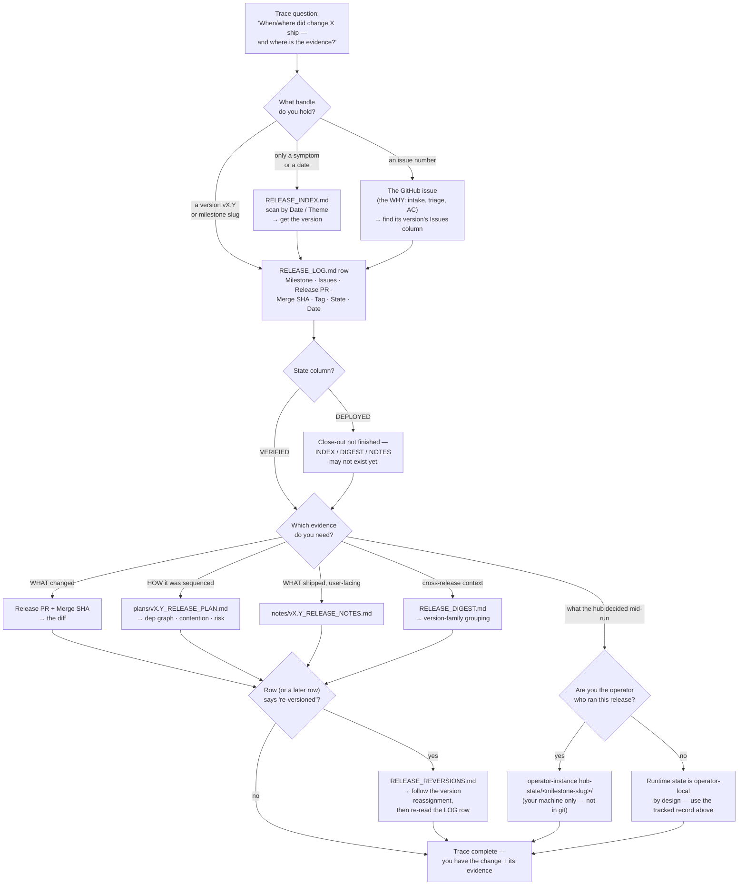

<!-- reference-durability: allow-link -->
# Release Record-Keeping — Tracing a Change Through the Record Trail

> The "where's the evidence?" guide. When you need to answer *"when and where did change X ship, and what's the proof?"* — an audit, an incident trace, a "did we ever ship that fix?" — this is the walk. It also explains **why release records live in two homes** and which surface is written at which stage, so the trail is navigable rather than mysterious.
>
> **Flow class:** Human process (per the [design-artifact standard's](../core/standards/design-artifact-standard.md) 7-flow-type taxonomy — steps a human operator takes through a workflow).
> **Tool:** Mermaid flowchart (text-based, GitHub-native, agent-readable).
> **Audience:** an operator tracing a release after the fact. This orients and links — it names each surface and points into the governing corpus for the normative detail; it does not restate the rules.

## The two homes (read this first)

Release records live in **two homes**, and knowing which is which is the whole key to tracing them. The split is governed by the [public-repo-vs-operator-instance taxonomy](../core/standards/public-repo-vs-operator-instance-taxonomy.md) — apply-test: *"does any participant outside the originating operator's session need to read this?"*

| Home | What lives here | In git? | Who reads it | Governed by |
|---|---|---|---|---|
| **Tracked corpus** — `release/releases/` root + `plans/` + `notes/` | `RELEASE_LOG.md`, `RELEASE_INDEX.md`, `RELEASE_DIGEST.md`, `RELEASE_REVERSIONS.md`, per-release `plans/vX.Y_RELEASE_PLAN.md`, `notes/vX.Y_RELEASE_NOTES.md` | **Yes** — tracked verbatim | Anyone, forever — the shared pipeline substrate and the permanent audit trail | taxonomy → **UNIVERSAL-PUBLIC** |
| **Operator-instance runtime** — `<OPERATOR_INSTANCE_HUB_STATE_PATH>/<milestone-slug>/` | `hub-state`: `pending-approvals.md`, `sessions.md`, `action-items.md` — the hub's live session-continuity state | **No** — only the schema *templates* ship; the runtime instance is per-machine | Only the **same operator's hub**, across sessions in one release | taxonomy → **OPERATOR-INSTANCE** |

**Why the split exists:** the tracked corpus is the durable, shared record — every downstream spoke, a future operator auditing what was planned, and `gh release create` all need it, so it is committed. Hub-state runtime mutates dozens of times per release and has no cross-operator readership, so tracking it would produce micro-commit noise for no benefit — it stays operator-local. The practical consequence for tracing: **if you are not the operator who ran the release, the runtime hub-state is gone by design — but the entire durable record is in the tracked corpus.** See [`release/releases/README.md` § Classification](../release/releases/README.md) for the per-surface breakdown.

## Which surface is written when

The trail is written across the pipeline, not all at once. Where each surface comes from:

| Surface | First written | Later updated | Home |
|---|---|---|---|
| `plans/vX.Y_RELEASE_PLAN.md` | Stage 4 (planning) | — | tracked |
| hub-state runtime (`pending-approvals`, `sessions`) | Hub session start, then each routing decision | continuously during the run | operator-instance |
| `RELEASE_LOG.md` row (state `DEPLOYED`) | [Stage 12 Phase B5](../release/references/pipeline/stage-12-execute.md) | → `VERIFIED` at Stage 13 | tracked |
| GitHub Release (`gh release create`) | Stage 12 Phase B5.5 | — | GitHub (out-of-repo) |
| `RELEASE_INDEX.md`, `RELEASE_DIGEST.md` | [Stage 13 close](../release/references/pipeline/stage-13-close.md) | append-only | tracked |
| `notes/vX.Y_RELEASE_NOTES.md` | Stage 13 close | — | tracked |
| `CHANGELOG.md` | Stage 13 (a transform of the notes) | — | tracked |

## The trace walk

Start from whatever handle you hold and follow the arrows. Every box is a real surface named above.

## Two things that surprise people

**Retention differs by home.** Tracked surfaces are *current-only + git history* — one canonical file, and `git log --follow <path>` is the version database (no snapshot directory). Operator-instance hub-state is *ephemeral* — it is not retained anywhere shared; once the release closes and the machine moves on, it is gone. So: trace **durable** facts from the tracked corpus; do not expect to reconstruct a past run's live hub decisions unless you were the one running it.

**Overlapping releases don't collide.** `RELEASE_LOG` / `RELEASE_INDEX` / `RELEASE_DIGEST` are **append-only** — two releases in flight each append their own row, so distinct rows never merge-conflict. Version collisions (two concurrent claims on one number) are resolved by **re-versioning**, and the reassignment is recorded in `RELEASE_REVERSIONS.md` — that is why a few historical `RELEASE_LOG` rows read `(unrecoverable — re-versioned)`. hub-state is namespaced per **milestone slug** (`hub-state/<milestone-slug>/`) — which is exactly why overlapping runs keep separate runtime state: two concurrent releases can rule-compute the same provisional version, but never the same slug. A small number of directories predate that convention and are keyed on a version; the resolver reads the slug form first and falls back to the version form, which it treats as read-only.

## Related References

This artifact orients into (depicts) the corpus that owns the normative detail; each depicted source reciprocates with a link back here.

- [`core/standards/public-repo-vs-operator-instance-taxonomy.md`](../core/standards/public-repo-vs-operator-instance-taxonomy.md) — the two-homes classification and apply-test.
- [`release/releases/README.md`](../release/releases/README.md) — the per-surface (plans / notes / hub-state) classification table.
- [`release/references/pipeline/stage-12-execute.md`](../release/references/pipeline/stage-12-execute.md) — where the `RELEASE_LOG` `DEPLOYED` row is written (Phase B5).
- [`release/references/pipeline/stage-13-close.md`](../release/references/pipeline/stage-13-close.md) — where INDEX / DIGEST / NOTES are appended and the row flips to `VERIFIED`.
- [`core/standards/design-artifact-standard.md`](../core/standards/design-artifact-standard.md) — the standard under which this artifact is produced, declared (`flow_class: human-process`), and refreshed (Stage 13 G-CL6).
