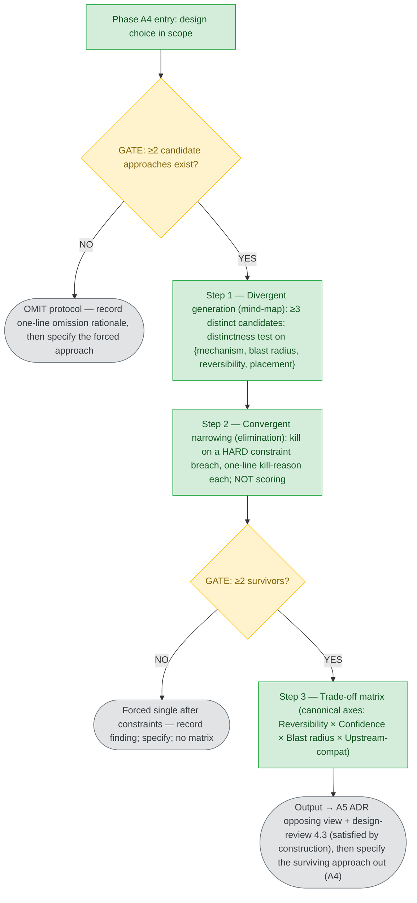

<!-- reference-durability: allow-version-ref -->
<!-- reference-durability: allow-link -->

# Design-Exploration Protocol — Stage 5 Phase A4 Micro-Protocol

## 1. Purpose + Activation

The platform's Stage 5 design surface jumps to *evaluation* without a governed *generation* step. The design-review checklist requires that a Stage-5 design evaluate at least three alternatives, but that is an exit check on the ADR — it inspects the finished design for alternatives, it does not govern how the alternatives come to exist. The within-spoke opposing-view ceremony (one counter-design) is a single-counter discipline, not a fan-out generator. The consequence: a spoke can anchor on its first solution, retrofit two thin alternatives to satisfy the exit check, and pass — with the anchoring bias never surfaced.

This protocol closes that gap. It makes *generation-then-narrowing* a named, gated micro-protocol that runs **inside Stage 5 Phase A4, BEFORE the trade-off matrix**. The trade-off matrix stays exactly where it is in the causal chain (it feeds the ADR's opposing view); this protocol adds the two steps that belong upstream of it.

**Activation.** The protocol fires inside Phase A4 WHEN a decision-class design choice with **two or more candidate approaches** is in scope — surfaced by the multiple-approaches activation trigger from the planning→solutioning handoff, OR by the Phase A1 scope-assessment finding genuine design latitude.

**Omission (the non-ceremony signal).** The protocol is OMITTED — and that omission is correct, not a skipped step — when the design has a single forced approach (no genuine latitude exists). Omitting a generation ceremony for a forced-single-approach design is the same omission discipline the cascade-completeness sweep and the doc-corpus-reorg ref-form enumeration follow: the ceremony fires only when its trigger predicate holds, and its absence under a non-triggering condition is the honest signal, not a gap. A spoke that omits the protocol records a one-line omission rationale ("single forced approach — no design latitude; generation omitted per the non-ceremony signal").

## 2. Step 1 — Divergent generation (mind-map)

Generate **three or more genuinely distinct candidate approaches** — not one real candidate plus two straw alternatives built to lose. This is the divergent step: widen before narrowing.

Structure the output as a candidate table:

| Candidate | One-line mechanism | Seed rationale |
|---|---|---|
| Approach A | how it works in one line | why it is a live option |
| Approach B | … | … |
| Approach C | … | … |

**The "distinct" test (borrowed from the adversarial counter-design axes for consistency):** each candidate must differ from the others on at least one of {mechanism, blast radius, reversibility, placement, **altitude**}. Two candidates that differ only cosmetically are one candidate — collapse them and generate a genuinely different third. The test is what prevents straw-alternative retrofitting: a straw alternative fails the distinctness test because it was constructed to be dominated, not to be different.

**The `altitude` axis (abstraction altitude / seam-composition).** A candidate's *altitude* is how high it solves the problem relative to the platform's existing seams. The three bands:

| Band | Meaning | Example shape |
|---|---|---|
| **point-fix** | solves this instance directly; introduces or hardcodes a concrete mechanism with no reusable seam | a host-concrete `gh`/`git` call inlined into capability logic |
| **extend-seam** | extends an *existing* platform seam — an `[adapters]` selector, a module boundary, a config surface — so the solution composes with what already exists | add a value to `operator.toml [adapters]`; add an operation to an existing adapter interface |
| **new-abstraction** | introduces a *new* seam/abstraction the platform did not have, because no existing seam fits and the capability warrants its own boundary | define a new adapter interface + its config selector |

Altitude is the axis the {mechanism, blast radius, reversibility, placement} set could not see: three candidates can share an identical (wrong) altitude — all three host-concrete point-fixes — while differing on mechanism, and all pass the old distinctness test. The `altitude` axis surfaces that shared-altitude blindness.

**The ≥2-band rule (fires when a new mechanism is introduced).** When the design choice **introduces a new mechanism** (not merely tuning an existing one), the ≥3 candidates MUST span **at least two of the three altitude bands**. A candidate set that is uniformly point-fix (or uniformly any single band) fails the rule — generate a candidate at a different altitude (typically the extend-seam candidate that asks "is there an existing seam this composes with?"). The rule's purpose is precisely to force the seam-extension alternative into the generated set so the narrowing step (§3) and the trade-off matrix (§4) can weigh it, rather than never seeing it. The seam-extension candidate is exactly the one the design-review seam-composition gate ([`design-review-checklist.md`](../templates/design-review-checklist.md) Section 4) will later require the chosen design to have considered. **Omission (the non-ceremony signal):** the ≥2-band rule does NOT fire when the design tunes an existing mechanism without introducing a new one (no new mechanism = no altitude choice to make) — record a one-line "no new mechanism; ≥2-band rule N/A" rather than manufacturing a band spread.

A mind-map framing is the recommended generation aid: start from the problem at the center, branch to mechanism families, and expand each family into a concrete candidate. The deliverable is the candidate table, not the mind-map itself.

## 3. Step 2 — Convergent narrowing (elimination)

Eliminate candidates against **hard constraints first**, before any scoring. The convergent step kills candidates that cannot survive a constraint breach, so the trade-off matrix scores only live options.

Hard-constraint classes (eliminate on a breach of any):
- **Governance conformance** — the candidate violates a shipped protocol, a guardrail, or the knowledge-architecture placement model.
- **Blast-radius ceiling** — the candidate's impact exceeds the change's risk budget (a structural-tier change where a behavioral-tier solution exists).
- **Irreversibility** — the candidate is an expensive or irreversible one-way door where a cheaper-to-reverse candidate achieves the same outcome.

Record a **one-line kill-reason** for each eliminated candidate:

| Candidate | Eliminated? | Kill-reason (the breached hard constraint) |
|---|---|---|
| Approach A | survives | — |
| Approach B | eliminated | breaches <named hard constraint> |
| Approach C | survives | — |

**Elimination is not scoring.** A candidate dies on a *constraint breach*, never on a close score — a candidate that merely scores slightly lower survives to the matrix, because the matrix is where comparative scoring happens. Conflating elimination with low scoring collapses the two steps and defeats the purpose: the matrix never sees the option that was quietly scored out.

**At least two survivors** proceed to the matrix. If narrowing leaves fewer than two survivors, the design genuinely has a forced single approach after constraints — record that finding (it retroactively validates the omission signal of §1 for the constrained sub-decision) and proceed to specification without a matrix.

Recording kill-reasons is also **why-not traceability**: the eliminated candidates and their kill-reasons are knowledge the platform captures (the knowledge-management capture discipline), so a later reviewer or a future release sees which options were considered and why each was rejected, rather than re-deriving them.

## 4. Step 3 — Trade-off matrix (the EXISTING entry point, now downstream)

The surviving candidates are scored on the **canonical axes already used by the adversarial counter-design schema** — REUSE these axes; do not invent a new axis set:

| Surviving candidate | Reversibility (CHEAP/MODERATE/EXPENSIVE/IRREVERSIBLE) | Confidence (HIGH/MED/LOW) | Blast radius | Upstream-compat |
|---|---|---|---|---|
| Approach A | … | … | … | … |
| Approach C | … | … | … | … |

The matrix output feeds two existing surfaces:
- the **ADR's opposing-view** — the chosen design plus the strongest surviving alternative and why it was not chosen; and
- the **design-review checklist's ≥3-alternatives check** — which this protocol now **satisfies by construction** rather than by retrofit. Because Step 1 generated three or more genuinely distinct candidates and Step 2 recorded the kill-reasons, the exit check inspects a real generation history, not three alternatives reverse-engineered to make the pre-chosen design look considered.

## 5. Composition with Phase A4 / A5 / A6.5

This protocol is **A4's opening move**, not a replacement for A4. The Phase A4 sequence becomes: run design-exploration (generation → narrowing → matrix) → THEN specify the surviving approach out (the existing A4 work: exact structure/naming/layout + implementability + debt flags + the cascade-completeness sweep). The trade-off matrix stays where it has always been in the causal chain — feeding the A5 ADR — and this protocol adds the two steps before it.

- **With Phase A5 (ADR drafting):** the matrix's strongest losing candidate becomes the ADR's opposing view; the kill-reasons from Step 2 become the ADR's "alternatives considered and rejected" content. The ADR is richer because the generation history is real.
- **With Phase A6.5 (independent adversarial design review):** the adversarial reviewer's counter-design findings are downstream and independent of this protocol. A counter-design the reviewer proposes that this protocol's Step 1 already generated and Step 2 eliminated is answered by the recorded kill-reason; a counter-design that this protocol did NOT generate is a signal that Step 1's divergence was too narrow — a legitimate adversarial finding the reviewer should raise. The two compose: this protocol widens generation up front; the adversarial review tests whether the widening was wide enough.

## 6. AC5 Worked Example — generation → elimination → matrix (altitude-diverging)

This worked example uses the **version-claim-determinism decision** as its case — the real design the platform made when it needed deterministic, collision-free version claims (recorded in [`repo-host-adapter-versioning.md`](../../../core/standards/repo-host-adapter-versioning.md)). It is chosen because its three candidates diverge on **altitude** (not merely placement), demonstrating the §2 `altitude` axis and the ≥2-band rule end-to-end. The decision: *how does a release claim a collision-free version number across concurrent releases?* — a design choice that **introduces a new mechanism**, so the ≥2-band rule fires.

**Step 1 — Divergent generation (mind-map → candidate table):**

| Candidate | One-line mechanism | Altitude band | Seed rationale |
|---|---|---|---|
| Inline `gh`/`git` version-claim | inline the `gh api releases/latest` + signed-tag-push compare-and-swap directly into the release pipeline's claim step | **point-fix** | it works against the actual host today; least code |
| `[adapters].repo_host` version-claim interface | define the claim as four host-agnostic operations (`anchor` / `claimed_set` / `atomic_claim` / `lineage`) behind the **existing** `operator.toml [adapters].repo_host` selector | **extend-seam** | the `[adapters]` seam already exists ([ADR-022](../../../core/ADRs/ADR-022-platform-config-vs-operator-toml-split.md)); the capability is host-agnostic, the host is not |
| New `version-authority` service abstraction | introduce a standalone version-authority module with its own contract, independent of the repo-host adapter | **new-abstraction** | maximal decoupling; a dedicated home for all version arbitration |

The three candidates pass the distinctness test on **altitude** (point-fix vs. extend-seam vs. new-abstraction), and span **three** bands — the ≥2-band rule (which fires because a new mechanism is introduced) is satisfied.

**Step 2 — Convergent narrowing (elimination against hard constraints):**

| Candidate | Eliminated? | Kill-reason (the breached hard constraint) |
|---|---|---|
| Inline `gh`/`git` version-claim | eliminated | governance conformance: hardcodes a host tool as *the* canonical mechanism in universal release governance where an adapter seam exists — a **host-binding leak** per [`knowledge-architecture.md`](../../../core/disciplines/knowledge-architecture.md) §4; couples the version-claim capability to one host with no portability seam |
| `[adapters].repo_host` interface | survives | — |
| New `version-authority` abstraction | eliminated | blast-radius ceiling: a whole new module + contract exceeds the change's risk budget when an existing seam (`[adapters].repo_host`) already provides the exact boundary; new-abstraction altitude is *too high* here (a structural-tier solution where an extend-seam solution suffices) |

Two candidates eliminated on constraint breaches — one for being **too low** (point-fix host-binding leak), one for being **too high** (unjustified new abstraction); the surviving candidate sits at the correct **extend-seam** altitude. (Note this is elimination on constraint breach, not scoring: the inline candidate did not "score lower," it breached the host-binding/governance-conformance constraint.) Per §3 this leaves a single survivor after constraints — a forced approach *at that altitude* — so the design proceeds to specification; the matrix below is shown for completeness to contrast the eliminated altitudes.

**Step 3 — Trade-off matrix (the surviving candidate vs. its strongest losing altitude):**

| Candidate | Reversibility | Confidence | Blast radius | Upstream-compat |
|---|---|---|---|---|
| `[adapters].repo_host` interface (extend-seam) | MODERATE (one config-selector binding + an interface spec) | HIGH | narrow — composes with the existing adapter table; one adapter (GitHub/git v1) implements it | exact: faithful to [ADR-017](../../../core/ADRs/ADR-017-distribution-architecture.md) §S2 / [ADR-022](../../../core/ADRs/ADR-022-platform-config-vs-operator-toml-split.md) (operator.toml as adapters home) |
| New `version-authority` abstraction (new-abstraction) | EXPENSIVE (a new module + contract to unwind) | MED | wide — a new platform surface every release consumes | over-built for a host-bound concern |

**Decision:** the `[adapters].repo_host` extend-seam candidate — a host-agnostic four-operation interface behind the **existing** `[adapters]` seam, with a GitHub/git v1 reference adapter. The matrix's strongest losing candidate (`version-authority` new-abstraction) and the reason it lost (over-built; an existing seam already provides the boundary) is the opposing-view content the ADR carries; the eliminated point-fix's kill-reason (host-binding leak) is the "alternatives considered and rejected" content.

This worked example demonstrates all three steps end-to-end on a real decision, and — unlike a placement-only example — exercises the `altitude` axis directly: the candidates diverge on abstraction altitude, the ≥2-band rule fires (new mechanism) and is satisfied (three bands present), and the narrowing kills both a too-low (point-fix) and a too-high (new-abstraction) candidate to land at the correct extend-seam altitude. It is the inverse of the actual version-claim-determinism history, where the host-concrete point-fix was *not* eliminated because no altitude axis forced the extend-seam candidate into the generated set — the exact gap this axis closes.

## 7. Process-flow artifact (Tier-A)

This protocol defines an agent-process flow with a gate (the elimination step) and a clear sequence, and it is cited as canonical by the Stage-5 Phase A4 spec — so it activates the Tier-A process-flow artifact requirement. The flow, as a Mermaid flowchart (required for a gated, cited-as-canonical process-flow per [`process-flow-diagram-standards.md`](../../../core/standards/process-flow-diagram-standards.md) § Scope & Diagram-Form Decision Rule):

*Diagram note: the Step-1 node lists four distinctness axes; per §2 the test now spans five — `{mechanism, blast radius, reversibility, placement, altitude}` — with the ≥2-altitude-band rule when a design introduces a new mechanism.*

This artifact is declared in the release plan's "Tier-A activated design artifacts" section, where the Stage 13 close-out reads it to scope artifact-refresh detection.

## 8. Cutover

The design-exploration protocol applies to all releases entering Stage 5 strictly AFTER this protocol's introducing-release merge SHA recorded in the release log. **The introducing release itself is exempt** — the protocol shipping in a release cannot fire on its own Stage 5 authoring without creating a reflexive-pipeline loop; the introducing release's own Stage 5 outputs use pre-rule discipline. (The introducing release's own Stage 5 is the proof of this exemption in action: it was produced under the pre-existing rules, with generation→narrowing applied informally in the home-selection decision of §6 but not gated by the not-yet-shipped protocol.) All releases that entered Stage 5 prior to the introducing release are also exempt. This matches the introducing-release-exempt reflexive-pipeline discipline used by the cascade-completeness sweep, the design-artifact production step, and the framework-corpus discipline.
