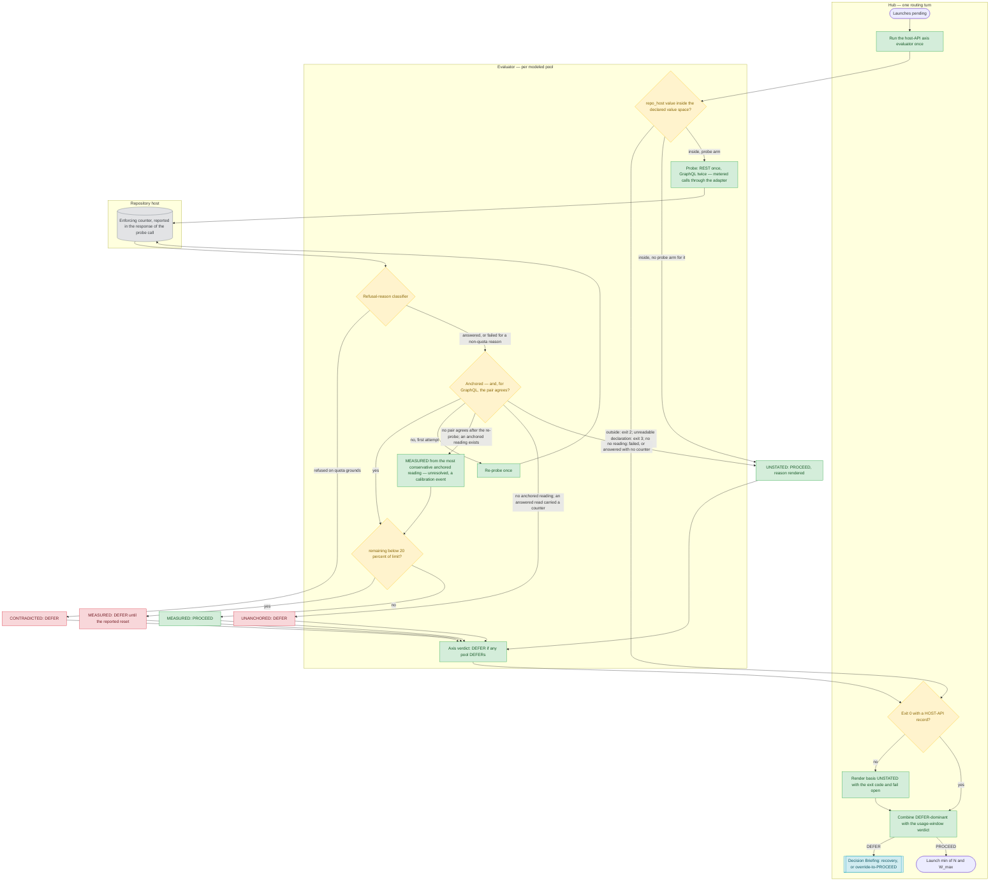

<!-- reference-durability: allow-version-ref -->
<!-- reference-durability: allow-link -->
# Quota-Budget Protocol — Dual-Checkpoint Parallel-Launch Gate

> **Part of:** the hub-and-spoke release bridge ([`../how-to/hub-spoke-bridge.md`](../how-to/hub-spoke-bridge.md)) and the Stage 4 planning spec ([`../pipeline/stage-04-planning.md`](../pipeline/stage-04-planning.md)).
> **Operationalizes:** the per-account 5-hour usage-window constraint documented in [`../how-to/hub-spoke-bridge.md`](../how-to/hub-spoke-bridge.md) § Per-Account Usage Window Constraint.

## 1. Purpose + Scope

This protocol is the active enforcement mechanism for the per-account **5-hour usage-window** constraint on parallel spoke launches. The window meters *cumulative total token consumption* within a sliding ~5-hour period (it resets five hours after window-start). This is a **usage-window** constraint — **not a rate limit**; the two are different constraint classes with different mitigations, and conflating them routes an envelope problem to a timing-only fix that does not change cumulative consumption.

The protocol defines two checkpoints:

- **Checkpoint A — Stage 4 plan-time estimate.** A one-time, agent-computed budget estimate authored into the release plan. It is advisory: it sizes the worst parallel batch against the assumed envelope so the operator sees capacity risk before Engineering.
- **Checkpoint B — runtime re-validation (load-bearing).** Fires before *every* `Agent`-tool spoke launch at hub routing time — **wave or singleton, at every stage** — re-estimating draw against the *remaining* window envelope and rendering a verdict that gates the launch. The runtime checkpoint is load-bearing because Stage 4 estimates the budget once, but spokes fire at many routing points across a release, each facing a potentially different remaining envelope; a one-and-done plan-time check misses the mid-release drift the runtime check catches.

**Scope.** The protocol governs **every `Agent`-tool spoke launch, at every stage.** Its verdict *depth* varies by launch shape — a wave (N ≥ 2) takes the full four-value hierarchy of § 4.3, a singleton (N = 1) takes the reduced two-value form of § 4.3a — but no launch is out of scope.

**Two axes, either sufficient to block.** Checkpoint B gates on **two independent axes** — the per-account **usage window** (§ 4.3 / § 4.3a) and the **host-API quota** (§ 4.3b) — and **either is independently sufficient to block a launch.** The axes are not symmetric and the asymmetry is deliberate: the usage-window axis consults declared state and has no instrument at all, while the host-API axis has one — metered probes, each read from the pool it draws on (§ 4.3b). Their grades differ accordingly (§ 6.1): an anchored REST `core` reading is `[SOURCE]` as a statement of the pool at the moment of the probe; a GraphQL reading stays `[ASSUMPTION – CONFIRM]` until its calibration window passes clean; headroom at launch is `[ASSUMPTION – CONFIRM]` on both pools, because other sessions keep drawing after the probe; and every usage-window figure is `[ASSUMPTION – CONFIRM]`. A verdict naming no basis cannot tell a reader which axis produced it.

**Why the former write-serialized exclusion was withdrawn.** § 1 previously excluded the write-serialized stages (Stage 6 Engineering, Stage 13 Close) on the ground that they launch one spoke at a time and therefore have no *concurrent-batch cumulative-draw surface*. That ground is **true and was never sufficient.** "No concurrent batch to sum" is a claim about batch shape; "no envelope risk" is a claim about the remaining window, and § 7 of this same protocol already states which one binds: *a fixed concurrent-count is not the binding predictor — a small batch on a near-tail window can overrun while a large batch on a fresh window succeeds.* A singleton is the N = 1 case of exactly that sentence. The exclusion criterion was **necessary but not sufficient** for launch safety, and the counterexample is on record: a singleton adversarial-review spawn died at the per-account session limit after thirty read-only tool uses, posting nothing, while the two-spoke wave that preceded it had been gated and completed. The predicate is corrected here rather than annotated, because a stage exclusion that a reader can derive from a count is one the next release will re-derive.

## 2. The two checkpoints

| Checkpoint | Stage | Nature | Output | Gating |
|---|---|---|---|---|
| **A** | Stage 4 Planning | Agent-computed plan-time estimate | `### Quota Budget` section in the release plan; verdict PASS / WARN / FAIL | Advisory — surfaces capacity risk; does not block |
| **B** | Hub runtime (per launch) | Runtime re-validation before each `Agent`-tool launch — wave **or** singleton | Wave: PROCEED / SERIALIZE / DEFER / REDUCE-scope (usage-window axis); singleton: PROCEED / DEFER (§ 4.3a); host-API axis: PROCEED / DEFER (§ 4.3b), combined DEFER-dominant per § 4.2. STAGGER labeled secondary (rate-limit only) | **Load-bearing** — gates the launch; any non-PROCEED verdict produces a Decision Briefing before any spoke fires |

Checkpoint A's plan-time estimate is the *baseline budget* Checkpoint B refines at runtime with observed per-spoke actuals, elapsed-window time, and operator-stated quota state.

## 3. Checkpoint A — Stage 4 plan-time estimate

Checkpoint A runs as the terminal Phase-A step (A6) of Stage 4 Planning, after the plan is assembled. It summarizes plan-level capacity by reading the parallel-eligible spoke count from the **A2 Stage Applicability Matrix** and the contention output from **A4**.

### 3.1 Input contract

| Input | Source |
|---|---|
| Parallel-eligible spoke count per parallel stage (Stage 5 / 7 / 8) | A2 Stage Applicability Matrix (the matrix records which stages apply per issue; the parallel-safe stages are 5 / 7 / 8 per the Parallelism Rules table) |
| Per-spoke cost estimate | Per-spoke cost-estimate heuristic (§ 5) — size-bucket ordinal band until telemetry medians are available |
| Cumulative work estimate | parallel-eligible count × per-spoke cost estimate, per parallel batch (worst batch) |
| Assumed/stated remaining usage-window envelope | Operator-stated quota state at hub start (§ 6), OR a conservative default when unstated |
| Estimated cumulative draw % | cumulative estimate ÷ envelope, expressed as a percentage of the worst parallel batch |
| Contention context | A4 file-contention output (informs whether the parallel-eligible count is realizable under the selected D-C topology) |

**Negative space — the host-API axis is deliberately NOT a Checkpoint A input.** Checkpoint A stays usage-window-only. A plan-time host-API pool reading has no predictive value at Engineering time: the pools reset hourly and are drained by concurrent sessions the planner cannot observe, so a Stage-4 reading is noise by the time the first spoke fires. The omission is recorded here as a decision rather than left as a gap, so a later reader does not "fix" it by adding a reading that would carry the authority of a measurement and the accuracy of a guess. The axis binds only at Checkpoint B, where the reading is contemporaneous with the launch it gates (§ 4.3b).

### 3.2 Bands and routing tree

The bands are expressed as a fraction of the stated/assumed envelope. They are provisional with one empirical datum — `[CALIBRATE-AFTER-3]` (MEDIUM confidence), calibration target = the cumulative-draw budget (§ 7):

```
PASS  (cumulative draw < 50% of envelope)      → proceed parallel; no warning in plan
WARN  (cumulative draw 50–80% of envelope)     → window-aware launch timing + quota-budgeting
                                                  (split batch) recommended in the plan
FAIL  (cumulative draw > 80% of envelope)       → three outcomes:
                                                  (a) split-batch (run across multiple windows)
                                                  (b) reduce per-spoke cost (compact prompts,
                                                      narrower scope, fewer canonical reads)
                                                  (c) escalate Tier 2 [SCOPE CHANGE]
                                                      (reduce release size)
```

The WARN band routes to **window-aware timing + quota-budgeting**, NOT to a stagger delay — stagger is a rate-limit defense and does not change cumulative consumption (§ 4.4). Checkpoint A's verdict is advisory; the binding gate is Checkpoint B at runtime.

## 4. Checkpoint B — runtime re-validation (load-bearing)

Checkpoint B fires before the hub issues **any** `Agent` invocation — whether that is N in the same response or a single one (per [`../how-to/hub-spoke-bridge.md`](../how-to/hub-spoke-bridge.md) § Spoke Launch Mechanisms § Default). It is the load-bearing gate.

**What the check can and cannot do — read this before § 4.1. The answer differs per axis, and that is the point.**

- **Usage-window axis — cannot measure.** Checkpoint B **cannot measure the remaining usage-window envelope.** § 6 makes that envelope operator-*stated*, and a platform-side usage-window quota API is not queryable from within a session. What the check honestly has on this axis is a *declaration* (the operator's stated band) and *elapsed time since that declaration*, which it measures exactly. Every usage-window figure downstream of § 4.1 is a projection of those two inputs, never a reading of the account's actual remaining window. See § 6.1's refuse-to-synthesize rule for what that forbids the check from rendering.
- **Host-API axis — has an instrument: metered probes, read in-band.** The host's REST and GraphQL quota pools **are** measurable from within a session, and that is why the axis exists. The axis measures them with metered probes — one repository-free REST read of the `core` pool, and two GraphQL reads of a query that selects a field beyond the rate-limit object — and reads each pool's counter from the probe's **own response**, the counter the host enforces on that very request (§ 4.3b). The host's pool-status endpoint is **not an input**. It was measured **non-deterministic** — reads seconds apart disagreed on `remaining` and on `reset`, and some reported an **unstarted window** (a full pool with `used = 0`) interleaved with reads of the started one — and then **blind**: every read reported an unstarted `core` window while the enforcing counter, read in-band in the same minutes, showed hundreds of requests already drawn. It also omits a *secondary* (user-level, concurrency or abuse) limit entirely. Blindness and non-determinism call for different remedies, and the in-band probe answers both: re-reading a disagreeing instrument can converge, re-reading one that omits the quantity cannot, and the counter that refuses a request is the counter that reports it.

**The consequence, stated so it is not inferred: the two axes differ in kind, and their grades say so.** A usage-window figure is a projection of a declared band, because no instrument exists. A host-API figure is a reading of the enforcing counter taken by the probe that drew from it: `[SOURCE]` for an anchored `core` reading at the moment of the probe; `[ASSUMPTION – CONFIRM]` for a GraphQL reading until its calibration window passes clean; and `[ASSUMPTION – CONFIRM]` for headroom at launch on both pools (§ 6.1). The two are never averaged into a single number that is neither, and § 4.2 combines them by disjunction rather than arithmetic — a rule that never depended on the grades.

**The probe's draw is certain and bounded, and it is the point.** Each probe draws from the pool it reads, so a run costs three metered requests — one REST, two GraphQL — and at most five with re-probes (§ 4.3a). That draw is what anchors the reading: a counter that has just served the probe cannot honestly report an unstarted window (§ 4.3b). The GraphQL probe selects a field beyond the rate-limit object because a query that selects the rate-limit object alone is not charged in a started window, and so could not declare a draw.

### 4.1 Input contract

| Input | Source |
|---|---|
| Baseline budget | Checkpoint A's `### Quota Budget` plan estimate |
| Observed per-spoke actuals | Two substrates, measuring different quantities (§ 5.2): **(a)** `finops-usage-extractor` `estimate-usage.sh` — **cumulative per-spoke draw, LOCAL, reproducible** — the quantity § 4.2's arithmetic consumes, and the PRIMARY source; **(b)** per-spoke *startup-cost* telemetry from earlier waves this release — the `spoke-launch` / `quota-reservation` event in [`pipeline-event-log-schema.md`](pipeline-event-log-schema.md) § 3, **declared but not currently emitted**. Refines the per-spoke cost estimate from the heuristic to observed medians, subject to § 5.1's per-bucket cutover predicate |
| Elapsed-window time | Time elapsed since hub session start (contributes to remaining-envelope refinement) |
| Operator-stated quota state | The session-start capture + per-batch optional override (§ 6) |
| Host-API pool state (`core` / `graphql`: `limit`, `remaining`, `used`, `reset`) | the host-API axis evaluator, `release/tools/host-api-axis-verdict.sh`, run **once per routing turn** from the repository root and reused for every launch issued in that turn: metered probes through the `[adapters].repo_host` adapter, each pool's counter read from the probe's own response (§ 4.3b). The reading is contemporaneous with the probe, and its staleness is bounded to one routing turn; headroom at launch stays `[ASSUMPTION – CONFIRM]`, because other sessions keep drawing after the probe |
| Host-API reading basis | `MEASURED` when an answered probe's reading is anchored to its own draw; **`UNANCHORED`** when an answered probe carried a reading that is not; **`CONTRADICTED`** when a probe was refused on quota grounds; **`UNSTATED`** when there is no reading — the probe failed for a non-quota reason, was answered without a counter, or the evaluator did not exit 0. `MEASURED` and `UNSTATED` reuse § 6.1's existing basis tokens and the other two join them; all four are *basis* tokens, not verdict tokens, so **the verdict enum is unchanged**. `CONTRADICTED` carries a positive exhaustion signal, which is why § 4.3b exempts it from the fail-open rule; `UNANCHORED` carries a reading the axis cannot attribute to its own probe, which is why it defers rather than failing open |

### 4.2 Procedure

1. Compute `N_planned` — the sub-tasks actionable at this routing point per Procedure 2. `N_planned = 1` is a valid, in-scope case, not a skip condition.
2. Estimate cumulative cost: `N_planned × per-spoke-cost-estimate` (from the Checkpoint A baseline, refined by observed actuals from prior launches this release where available).
3. Compare against the *remaining* window envelope (operator-stated state at hub start, adjusted for elapsed-window time and any per-batch override).
4. Run the host-API axis evaluator per § 4.1 and read the **host-API axis** verdict from its `HOST-API` record per § 4.3b — only when the evaluator exits 0. Any other exit is not evaluated: the basis is `UNSTATED` and the axis fails open, with the exit code rendered.
5. **Combine the two axes — DEFER-dominant disjunction.** If the host-API axis renders `DEFER`, Checkpoint B renders `DEFER`; otherwise Checkpoint B renders the usage-window verdict **unchanged**. The usage-window verdict is the one rendered by § 4.3 when `N_planned ≥ 2` and by § 4.3a when `N_planned = 1`, and that branch renders the wave-width output `W_max` (§ 4.3c) on the same line as its verdict. **The pass-through is opaque**: on a host-API `PROCEED` this step neither inspects, reformats, nor restates what the usage-window branch produced — whatever that branch renders is carried through as-is. That opacity is load-bearing, and it is why this rule needs no edit when the usage-window branch's own output grows.
6. On any non-PROCEED verdict: produce a Decision Briefing surfacing the verdict + recommendation to the operator **BEFORE** launching any spoke.

### 4.3 Verdict hierarchy (usage-window axis)

The verdict hierarchy is the binding output. Each verdict names the surface it reduces, so an envelope problem is never routed to a timing-only fix:

| Verdict | Meaning | Surface reduced |
|---|---|---|
| **PROCEED** | Cumulative estimate fits the remaining envelope comfortably | the simultaneous in-flight **count**, bounded at `W_max` per § 4.3c (`W_max = N` ⇒ every spoke goes in flight at once, the existing behavior). Disambiguated against SERIALIZE below: SERIALIZE reduces the count to exactly one; § 4.3c bounds it at `W_max` |
| **SERIALIZE** | Envelope is tight; launch one spoke at a time, halt on first usage-limit failure | the simultaneous-spawn/draw **count** (one in-flight draw at a time) |
| **DEFER** | Remaining envelope cannot absorb the batch | the batch is held for the next window; cumulative draw deferred entirely (see the operator-override exit, § 4.5) |
| **REDUCE-scope** | The batch can fit only with a smaller per-wave footprint | the per-wave **consumption** (compact prompts, narrower scope, fewer canonical reads per spoke) |

### 4.3a Singleton verdict form (N = 1)

A singleton launch renders from a **reduced two-value enum drawn from the same vocabulary above** — no new tokens are minted:

| Verdict | When | Note |
|---|---|---|
| **PROCEED** | The stated band, decayed for elapsed time, is not `near-tail` | Launch proceeds. The verdict is still **rendered**, not skipped — see the rendering obligation below |
| **DEFER** | The stated band is `near-tail`, or decays into `near-tail` | Inherits § 4.5's operator-override-to-PROCEED exit unchanged, so the deadlock escape already designed for waves applies to singletons for free |

**SERIALIZE is structurally meaningless at N = 1** — the launch is already serial. **Wave-width guidance (§ 4.3c) is inert at N = 1 for the same reason** — no wave is narrower than one — and renders `W_max n/a (N=1)`; the singleton enum below is unchanged. **REDUCE-scope is not a singleton verdict**: it remains available as a hub-side *mitigation* (compact the prompt, narrow the scope, cut canonical reads) applied **before** re-rendering, which is a different act from returning it as a verdict.

**Cost, and why per-launch firing is affordable — stated per axis, because the two differ.** The **usage-window** axis is **zero tool calls**: a hub-side reasoning step over state the hub already holds (§ 6's session-start capture) plus in-session elapsed time. It is not an instrument, so it cannot itself draw against the envelope it protects. The **host-API** axis costs **one evaluator run per routing turn** — not one per spoke — and that run draws exactly three metered requests (one REST, two GraphQL; at most five with re-probes). The draw is certain and bounded, and it is deliberate: the probe's own draw is what anchors its reading (§ 4.3b). Its cost is also **cross-axis**: the run is one hub tool call, so it spends the *usage-window* axis to read the *host-API* axis, which is stated here rather than hidden. Both figures stay small enough that the original conclusion survives intact: **per-launch firing is affordable, and there is no launch shape too small to gate.**

**Rendering obligation — silence is a failure, not a PROCEED.** Every launch, wave or singleton, **states its verdict visibly in the hub's routing output for that launch.** A `PROCEED` that was never rendered and a gate that was never run are indistinguishable afterwards, and a control whose skipped state is unobservable is not a control. This is a rendering requirement, not a telemetry one: the check emits no pipeline event (see § 6's note on that boundary), so the rendered line is the whole audit surface.

### 4.3b Host-API axis verdict form

**Why this axis exists.** The host's REST and GraphQL quotas are **separate pools**, and they deplete independently. The recorded failure: mid-release the GraphQL pool sat at `0/5000` while REST sat effectively untouched at `4966/5000`. Every Issue-and-PR command failed while direct REST paths kept working, and Checkpoint B rendered PROCEED throughout — because it was reading the wrong exhaustion surface entirely. The asymmetry is what made the failure confusing: half the host command surface failed while the other half looked healthy.

The consequence is worse than degradation, and it is why this axis gates rather than warns. A Stage 5 / 7 / 8 spoke's **entire output channel is a GitHub Issue comment**. A depleted GraphQL pool therefore does not slow such a spoke down — it destroys the deliverable *after* the full usage-window draw has already been spent. The work is done, paid for, and unpostable.

**Pool → operation-class mapping.** Which pool an operation rides is not inferable from the command's name, so it is recorded. The table is the v1 adapter's pool map (*GitHub reference binding*, below):

| Pool | `gh` operation classes that ride it |
|---|---|
| `graphql` | `gh issue view` · `gh issue comment` · `gh issue close` · `gh issue list` · `gh pr view` — the Issue/PR command surface |
| `core` (REST) | `gh api repos/…` and the other direct REST paths |

**The extension seam.** Only `core` and `graphql` are modeled. The host's pool-status response names a wider resource map, whose other pools (notably the search pools) carry limits one to two orders of magnitude tighter than `core`. A further pool is modeled by adding a row above **and a probe for it**, never by reading a wider status response: a status response cannot reach a limit it omits, and adding rows to one cannot either.

**Instrument.** The axis is evaluated by `release/tools/host-api-axis-verdict.sh`, run **once per routing turn** from the repository root. It issues metered probes through the `[adapters].repo_host` adapter and reads each pool's counter from the probe's **own response** — the counter the host enforces on that very request:

- `core`: one read of a repository-free REST endpoint, re-probed once when its reading is not anchored;
- `graphql`: two reads, issued in sequence, of a query that selects a field beyond the rate-limit object, and a third read when the two do not agree. A query that selects the rate-limit object alone is **not charged** in a started window `[SOURCE: measured — 0 of 4 same-window reads of that shape advanced the counter, against 15 of 15 for three shapes that select one more field]`, so it cannot declare a draw.

The draw is certain and bounded: three metered requests per run, at most five. The pool-status endpoint is **not an input**; *What the retired endpoint was measured to do*, below, records why. The hub reads the axis verdict from the evaluator's `HOST-API` record, and only when the evaluator exits 0.

**The declared draw and the anchor test.** A probe declares its own draw of at least one unit, so a counter that has just served the probe cannot honestly report an unstarted window. A reading is **individually anchored** when all of these hold:

1. the probe was answered (the refusal-reason classifier, below);
2. the reading names the probed pool;
3. `limit`, `remaining`, `used` and `reset` are all present;
4. `used ≥ 1` and `remaining < limit` — the probe's own draw is visible;
5. `Date − 120 s < reset ≤ Date + 3600 s + 120 s`, where `Date` is **that response's own** `Date` header. A missing or unparseable `Date` means not anchored; the local clock is never read. The 3600 s window is the host's primary-limit window; the 120 s skew is `[CALIBRATE-AFTER-3]`.

Two GraphQL readings, an earlier `E` and a later `L`, **agree** when both are individually anchored, `reset(L) = reset(E)`, and `used(L) − used(E) ≥ 1`. Other sessions can only add to `used`, so a later reading that has not advanced by the later probe's own draw is not a report of that probe. The draw clause is **necessary, not sufficient**: under foreign traffic an uncharged pair can pass it, which is why the evaluator's self-test pins the query's shape.

Per pool, a quota refusal on any read makes the basis `CONTRADICTED` — it is exhaustion, and it dominates — and no other failure ends the procedure early:

- **`core`:** an anchored first reading is `MEASURED`; otherwise the probe is re-run once, and an anchored second reading is `MEASURED`.
- **`graphql`:** two agreeing reads give `MEASURED` from the later one (`agreement=pair`). Otherwise a third read that agrees with the second, or else with the first, gives `MEASURED` from the third (`agreement=reprobe`). Otherwise the **most conservative** individually anchored reading — the lowest `remaining/limit`, ties to the latest — gives `MEASURED` (`agreement=unresolved`, a calibration event, § 6.1).
- **Either pool:** with no individually anchored reading, the basis is **`UNANCHORED`** and the verdict `DEFER` when an answered read carried a counter; with no counter at all, the basis is `UNSTATED` (*The fail-open boundary*, below).

An unstarted-window reading — a full pool with `used = 0` — is never individually anchored, so it can never be the conservative pick and can never reach `PROCEED`. A genuinely fresh window reads the probe's own draw — `used` equal to the probe's cost, with `reset` one window after its `Date` — and is anchored `[SOURCE: observed at a live window rollover, where the first charged read of a fresh window started the window itself]`.

**The residual, stated.** Two readings that both come from another window agree with each other. When measured, 2 of 128 individual GraphQL readings came from another window, which puts an agreeing pair of them near 0.02 % of runs `[INFERRED]`; that is why the GraphQL grade stays `[ASSUMPTION – CONFIRM]` until its calibration window passes clean (§ 6.1).

**Verdict rule.** Each modeled pool renders a verdict from its basis:

| Basis | Verdict |
|---|---|
| `MEASURED` | `DEFER` when `remaining < 20 % of limit`, otherwise `PROCEED` |
| `UNANCHORED` | `DEFER` — rerun at the next routing turn |
| `CONTRADICTED` | `DEFER` — with the recovery the refusal's own evidence supports (below) |
| `UNSTATED` | `PROCEED` — fail open, the reason rendered |

The axis renders `DEFER` when **any modeled pool** renders `DEFER`; otherwise `PROCEED`. The floor is the mirror of § 3.2's already-canonicalized `> 80 % drawn` FAIL boundary — the same draw-vs-capacity question, so the boundary is reused rather than invented. `[CALIBRATE-AFTER-3]` (MEDIUM confidence); see § 7.

**Why only two values, and why nothing is minted.** The axis renders from § 4.3a's existing `{PROCEED, DEFER}` pair — **no new VERDICT token is minted**. (§ 4.1 adds two *basis* tokens, `CONTRADICTED` and `UNANCHORED`; basis and verdict are separate vocabularies and the verdict enum is untouched.) `SERIALIZE` and `REDUCE-scope` are structurally meaningless here for the identical reason § 4.4 gives for STAGGER: they reduce quantities this pool does not meter. Serializing N spokes consumes the same total points; compacting a prompt consumes none fewer. **Narrowing a wave is therefore not a host-API mitigation either** — a depleted pool blocks every spoke equally regardless of how the batch is arranged, because the pool meters requests the work requires, not their concurrency. Route a host-API block to **waiting for recovery**, never to a count-shaped or width-shaped remedy.

**Recovery — DEFER names only the recovery its evidence supports.**

| Condition | Recovery |
|---|---|
| `MEASURED` below the floor | the reading's own `reset` epoch |
| a primary refusal | the refusing response's own `reset` epoch |
| a secondary refusal carrying `retry-after` | wait exactly that many seconds |
| no recovery published | at least `60 × 2^N` seconds, capped at 3600, where `N` is the prior consecutive-refusal count the hub holds on the open DEFER action item and passes to the evaluator (§ 8); **never a timestamp** |
| `UNANCHORED` | rerun at the next routing turn |

A reset is **never borrowed** from another pool: a timestamp copied from a pool whose depletion is not the binding constraint is a fabricated recovery time, which is worse than none. The 60 s floor and the doubling follow the host's documented retry guidance for repeated refusals. The 3600 s cap is `[CALIBRATE-AFTER-3]`: beyond an hour, the cheapest way to learn whether a limit lifted is the probe itself, one run per routing turn, and a DEFER is an operator stop that renders advice rather than a hub loop that obeys it.

**What the retired endpoint was measured to do.** The axis previously read the host's pool-status endpoint, and that instrument failed in two different ways. It was **non-deterministic**: 12 reads inside 3.6 seconds returned two different `remaining` figures per pool and 6 distinct `reset` epochs per pool, and 8 of the 12 reported an *unstarted* window — a full pool with `used = 0` — interleaved with reads of the started window, while a deterministic local control sampled the same 12 times returned exactly one value. On a later sample it was **blind**: every read reported an unstarted `core` window, with a `reset` sliding to one hour out, and a `graphql` window that was not the enforcing one, while the counter the host enforces, read in-band from real calls in the same minutes, showed hundreds of requests already drawn. And it omits a secondary limit by construction. Re-reading a disagreeing instrument can converge; re-reading one that omits the quantity cannot. The in-band probe answers both, because the counter that refuses a request is the counter that reports it.

**The presentations, resolved.** Exhaustion, or its absence, presents to a successful read in more than one way, and the case analysis here was previously wrong by omission twice, so each presentation is named with its resolution:

| Presentation | What the reading shows | Resolution |
|---|---|---|
| **(a) Depleted window** | `remaining` at or near zero | `MEASURED` `DEFER`, or `CONTRADICTED` `DEFER` when the probe itself is refused |
| **(b) Unstarted window** | a full pool with `used = 0` | **Cannot reach the verdict.** The pool-status endpoint is not read, and an in-band reading of that shape fails the anchor test: `UNANCHORED` `DEFER`. A genuinely fresh window reads the probe's own draw and resolves to `MEASURED` `PROCEED` |
| **(c) A limit in force while every pool reads full — read-scoped** | the probe itself is refused | `CONTRADICTED` `DEFER` |
| **(c) — write-scoped** (content creation; mutation weight) | nothing: a read probe cannot be refused by it | **named residual** (below). Its discriminator is the hub's own count of content-generating requests |

**A host-API PROCEED attests that reads were available at the probe. It does not attest that writes will be.**

**The resolution does not depend on the attribution.** Presentation (c) was first recorded as a *secondary* limit, because every pool read full while both surfaces refused. The refusals themselves carried the host's primary-limit wording, and primary exhaustion hidden behind a blind meter fits the same evidence `[INFERRED]`. The design needs neither reading: the refusing response says which limit applies, and the classifier reads it there. One measured instance, from a wait loop that polled the host: 13 of 24 real calls were refused while the pool-status endpoint read every pool full.

**Presentation (c) has a write-scoped half the probe cannot observe, and it stays a named residual.** The probe resolves (c) for every limit that refuses a read. The host also documents limits that only a write can trip: no more than 80 content-generating requests per minute and 500 per hour, counting actions on the web interface, the REST API and the GraphQL API alike; and a GraphQL mutation weighs 5 points against the per-minute secondary budget where a query weighs 1. Neither probe creates content or mutates, so neither can be refused by those limits, and a PROCEED can be rendered while a spoke's final comment is refused. **The discriminator is the hub's own count** of content-generating requests — comments, issue and pull-request creations and edits, label changes — made by it and its spokes, per minute and per hour, against those bounds. It needs no host call. No axis carries that count today; it belongs to the requests-per-interval gap named next.

**(c) is self-reinforcing, and that is why it is a gate defect rather than a host quirk.** The condition is induced by sustained high-concurrency `gh` traffic — the spoke fan-out this gate exists to govern — and has been observed persisting beyond ten minutes. A wide wave therefore manufactures the condition that a gate reading only the pool-status endpoint could not see. The metered quantity is **requests per interval**, which is neither the usage-window envelope § 4.3 reads nor the interruption exposure § 4.3c's `W_max` bounds; **no axis meters it today**, and saying so is the point — the gap is named rather than implied. The probe detects the refusal the fan-out provokes; it does not throttle the fan-out.

**The fail-open boundary.** A probe that failed in transport or for a non-quota reason, a probe answered with no counter, and an evaluator that exits non-zero each carry **no exhaustion signal at all**; failing closed there would deadlock the pipeline on a fault that says nothing about capacity. So: basis → `UNSTATED` (§ 6.1's existing basis token, reused — a *basis* token, not a verdict token); axis → `PROCEED`; and the failure reason is **rendered**, never swallowed. With the probe in place, the fail-open residual narrows back to exactly "the probe failed": a successful read that reports a window that had not started no longer passes for a measurement, because it fails the anchor test. The write-scoped half of (c) is a separate named residual, not a fail-open case. The residual that remains — a launch proceeding blind to the pool state — is discharged by the write-early discipline.

**CARVE-OUT — a quota refusal is NOT a probe failure and does NOT inherit fail-open.** The fail-open rule rests on one premise: a fault says nothing about capacity. A probe refused **on quota grounds** inverts that premise exactly — it is a positive, first-hand observation that the resource is unavailable, which is the strongest evidence this axis can hold. Reading such a refusal as "the probe failed" and failing open would spend the window on the strength of the one signal that proves it should not be spent. So the branches separate by **what happened, not by whether something failed**:

| Probe outcome | Basis | Verdict for the pool |
|---|---|---|
| answered, reading anchored | `MEASURED` | `PROCEED`, or `DEFER` below the floor |
| answered, a reading present but not anchored after the re-probe | **`UNANCHORED`** | **`DEFER`** |
| answered with no counter | `UNSTATED` | `PROCEED` — fail open, the reason rendered |
| **refused on quota grounds** | **`CONTRADICTED`** | **`DEFER` — fail-open does NOT apply** |
| failed in transport or for a non-quota reason (authentication, a missing resource, a server error) | `UNSTATED` | `PROCEED` — this *is* a probe failure, so fail-open holds |

The last two rows are the ones an implementer gets wrong: not every failed call is an exhaustion signal, and the classifier is the **refusal reason**, never the fact of failure. Together these five give the axis a **distinct emitted state for every reachable state of its predicate**, which is the obligation `review-discipline-principles.md` § 8.1 **PV-7** places on any check, and which this axis did not meet while its `PROCEED` was shared by the healthy and the exhausted state. **PV-7b** is the consuming half: branch on the basis before reading `remaining`, because a counter read without its status consumes "nothing was measurable" as "nothing was drawn."

#### Refusal-reason classifier

This is the rule every tool that classifies a host response applies. It is implemented once, in the shared library `release/tools/lib/host-refusal-class.sh`, which each such tool sources rather than restates.

- **Rule 1 — read only the call's own response.** The class is read from the call's own status, rate-limit headers and error payload. Quota wording anywhere else is never a refusal: text inside a successful body, a comment quoting an earlier refusal, an agent-runtime notice, a log line. Header names are matched exactly, never by substring.
- **Rule 2 — four classes, first match wins:** `refused-quota` (subclass `primary`, `secondary` or `unspecified`), `failed-transport`, `failed-other`, and `answered`. A quota signal counts only on a **quota-eligible error** — a refusal status, or a response whose body reports errors on a transport that answers refusals that way. A retry hint on any other error, a server error say, is transient routing and not a quota refusal; and a response that carried no status line is a transport failure only when the client exited as a transport failure does, never when it exited for want of a credential or a binary.
- **Rule 3 — the citable sentence.** The class is decided by the refusal reason, never by the fact of failure. A quota refusal is exhaustion: it is never a probe failure (it never fails open) and never a state verdict (it never reports the subject as absent, unmerged, or empty).

#### GitHub reference binding

A **reference mapping, not the contract**: it shows how the host-agnostic rules above bind to the v1 adapter — GitHub, driven through its `gh` command-line client — and a different adapter binds differently. The budget probe and this binding are named gaps of the `repo_host` interface (`core/standards/repo-host-adapter-versioning.md` § 3), owned by the repository-host abstraction work; until that interface declares them, the evaluator performs them behind the selector.

- **Probe targets.** REST `core`: `GET /versions`, repository-free because the pool is per credential, with a body that carries no identity. GraphQL: a query selecting `__typename` beside the rate-limit object; `__typename` is defined by the GraphQL specification on every server, is charged, and returns no account identifier.
- **Readings.** The `x-ratelimit-limit`, `x-ratelimit-remaining`, `x-ratelimit-used`, `x-ratelimit-reset` and `x-ratelimit-resource` headers of the probe's own response, matched exactly by name; the window from that response's `Date` header. Every live response also carries `Access-Control-Expose-Headers`, whose *value* lists `Retry-After` and the `X-RateLimit-*` names, which is why a substring match would read every refusal as secondary.
- **Classification.** First match wins, on the call's own response only:

| # | Transport | Condition | Class · subclass |
|---|---|---|---|
| 1 | both | no status line, and the client exited 1 | `failed-transport` |
| 2 | both | no status line, and any other exit (0; 4 unauthenticated; 127 a missing binary) | `failed-other` |
| 3 | both | a status line that does not parse | `failed-other` |
| 4 | REST | 2xx and exit 0, whatever the body text | `answered` |
| 5 | GraphQL | 2xx, exit 0, and a JSON body with no `errors` member, whatever the data text | `answered` |
| 6 | GraphQL | 2xx whose body is not JSON | `failed-other` |
| 7 | both | a quota-eligible error with `x-ratelimit-remaining: 0` | `refused-quota` · `primary` |
| 8 | both | a quota-eligible error carrying `retry-after` | `refused-quota` · `secondary` |
| 9 | both | a quota-eligible error whose message names a secondary rate limit or abuse detection | `refused-quota` · `secondary` |
| 10 | GraphQL | a 2xx whose `errors[].type` is `RATE_LIMITED`, not matched above | `refused-quota` · `unspecified` |
| 11 | both | status 429, or a quota-eligible error whose message says "API rate limit", not matched above | `refused-quota` · `unspecified` |
| 12 | both | everything else: 401; a 403 without quota signals; 404; 422; any 5xx, a 5xx carrying `retry-after` included; GraphQL errors of any other type | `failed-other` |

A **quota-eligible error** is, for REST, status 403 or 429. For GraphQL it is status 403 or 429, or a 2xx whose JSON body carries `errors`: the host documents that a GraphQL primary-limit refusal arrives as a `200` with an error message and `x-ratelimit-remaining: 0`, and a secondary one as a `200` or a `403`. `x-ratelimit-*` headers on an answered response are readings, never refusal signals.

**`CONTRADICTED` and `UNANCHORED` do not coin tokens PV-7a forbids, and the distinction is worth stating because a reader will reasonably ask.** PV-7a governs the closed *measurement-state* vocabulary — whether a check measured, and how completely. This axis's basis tokens answer a different question: **how availability was established**. On the PV-7a axis every row above is `fetched` or `degraded`, and nothing new is needed: `CONTRADICTED` records that a measurement succeeded and returned an adverse finding, which is a *result*, not a degradation; `UNANCHORED` — a reading present but not attributable to the probe that drew it — maps to Register A `degraded` and Register B `DEGRADED`. The two vocabularies compose rather than compete, and the axis's own `{MEASURED, UNSTATED}` pair already sat in the same relation.

**Rendering obligation extension.** § 4.3a's rendering obligation applies unchanged and widens by one requirement: with two axes, a verdict naming no basis cannot tell a reader which axis produced it. The rendered line therefore names **both bases**, and for the host-API axis it carries the evaluator's `RENDER` output verbatim — per pool, its basis; for an anchored reading, `remaining/limit` with that pool's grade and `reset`; for a refused pool, the recovery. Counters are absent under `UNSTATED`, and the `reported_*` figures of an `UNANCHORED` pool are never shown as remaining. Cite § 4.3a for the obligation itself; it is not restated here.

**Host-API axis — evaluation flow.**



### 4.3c Wave-width guidance (second output — not a verdict)

The verdict decides **whether** to launch. It does not decide **how many at once**, and those are
different questions because they reduce different quantities:

- **Cumulative draw is invariant under width.** N spokes draw N spokes' worth against the window
  whether they run nine-at-once or one-at-a-time. Width buys nothing on the envelope — which is
  why the verdict, correctly, does not read it.
- **Interruption cost is linear in width.** A wave of `W` that dies mid-flight destroys up to `W`
  in-flight spoke-runs; the same interruption in a narrower arrangement destroys fewer and banks
  the rest. Width is the only lever on that loss.

Checkpoint B therefore renders a second output alongside its verdict: **`W_max`**, the maximum
spokes it may put in flight simultaneously. `W_max` is **not a verdict**, mints no new token, and
never converts a PROCEED into a non-launch. The existing hierarchy already brackets it —
**PROCEED is `W_max = N`, SERIALIZE is `W_max = 1`** — and this section supplies the interior
those endpoints leave undefined.

**Which axis it belongs to.** `W_max` is an output of the **usage-window** axis (§ 4.3 / § 4.3a),
not of the host-API axis and not of the combination step. § 4.2's combination of the two axes is
an opaque pass-through: on a host-API `PROCEED` it carries the usage-window branch's output
through as-is, `W_max` included, without inspecting or restating it. Nothing in this section
changes that rule.

**What it keys on.** The same basis the verdict already reads: the operator-stated band (§ 6),
decayed for elapsed time. No new input, no new tool call, and nothing measured that § 6.1 forbids
on this axis.

| Verdict basis (stated band, decayed) | Verdict | `W_max` |
|---|---|---|
| `fresh` | PROCEED | **`N`** — uncapped; no split |
| `partial-N%` | PROCEED | **3** |
| **`UNSTATED`** (§ 6.1 conservative default) | PROCEED | **2** |
| Envelope tight | SERIALIZE | **1** (definitionally) |
| `near-tail` | DEFER | **0** — nothing launches. On the § 4.5 override-to-PROCEED exit, `W_max = 1` |

`UNSTATED` sits **tighter than** `partial-N%` deliberately: the conservative default is the
assume-less-headroom posture, so it cannot buy more width than a band the operator actually
stated. The consequence is intended — **stating the band is what buys width** — which turns § 6's
standing request for a stated band into a live incentive rather than a recommendation.

**Observed-interruption demotion — the one usage-window input that is measured, not declared.**
§ 6.1 forbids the check from *projecting* remaining quota on this axis. It does not forbid it from
reading an event the hub witnessed. When a spoke has already died at the account session limit
during this release, each such death **demotes the basis one step** down the table above
(`fresh` → `partial-N%` → `UNSTATED` → SERIALIZE), floor `W_max = 1`. A death at the limit
falsifies whatever band was stated before it; launching on against the stale declaration is the
failure this closes. Demotion is used rather than arithmetic because the basis is an **ordinal**,
and halving an ordinal is a category error.

**Splitting, and why narrowing compounds.** When `W_max < N`, the wave splits into
`⌈N / W_max⌉` sub-waves launched in sequence. Because § 4 gates **every** `Agent`-tool launch,
Checkpoint B fires again before each sub-wave. Narrowing therefore bounds the loss **and**
multiplies how often the envelope is re-read: a nine-wide wave is gated once; the same nine spokes
at `W_max = 2` are gated five times, each against a fresher basis.

**Rendering.** The width output rides the § 4.3a rendering obligation on the same line as the
verdict — it is not separately announced. The line already names both axes' bases per § 4.3b's
rendering-obligation extension; the width field joins it. For example:

`Checkpoint B: PROCEED · W_max 2 · N=9 → 5 sub-waves, re-gated · usage-window basis UNSTATED — conservative default [ASSUMPTION – CONFIRM] · host-API basis MEASURED — anchored in-band: core 4966/5000 [SOURCE] (reset 01:22:49Z), graphql 4780/5000 [ASSUMPTION – CONFIRM] (reset 01:20:16Z, 2 reads agree)`

At `N = 1` width guidance is **structurally inert** — no wave is narrower than one — exactly as
SERIALIZE is structurally meaningless at `N = 1` (§ 4.3a). Render `W_max n/a (N=1)`.

**This is not the fixed batch-size count § 7 rejects.** § 7 rules out a fixed concurrent-count as
the predictor of *envelope overrun*, and that ruling stands untouched: the **verdict** remains the
sole envelope gate and still reads cumulative draw against the remaining window. `W_max` predicts
nothing about the envelope. It bounds *exposure to a single interruption* — a quantity literally
counted in spokes — and it is **not fixed**: it moves with the same basis the verdict moves with.
Two questions, two units.

**Neither coordination-safety nor host-API health is a licence for width.** A stage marked
parallel-safe has no file-contention surface; a healthy host-API pool has requests available.
Both are **availability** properties. Neither says anything about how much work one interruption
would destroy, and reading either as permission to go wide is the substitution this section exists
to foreclose. Width comes from `W_max` above — never from a stage's parallelism class (Procedure 2
Step 5), and never from the host-API reading. The converse is stated at § 4.3b and holds jointly
with this one: narrowing a wave is not a host-API *mitigation* either, because a depleted pool
blocks every spoke equally regardless of how the batch is arranged. Width and pool health are
independent in both directions.

**Calibration.** The `W_max` values are provisional, `[CALIBRATE-AFTER-3]` (MEDIUM confidence).
No release has yet recorded the distribution of *work destroyed per interruption*, which is the
quantity they bound; until one does, they calibrate against § 7's registered trigger.

### 4.4 Secondary — STAGGER (rate-limit only, not load-bearing for the usage window)

A hub MAY add an in-prompt `sleep <position × delay>` stagger to spread *momentary peak* draw — a defense against the separate **rate-limit** constraint (tokens/sec or concurrent in-flight reservations). It is harmless, but it is **not load-bearing for the 5-hour usage window**: spreading N spokes across a few minutes changes nothing about cumulative token consumption within the window. STAGGER is therefore a *labeled secondary* defense — never the mitigation for a usage-window overrun. Route a usage-window problem to SERIALIZE / DEFER / REDUCE-scope, never to STAGGER.

### 4.5 DEFER operator-override-to-PROCEED exit

When Checkpoint B renders **DEFER**, the hub offers the operator an explicit override-to-PROCEED exit. The override is the escape hatch for a wrong-stated-envelope deadlock — a DEFER driven by a conservative or stale stated state that the operator knows to be wrong (e.g., the operator just refreshed quota by doing nothing for several hours). The override:

- is **operator-initiated** (the hub renders DEFER as the *recommended* verdict; the operator chooses to override), not a default path the hub takes;
- is **deviation-logged** (a recorded, auditable choice in the release plan's Deviation Log), mirroring the recorded-decision discipline of [`triage-design-rereview.md`](triage-design-rereview.md);
- does not reopen the gate at every wave — it is an explicit, recorded exit for a specific batch, not a standing PROCEED.

This keeps the override from training reflexive override (which would defeat the gate): the gate still renders DEFER as recommended, and overriding it is a deliberate, logged act.

## 5. Per-spoke cost-estimate heuristic

Until per-spoke startup-token telemetry medians are available, the per-spoke cost estimate is a **size-bucket ordinal band** keyed to the spoke's work-item size label:

| Size bucket | Ordinal cost band |
|---|---|
| `size:S` | lowest |
| `size:M` | low–moderate |
| `size:L` | moderate–high |
| `size:XL` | highest |

The ordinal band is a relative ranking, not an absolute token count — it lets Checkpoint A rank a batch's worst-case draw before any telemetry exists.

### 5.1 Cutover to observed medians — conditioned, and evaluated PER BUCKET

The ordinal band is **superseded for a size bucket `B`** — replaced by an absolute token figure Checkpoint B compares against the remaining envelope directly — when **all** of the following hold at evaluation time. Until then `B` keeps its band:

| # | Condition | Threshold provenance |
|---|---|---|
| **(i)** | `n_B ≥ 3` eligible comparables contribute to `B`'s figure | the platform-wide calibration threshold ([`../../../core/schemas/gate-evaluation-spec.md`](../../../core/schemas/gate-evaluation-spec.md)) |
| **(ii)** | `rMAD_B ≤ 0.50` | the attribution convention's WARN boundary ([`../../../core/standards/finops-attribution-convention.md`](../../../core/standards/finops-attribution-convention.md)). Above it the telemetry's spread exceeds the ordinal band's own resolution, so an absolute figure is *less* informative than a ranking, not more |
| **(iii)** | the estimate's rendered confidence for `B` is **≥ MEDIUM after all caps** | so a network-resolved or best-effort-heavy population cannot silently promote itself |
| **(iv)** | the best-effort attribution **token fraction** for `B`'s comparable set is `≤ 0.50` | the same convention's FAIL boundary |
| **(v)** | the **leave-one-out median absolute percentage error** over `B`'s comparables is `≤ 50 %` | measured by `estimate-usage.sh --delta` |

**The ordinal band is the retained FLOOR, not a thing being deleted.** A bucket failing any condition keeps it.

**A mixed state — some buckets superseded, some not — is the expected steady state, not a defect.** Partial supersession is neither a broken cutover to be forced through nor a reason to abandon the cutover.

Conditions (i)–(iv) measure **precision** (the comparables agree with *each other*). Only **(v)** measures **accuracy** (they agree with *reality*) — a tight cluster of systematically-wrong comparables passes (i)–(iv) cleanly. All five are `[CALIBRATE-AFTER-3]`: no usage distribution exists to calibrate them against.

### 5.2 The two candidate substrates, and their unit divergence

Two telemetry substrates are declared for this estimate. They measure **different quantities**, and the difference is load-bearing:

| Substrate | Measures | Status |
|---|---|---|
| `spoke-launch` / `quota-reservation` (§ 4.1; [`pipeline-event-log-schema.md`](pipeline-event-log-schema.md) § 3) | a **startup reservation** — prompt-construction cost at spawn | **Defined in the schema enum but not currently emitted.** No producer exists. Retained as a declared input; if wired it composes with, rather than replaces, cumulative draw. |
| `finops-usage-extractor` → `estimate-usage.sh` | **cumulative per-spoke draw** — what a spoke consumes over its life | **PRIMARY.** This is the quantity § 4.2's arithmetic consumes: the usage window meters *cumulative* total token consumption (§ 1), so a startup-only figure would under-estimate a batch's draw. LOCAL and reproducible — no network call. |

The size↔points bridge is local and in-repo: a `rollup` row keyed `milestone:vX.Y` joins [`../../releases/RELEASE_LOG.md`](../../releases/RELEASE_LOG.md)'s governed `**Velocity:**` field for that version → `(planned points, release class)` → tokens-per-point → × the canonical point scale, which is **cited by role from [`bundle-composition-doctrine.md`](bundle-composition-doctrine.md) § 3 Step 5 and never restated here**.

The substrate decision — FinOps primary, `spoke-launch` retained as declared-but-unwired — is recorded at **[ADR-102](../../ADRs/ADR-102-quota-budget-successor-substrate-finops-cumulative-draw.md)**, which supersedes [`ADR-026`](../../ADRs/ADR-026-spoke-launch-quota-reservation-telemetry-event.md) **in its substrate choice for this section only**; ADR-026's event definition and writer-contract reasoning stand.

## 6. Operator-interaction surface

The hub learns the operator's current quota state via a **hybrid** mechanism:

- **Session-start capture (the common case).** At hub session start, the hub captures the operator's initial quota state — `fresh` / `partial-N%` / `near-tail` — and propagates it to every routing decision, adjusting for elapsed-window time since capture. This is low-friction and covers the common case.
- **Per-batch optional override (the drift case).** Before a parallel wave, the operator MAY update the stated state (e.g., "I just did other work" / "fresh quota now"). The override is *optional* — zero-friction when unused, available when state changed. It handles the mid-release drift the runtime checkpoint exists to catch.

A future platform-side **usage-window** quota API (currently not queryable from within a session) is the eventual ground-truth surface for *that* axis; it slots into the Checkpoint B input contract (§ 4.1, "remaining window envelope") without reworking the verdict logic when it ships. The verdict logic accepts any capture mechanism behind the stable "remaining envelope" input, so the capture surface is swappable.

**This section governs the usage-window axis only.** The **host-API** axis has no operator-interaction surface and needs none: its pools are measurable from within a session (§ 4.3b), so the hub probes them rather than asking. Nothing in this section — the session-start capture, the per-batch override, the conservative default — applies to that axis.

### 6.1 Refuse-to-synthesize rule — scoped to the usage-window axis

**Scope, stated first because it is the load-bearing part.** This rule binds the **usage-window axis**. It does *not* bind the host-API axis, and the difference is evidentiary rather than editorial: one axis is measurable from inside a session and the other is not. Applying the rule globally would forbid labelling a genuine instrument reading as a reading, which is a different error in the same family as the one the rule exists to prevent.

**The usage-window axis.** On this axis the check consults **declared** state and measures **elapsed time**. It does not measure remaining quota, and no usage-window verdict it renders may be presented as a measurement. A rendered draw percentage is only ever a projection of an operator-stated band; every such figure carries `[ASSUMPTION – CONFIRM]`, never `[SOURCE]`. When no band is stated, the check renders the verdict basis as **`UNSTATED`** and applies the § 3.1 conservative default — **it does not synthesize a figure.** A sourced-looking number the session could not have obtained is worse than no number: it trains confidence in a quantity nobody measured, and the reader has no way to tell the two apart afterwards. When the platform-side usage-window quota API becomes queryable it slots into this input contract unchanged, at which point — and only then — the usage-window verdict may be sourced rather than assumed.

**The host-API axis is instrument-read, and its grade is per pool.** The pool-status endpoint's figures lost the `[SOURCE]` grade because a non-deterministic instrument does not yield one: reads seconds apart disagreed on `remaining` and on `reset`, some reported an unstarted window while others in the same second reported a drawn one, and granting `[SOURCE]` to one sample from an instrument that contradicts itself is the error this rule exists to prevent, arrived at through an instrument rather than through synthesis. That endpoint is no longer read (§ 4.3b). The instrument that replaced it — a metered probe whose reading must be anchored to its own draw — restores the grade where the evidence supports it, and only there:

- an anchored `core` reading is **`[SOURCE]`**, as a statement of the pool at the moment of the probe: the counter counts each request exactly once, and every in-band `core` reading taken while this was measured came from the enforcing window;
- a GraphQL reading is **`[ASSUMPTION – CONFIRM]`** until the calibration window below passes clean, because a small fraction of individual GraphQL readings came from another window (§ 4.3b, *The residual, stated*);
- **headroom at launch** is `[ASSUMPTION – CONFIRM]` for both pools, because other sessions keep drawing after the probe.

**The per-pool grade does not disturb the usage-window axis's treatment above, and does not merge the two axes.** They remain distinct in *kind*: the usage-window axis has no instrument at all, the host-API axis has one. That distinction still governs § 6's scope (the operator-interaction surface remains usage-window-only) and still governs which section owns which figure. Two consequences carry over unchanged: the two axes are **never averaged** into a combined capacity score — which is why § 4.2 combines them by disjunction rather than arithmetic; and **`UNSTATED` is the shared basis token** for either axis whose input could not be established (no stated band on the usage-window axis; on the host-API axis, a probe that failed for a non-quota reason, one answered without a counter, or an evaluator that did not exit 0, per § 4.3b). A shared basis token is not a claim that the two axes measure alike: it records that the input is missing.

**The path that could not restore the grade, kept because it is the cheaper one and would otherwise be tried.** A repeated-sampling discipline over the pool-status endpoint was once recorded as the precondition for grading this axis above `[ASSUMPTION – CONFIRM]`. **It could not serve as one.** Sampling addresses disagreement *between reads*; it cannot surface a limit the endpoint omits from **every** read, which is presentation (c) in § 4.3b. No number of samples of a response that does not carry the quantity will ever contain it. What restored the grade is the other path named here: an **out-of-band instrument** — a real call whose refusal, or whose counter, is observed directly. The metered probe is that instrument, and it reaches every presentation a read can observe (§ 4.3b).

**The GraphQL upgrade path.** A GraphQL reading becomes `[SOURCE]` only by an operator decision recorded in an ADR, once the three releases after this instrument's introduction pass with no **calibration event** — a run reporting `used_zero ≥ 1` on either pool, or a GraphQL `agreement=unresolved`. A disagreement the re-probe resolves is the filter working, and it is reported (`reset_disagreements`) but is not an event. The evaluator reports each event on its `HOST-API` record, and the hub records it as a `verification` action item (§ 8), so the Stage-13 action-item gate forces a disposition. No event row is emitted: the boundary below stands.

**Boundary — this check emits no pipeline event.** The `spoke-launch` / `quota-reservation` event declared in [`pipeline-event-log-schema.md`](pipeline-event-log-schema.md) § 3 is a *startup-reservation telemetry* substrate with no producer (§ 5.2); Checkpoint B's widening to every launch does not wire one, and this section does not claim otherwise. The consequence is stated rather than left to inference: **the gate's audit surface is the rendered verdict of § 4.3a and § 4.3b, not a queryable row.** A durable per-launch row would make a skipped gate detectable by absence rather than by reading hub output, and that is a strictly stronger design — it is deliberately not taken here because emitting the event is a separate substrate decision (ADR-102's scope), not a scope-widening of this gate.

## 7. Calibration

The following are provisional with one empirical datum and carry the `[CALIBRATE-AFTER-3]` flag (MEDIUM confidence):

- the Checkpoint A PASS / WARN / FAIL bands (§ 3.2);
- the per-spoke cost estimate (§ 5, until telemetry medians replace the heuristic);
- the **§ 5.1 cutover predicate's own thresholds** — `n_B ≥ 3`, `rMAD_B ≤ 0.50`, confidence `≥ MEDIUM`, best-effort token fraction `≤ 0.50`, and leave-one-out median absolute percentage error `≤ 50 %`. These are the calibration target for the band→telemetry cutover, and the **calibrating instrument is the leave-one-out backtest** (`estimate-usage.sh --delta`), which is the only one of the five that measures accuracy rather than self-consistency. Recalibrate per bucket, never globally;
- the **cumulative-draw budget** threshold — the per-spoke cost estimate combined with the batch-vs-remaining-window threshold at which Checkpoint B renders SERIALIZE / DEFER / REDUCE-scope;
- the **host-API `20 %`-remaining floor** (§ 4.3b) — the fraction of a pool's `limit` below which the host-API axis renders DEFER. Its **successor form is recorded now** so the fixed floor is not mistaken for a permanent answer: `remaining < N_planned × per-spoke gh-call estimate × safety` supersedes it, per the same conditioned-cutover discipline § 5.1 applies, **once a per-spoke `gh`-call figure exists** — which it does not today, which is exactly why the draw-relative form was not taken first. As in § 5.1, **the fixed floor is the retained FLOOR, not a thing being deleted**: until the successor's precondition holds, the floor binds. The floor now reads an anchored reading of the enforcing counter, and the change in `used` between routing turns makes the successor form computable; it is not built here.
- the **GraphQL host-API grade** (§ 6.1) — `[ASSUMPTION – CONFIRM]` until the three releases after the in-band probe's introduction pass with no calibration event (`used_zero ≥ 1` on either pool, or a GraphQL `agreement=unresolved`). The window and the event definition are the calibration target; the upgrade itself is an operator decision recorded in an ADR, never automatic;
- the **host-API backoff cap** (§ 4.3b recovery table) — `min(60 × 2^N, 3600)` seconds for a refusal that publishes no recovery. The 60 s floor and the doubling follow the host's retry guidance; the 3600 s cap and the anchor test's 120 s skew are provisional;
- the **§ 4.3c `W_max` values** — the wave widths the usage-window basis maps to. They are provisional and bound a quantity no release has yet recorded: the distribution of *work destroyed per interruption*. The verdict bands above calibrate against cumulative draw; these calibrate against that loss distribution, which is a different measurement and needs a different instrument. Until one exists they ride § 7's registered trigger unchanged.

**The calibration target is the cumulative-draw budget — NOT a stagger-delay value and NOT a fixed batch-size count.** A fixed concurrent-count is not the binding predictor: a small batch on a near-tail window can overrun while a large batch on a fresh window succeeds — and at the limit, a *single* spoke on a near-tail window can overrun, which is why § 1's scope covers every launch rather than every batch. The binding variable is the *remaining* window envelope against cumulative draw, which a count does not read. The calibration trigger is registered at Stage 13 on the release log; recalibrate after this protocol's introducing release plus two further post-cutover releases supply an outcome distribution.

## 8. Composition

- **Per-Account Usage Window Constraint** ([`../how-to/hub-spoke-bridge.md`](../how-to/hub-spoke-bridge.md) § Per-Account Usage Window Constraint) — this protocol is the active gate that operationalizes that subsection's documented constraint and load-bearing mitigations (pre-flight check / quota-budgeting / window-aware timing / serialize-on-failure / reduce-consumption). The subsection documents the *what*; this protocol defines the *gate*.
- **Parallelism Rules orthogonality** ([`../how-to/hub-spoke-bridge.md`](../how-to/hub-spoke-bridge.md) Procedure 2 Step 5) — parallel-safe is a *coordination*/file-contention property, orthogonal to the usage-window envelope. The two gates compose: a stage marked parallel-safe has no file-contention surface but may still require SERIALIZE / DEFER / REDUCE-scope under the usage-window gate. It is not a licence for **width** either: how many spokes go in flight at once is set by § 4.3c's `W_max`, never by the stage's parallelism class.
- **Hub action tracking** ([`../../../core/standards/hub-action-tracking.md`](../../../core/standards/hub-action-tracking.md)) — when DEFER fires, the hub MAY emit an action-item entry (e.g., "Resume Stage 5 batch after window-reset at HH:MM") so the deferred batch is tracked and resumed. **On a host-API DEFER caused by a quota refusal (`CONTRADICTED` on any pool) the hub MUST open one, or supersede the open one:** category `reminder`, owner `hub`, trigger_type `time`, trigger_detail `not before <the hub's clock plus the rendered wait, ISO-8601 UTC> — host-API quota refusal; refusals_in_a_row=<k>`. The count rides `trigger_detail` and advances by the standard's supersede transition, never by an in-place edit; the hub passes it back to the evaluator as `--prior-refusals` at the next routing turn, and marks the item `done` when a run reports `refusals_in_a_row=0`. **A calibration event** the evaluator reports (§ 6.1) is recorded as a `verification` action item — owner `operator`, trigger_type `stage-boundary`, trigger_detail `Stage 13`, targeting the GraphQL grade decision — so the Stage-13 action-item gate forces a disposition.
- **Autonomy Tier (no downgrade).** The usage-window verdicts are decisions about *whether and when* to launch; they do not reclassify any stage's Autonomy Tier (Stage 5 / 7 / 8 remain auto-launch). The gate applies at the write-serialized stages (6 / 13) too — being serial by design bounds the *batch* surface, not the remaining envelope, and gating a singleton launch is not an autonomy downgrade any more than gating a wave is.

## 9. Cutover

Applies to releases entering the pipeline on or after this protocol's introducing-release merge SHA recorded in [`<OPERATOR_INSTANCE_RELEASE_LOG_PATH>`](<OPERATOR_INSTANCE_RELEASE_LOG_PATH>); the introducing release itself is exempt (reflexive-pipeline-loop discipline — the gate shipping in a release cannot retroactively bind its own pipeline run, whose parallel waves fired before the gate existed). All releases that entered the pipeline prior to the introducing release are also exempt.
