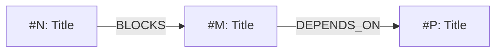

# Release Plan Template

## Purpose

This template defines the standard structure for PMO platform release plans. The release-planner skill (Mode B) generates release plans following this template. Release plans are committed to the release branch at `release/releases/plans/<slug>_RELEASE_PLAN.md` (slug-primary / pre-claim — no version stem; the version binds at the Stage-12 claim, when the file is renamed to `vX.Y_RELEASE_PLAN.md` per ADR-092).

## Template

```markdown
# Release Plan: <slug> — [Release Title]

## Header

| Field | Value |
|-------|-------|
| **Version** | {{RELEASE_VERSION}} |
| **Date Created** | YYYY-MM-DD (Day) |
| **Release Manager** | [Name or "Agent-assisted"] |
| **Status** | Draft / In Review / Approved / Executing / Completed / Rolled Back |
| **Branch** | release/<slug> |
| **PR** | #[PR number] (populated at Stage 6) |
| **Milestone** | <slug> |

## Scope

### Issues Included

| # | Issue | Title | Priority | Category | Labels |
|---|-------|-------|----------|----------|--------|
| 1 | #[N] | [Title] | [P1-P4] | [category] | [labels] |
| 2 | #[M] | [Title] | [P1-P4] | [category] | [labels] |

### Dependency Graph

Per ADR-1 — Kahn's BFS topological sort, priority-desc → issue-asc tie-breaker. Algorithm spec in `references/dependency-analysis.md` § Dependency Graph Construction Algorithm.

#### Topologically Sorted Sequence

The `Edge Type` column carries the §Category 4 artifact-relationship type for each issue's in-release dependency (GENERATES / DEPENDS_ON / BLOCKS / SUPERSEDES), derived per `references/dependency-analysis.md` § Artifact-Relationship Classification. It is the artifact-relationship axis — independent of the FS/SS scheduling type read by the critical path. A root with no in-release dependency carries `—`.

| Position | Issue | Priority | Status | Dependencies (in-release) | Edge Type |
|---|---|---|---|---|---|
| 1 | #N | P2 | bundled | (none — root) | — |
| 2 | #M | P2 | bundled | #N | DEPENDS_ON |
| 3 | #P | P3 | bundled | #M | BLOCKS |

#### Artifact Relationship Graph

Typed per `core/schemas/frontmatter-schema.md` §Category 4 (GENERATES · DEPENDS_ON · BLOCKS · SUPERSEDES) — referenced, not redefined. Derivation: `references/dependency-analysis.md` § Artifact-Relationship Classification. This is the artifact-relationship axis; it is orthogonal to the FS/SS scheduling axis the critical path consumes. Issue→issue edges carry DEPENDS_ON (default) or BLOCKS; file-level edges carry GENERATES (File Change Matrix Create) or SUPERSEDES (version-supersession Modify).

| Source | Type | Target | Direction | Derived from |
|---|---|---|---|---|
| #N | BLOCKS | #M | #N → #M | native `blocks` |
| #P | DEPENDS_ON | #N | #P → #N | body Dependencies (default) |
| #N | GENERATES | core/standards/adkar-assessment.md | #N → file | File Change Matrix (Create) |
| design_v2.md | SUPERSEDES | design_v1.md | v2 → v1 | FCM version pattern |

Emit `No typed artifact relationships — bundle has no native/body dependency edges and no Create/supersede file changes` as the body when the classifier yields zero edges — explicit positive signal that typing was checked, per the `No file contention detected` convention.

#### Mermaid Visualization

Optional — emit when graph has >5 nodes (renders on GitHub). When emitted, label each edge with its §Category 4 artifact-relationship type as a no-cost secondary surface (`A -->|BLOCKS| B`):



#### Tie-Breaker Trace

Emit only when ties existed in Kahn's emission. Format:

- Position-3 tie between #N (P3) and another P3 issue: broken by issue-number ascending. #N ordered ahead.

Or text format:
- #N must land before #M (reason: [file contention / logical dependency])
- #M must land before #P (reason: [file contention / logical dependency])
- #Q is independent (no dependencies)

### File Change Matrix

| File Path | Issues | Change Type | Risk |
|-----------|--------|------------|------|
| core/[file].md | #N, #M | Create / Modify / Delete | Low / Medium / High |
| release/skills/[skill]/SKILL.md | #P | Modify | Low / Medium / High |

### File Contention Map

Automated parse via `release/tools/bundle-issues-parser.py`. 4-tier severity rubric:

| File | Issues | Intent Mix | Severity | Recommendation |
|---|---|---|---|---|
| <path> | #N, #M, ... | edit×K, add×J, delete×L | NONE \| BINARY \| MULTI-WAY \| CONFLICT | <operator hint per severity> |

**Severity legend:**
- **NONE** (suppressed) — 1 issue, no contention
- **BINARY** — 2 issues, sequencing required (logical dependency → smaller change → lower risk)
- **MULTI-WAY** — ≥3 issues, atomic edit batch via single skill-editor invocation + single commit recommended
- **CONFLICT** — delete + other intent, scope reconciliation required (BLOCKS bundle approval)

**Parse-quality:** <N> issues parsed cleanly · <M> deferred (excluded) · <K> parse-failed (BLOCKING — see issue numbers above)

Emit always when bundle has ≥2 issues (use `No file contention detected` body row when severity_map is all-NONE — explicit positive signal that contention was checked).

### Cross-Milestone Dependency Validation

Per ADR-2 + always-emit harmonization — G3-07 gate output. Section is emitted when bundle has ≥1 dependency edge (any type); suppressed only when bundle has zero dep edges (no check possible). `### G3-07 Status` subsection is always populated when section emitted — body `PASS — N dependency edge(s) checked, 0 cross-milestone violations` is the load-bearing positive-signal artifact when zero violations exist (analogous to the File Contention Map `No file contention detected` empty-state).

#### G3-07 Status

`PASS | PASS-WITH-EXCEPTIONS (N registered) | FAIL (N unresolved)`

#### Violations

| Edge | Source ms (pos) | Target ms (pos) | Gap | Severity | Remediation |
|---|---|---|---|---|---|
| #A → #B | vX.Y (5) | vX.Z (9) | 4 | FAIL | (a) bundle #B in vX.Y, (b) resequence, (c) register exception, (d) remove dep |

#### Resolved Edges (B is Done)

| Edge | Notes |
|---|---|
| #C → #D | [RESOLVED] B is Done in closed milestone vM.N |

#### Registered Exceptions

| Edge | Rationale | Authorized by | Date |
|---|---|---|---|
| #E → #F | <one-sentence justification> | @<operator-handle> | YYYY-MM-DD |

### Bundle Refresh State

Per ADR-3 — CONDITIONAL section. Present only when Gate G-BR fired non-no-op since the last Mode A/B invocation for this bundle; absent otherwise.

**Refresh trigger:** T1 (≥3 new Approved theme-matching issues) | T2 (priority shift) | T3 (dep-state change) | T4 (Stage 4 boundary)
**Churn:** composition_delta_pct = X% (theme_preserved: TRUE | FALSE)
**Outcome path selected:** no-op | amend | re-bundle | defer
**Decision recorded:** [link to Milestone description `## Bundle Refresh Decisions` block OR comment URL]
**Refresh-check date:** YYYY-MM-DD

**Detected since last refresh-check:**
- T1: <count> new Approved issues since <timestamp> — #N1, #N2, ...
- T2: <count> priority shifts — <issue: from → to>
- T3: <count> dep-state changes — <issue: dep → new state>

### Exclusions

Items explicitly NOT in this release and why:
- #[X]: Deferred to vX.(Y+1) because [reason]

## Implementation Sequence

Dependency-ordered implementation plan. Each issue includes file-level change specifications.

### Issue #N: [Title]

**Change Specification:**
- **Files modified:** [list with paths]
- **Change description:** [what changes and why]
- **Acceptance criteria:** [from issue]
- **Estimated complexity:** Low / Medium / High
- **Dependencies:** [issues that must be complete first, or "None"]

### Issue #M: [Title]

[Same structure as above]

## Risk Register

| # | Risk | Likelihood | Impact | Mitigation | Owner |
|---|------|-----------|--------|-----------|-------|
| 1 | [Risk description] | Low/Med/High | Low/Med/High | [Mitigation action] | [Owner] |

## Delivery Strategy

| Aspect | Decision |
|--------|---------|
| **Implementation approach** | Sequential (dependency-ordered) / Parallel (independent issues) / Mixed |
| **Commit strategy** | One commit per issue / Grouped commits / Single commit |
| **Review approach** | Single PR for entire release / PR per issue |
| **Deployment mechanism** | Git merge + S-2 skill copy + manifest execution |
| **Stacked-base cleanup posture** | Phase B0 base-shift per dep (default — Option A) / Defer cleanup to Phase D0 (Option B — declare here when stacked-base waves are planned) |

## Verification Plan

### Per-Issue Verification

| Issue | Verification Method | Expected Result |
|-------|-------------------|----------------|
| #N | [How to verify this issue's changes] | [What correct looks like] |
| #M | [How to verify] | [Expected result] |

### Release-Level Verification

Per verification-checklist.md:
- [ ] File Integrity
- [ ] Content Correctness
- [ ] Cross-Reference Validity
- [ ] Skill Invocation
- [ ] Output Contract Compliance

## Rollback Strategy

### Per-Issue Rollback

| Issue | Rollback Method | Rollback Complexity |
|-------|----------------|-------------------|
| #N | `git revert [commit]` | Low — isolated file change |
| #M | Forward fix preferred (entangled with #N) | Medium |

### Whole-Release Rollback

| Strategy | Trigger | Procedure |
|----------|---------|-----------|
| **Partial Revert** | Isolated issue failure | Revert specific commits per rollback-protocol.md |
| **Full Restore** | Systemic failure | Revert merge commit per rollback-protocol.md |
| **Forward Fix** | Minor issue, fix well-understood | Fix branch per rollback-protocol.md |

## Operational Deployment Manifest

Layer 2 file propagation targets for Stage 12/13:

| # | Source (Layer 1) | Target (Layer 2) | Mechanism | Verification |
|---|-----------------|-----------------|-----------|-------------|
| 1 | release/skills/[name]/SKILL.md | [Installed skill path] | S-2 direct copy | diff shows no differences |
| 2 | [source] | [target] | [mechanism] | [verification method] |

### Schema Migrations (if applicable)

| # | Migration | Target | Verification |
|---|-----------|--------|-------------|
| 1 | [description] | [target file/system] | [how to verify] |

## Verification Evidence

(Populated after Stage 12 execution — see verification-checklist.md for format)

## Deployment Execution Log

(Populated during Stage 12 — see execution-checklist.md)

| Step | Timestamp | Result | Notes |
|------|-----------|--------|-------|
| Pre-execution check | | PASS/FAIL | |
| Merge PR | | PASS/FAIL | |
| Tag release | | PASS/FAIL | |
| Skill deployment | | PASS/FAIL | |
| Manifest execution | | PASS/FAIL | |
| State anchor update | | PASS/FAIL | |
| Post-execution verification | | PASS/FAIL | |

## Change Description

(Authored by the Stage 6 release-engineering spoke at PR-creation time per `release/governance/RELEASE_PROTOCOL.md` § Change Description Protocol. Operator-facing, pre-merge, ~60 lines. Distinct from `release/releases/notes/vX.Y_RELEASE_NOTES.md` — the user-facing release note authored at Stage 13 Close.)

### Outcome

[2-3 sentences. What this release delivers in plain-but-engineering-OK language. Lead with operator-facing capability — what changes for the operator at Stage 9 Plan Review and beyond.]

### Issues resolved

| # | Outcome (one line) | Status |
|---|---|---|
| #N | [one-line operator-readable outcome] | DONE / PARTIAL / DEFERRED |
| #M | [one-line operator-readable outcome] | DONE / PARTIAL / DEFERRED |

### Key decisions (when applicable; omit this sub-section when no D-decisions were rendered)

- **D-X:** [verdict]. [One-line rationale; link to release plan § Hub-Rendered D-Decisions row.]
- **D-Y:** [verdict]. [One-line rationale.]

### Reversibility

**[CHEAP / MODERATE / EXPENSIVE / IRREVERSIBLE] — [HIGH / MEDIUM / LOW] confidence.** [One sentence naming the rollback mechanism — e.g., `git revert <commit>`; revert of chore PR #NNNN; manual restore from `releases/_snapshots/vX.Y/`.]

### Downstream impact

- [What this release enables in the next release.]
- [Affected surfaces / carry-forward items.]
- [Cross-cutting consumer impact, if any — which skills, hooks, deploy gates, etc.]

### Cross-references

- Release plan: this file, top section
- Milestone: <slug>
- User-facing release notes: [`release/releases/notes/vX.Y_RELEASE_NOTES.md`](release/releases/notes/vX.Y_RELEASE_NOTES.md) (authored at Stage 13 Close per [`release/references/standards/release-notes-standard.md`](../../../references/standards/release-notes-standard.md))
```

## Template Usage Rules

1. **All sections required.** If a section is not applicable (e.g., no schema migrations), include the section header with "N/A — no [items] in this release."
2. **Status field must be maintained** throughout the release lifecycle.
3. **Verification Evidence section** is blank at creation and populated after execution.
4. **Deployment Execution Log** is blank at creation and populated during execution.
5. **File committed on release branch** at Stage 4 (Planning) and updated through Stage 13 (Close).
6. **Change Description section** is appended by the Stage 6 release-engineering spoke as part of PR creation per [`release/governance/RELEASE_PROTOCOL.md`](../../../governance/RELEASE_PROTOCOL.md) § Change Description Protocol — ~60 lines, operator-facing voice, 6 sub-sections (Outcome / Issues resolved / Key decisions [conditional] / Reversibility / Downstream impact / Cross-references). Distinct artifact from the user-facing release note at `release/releases/notes/vX.Y_RELEASE_NOTES.md` (authored at Stage 13 per [`release/references/standards/release-notes-standard.md`](../../../references/standards/release-notes-standard.md)).
